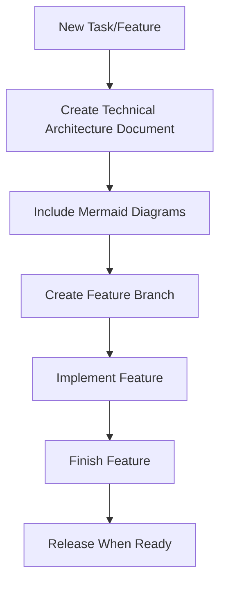

# Project Workflow Rules

This document defines the mandatory workflow rules for this project.

## Technical Architecture First



### Mandatory Steps for Each Task

1. **Start with Technical Architecture**
   - Before writing any code, create or update the technical architecture document
   - Place architecture documents in the `docs/` directory
   - Name files descriptively (e.g., `docs/AUTH_ARCHITECTURE.md`)

2. **Include Mermaid Diagrams** for visualizing:
   - Component relationships
   - Data flow
   - System architecture
   - Process workflows
   - State transitions

3. **Follow GitFlow Workflow**
   - Create feature branches from develop
   - Finish features by merging back to develop
   - Create release branches for version preparation
   - Hotfix critical issues from main

4. **Documentation Updates**
   - Update README.md with new feature information
   - Keep documentation synchronized with code changes
   - Document API changes and new dependencies

## Branch Naming Convention

- Feature branches: `feature/descriptive-name`
- Release branches: `release/x.y.z`
- Hotfix branches: `hotfix/descriptive-name`

## Commit Message Guidelines

- Use clear, descriptive commit messages
- Reference task/issue numbers when applicable
- Indicate the type of change (feat, fix, docs, etc.)

## Code Review Requirements

- All code must be reviewed before merging
- Documentation must be updated before feature completion
- Technical architecture documents must be accurate and up-to-date

## Technical Architecture Document Template

```markdown
# Feature Name Technical Architecture

## Overview
Brief description of the feature or component

## System Architecture
Mermaid diagram showing system components

## Component Diagram
Mermaid diagram showing internal components

## Data Flow
Mermaid sequence diagram showing interactions

## API Design
API endpoints or interfaces

## Data Models
Key data structures

## Dependencies
External dependencies

## Security Considerations
Security implications

## Future Considerations
Potential future enhancements
```