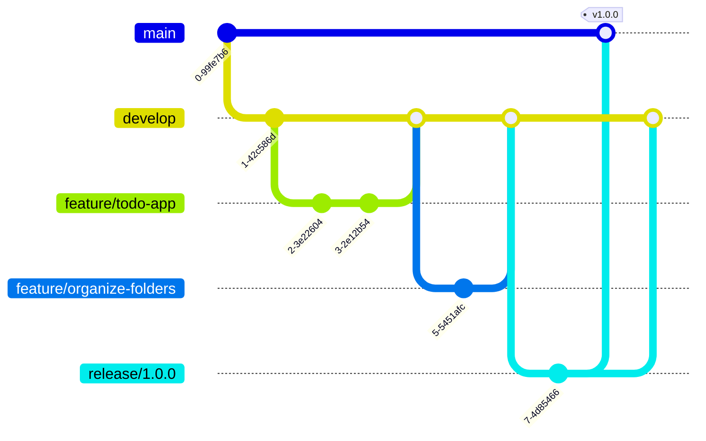

# Contributing to Todo App

This document provides guidelines for contributing to the Todo App project.

## GitFlow Workflow

This project follows the GitFlow branching model:

### Branch Structure
- `main`: Production code
- `develop`: Latest development changes
- `feature/*`: New features
- `release/*`: Release preparation
- `hotfix/*`: Urgent fixes for production

### Workflow Steps
1. Create a feature branch from develop: `git flow feature start feature-name`
2. Make changes, commit, and push
3. Finish the feature: `git flow feature finish feature-name`
4. Create a release branch when ready: `git flow release start x.y.z`
5. Make release-specific changes
6. Finish the release: `git flow release finish x.y.z`

## Technical Documentation

For each significant task or feature:

1. Create a technical architecture document in the `docs` folder
2. Include Mermaid diagrams to visualize:
   - Component relationships
   - Data flow
   - System architecture
3. Document any API changes or new dependencies

## Coding Standards

- Use consistent indentation (2 spaces)
- Write meaningful commit messages
- Comment complex logic
- Keep functions small and focused
- Follow semantic HTML practices
- Use CSS classes for styling
- Write modular JavaScript