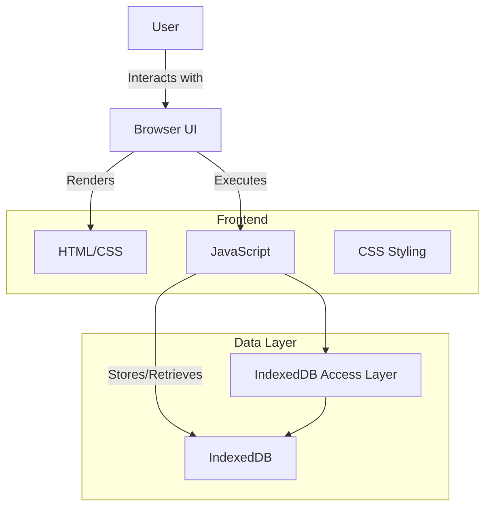
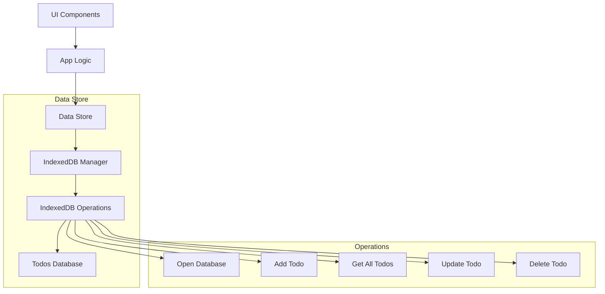
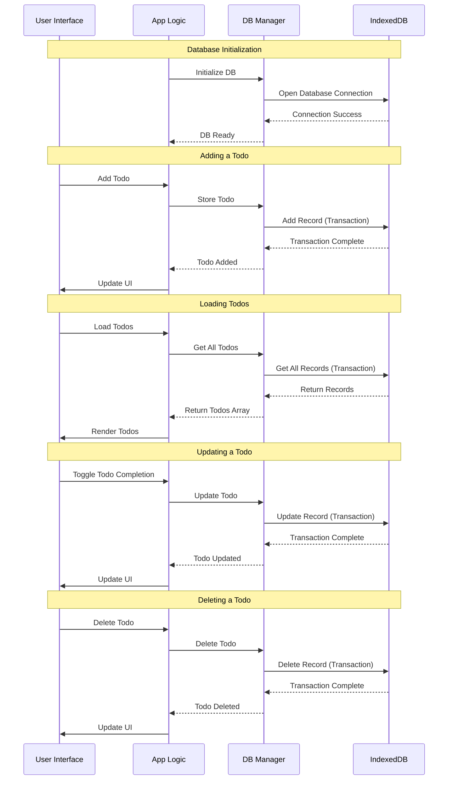
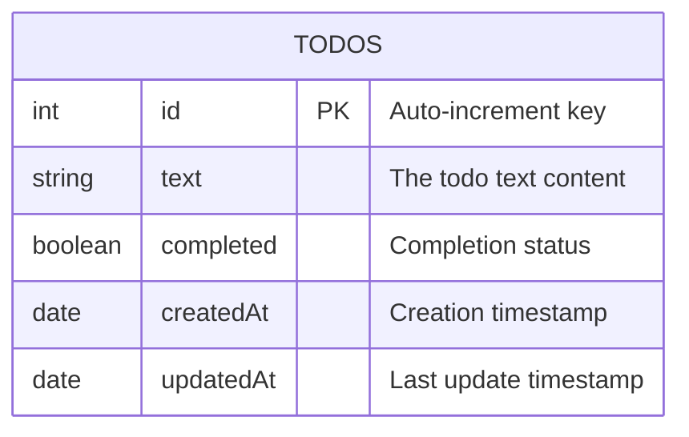
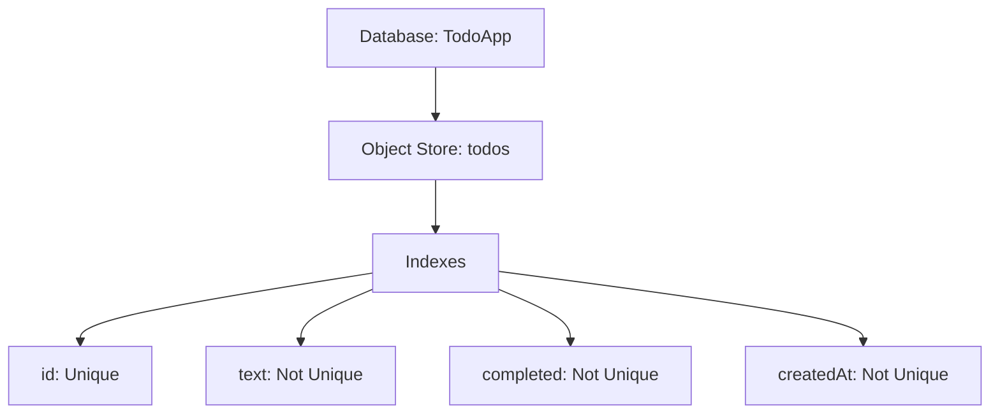
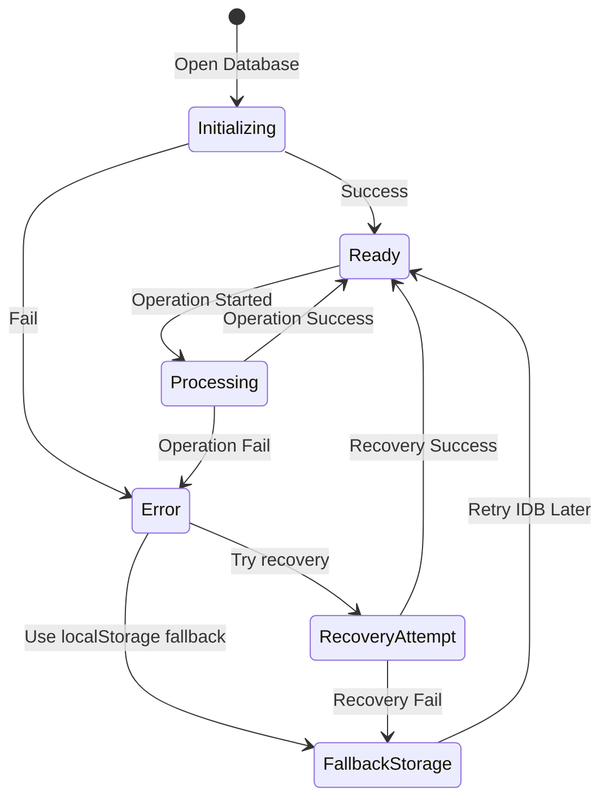
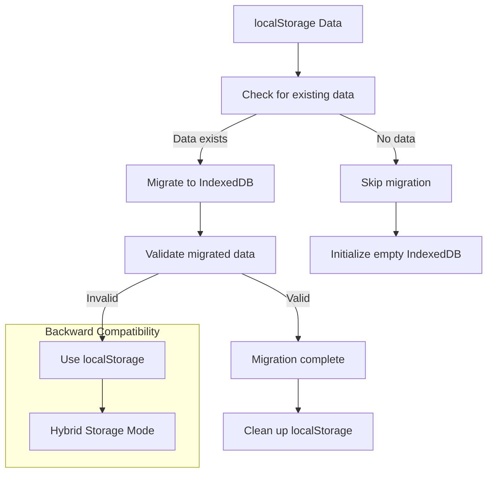

# Browser Database Storage Technical Architecture

## Overview
This document outlines the architecture for migrating the Todo App's data storage from localStorage to IndexedDB. IndexedDB is a low-level browser API for client-side storage of significant amounts of structured data, including files/blobs.

## System Architecture



## Component Diagram



## Data Flow



## Database Schema



## IndexedDB Structure



## Error Handling



## Transition Strategy



## API Design

New JavaScript module for IndexedDB operations:

```javascript
/**
 * Database configuration
 */
const DB_CONFIG = {
  name: 'TodoApp',
  version: 1,
  stores: {
    todos: { keyPath: 'id', autoIncrement: true }
  }
};

/**
 * Initialize the database
 * @returns {Promise} Promise resolving to the database instance
 */
function initDatabase() { ... }

/**
 * Add a new todo item
 * @param {Object} todo - Todo object to add
 * @returns {Promise} Promise resolving to the added todo with ID
 */
function addTodo(todo) { ... }

/**
 * Get all todos
 * @returns {Promise} Promise resolving to array of todos
 */
function getAllTodos() { ... }

/**
 * Update a todo item
 * @param {Object} todo - Todo object with updated properties
 * @returns {Promise} Promise resolving when update is complete
 */
function updateTodo(todo) { ... }

/**
 * Delete a todo item
 * @param {number} id - ID of todo to delete
 * @returns {Promise} Promise resolving when delete is complete
 */
function deleteTodo(id) { ... }

/**
 * Clear all todos
 * @returns {Promise} Promise resolving when database is cleared
 */
function clearAllTodos() { ... }

/**
 * Migrate data from localStorage to IndexedDB
 * @returns {Promise} Promise resolving when migration is complete
 */
function migrateFromLocalStorage() { ... }
```

## Migration Path

1. Check for existing localStorage data
2. Create IndexedDB database and object store
3. If localStorage data exists, migrate it to IndexedDB
4. Validate migration success
5. Update app to use IndexedDB for all operations
6. Implement fallback to localStorage if IndexedDB is unavailable

## Performance Considerations

1. IndexedDB operations are asynchronous and non-blocking
2. Use indexes for faster querying when the todo list grows large
3. Batch operations when possible for better performance
4. Implement proper error handling and recovery strategies

## Browser Compatibility

IndexedDB is supported in all modern browsers, but we'll implement a feature detection system with localStorage fallback for maximum compatibility.

## Future Enhancements

1. Add support for todo attachments (files, images)
2. Implement data synchronization with a backend server
3. Add offline capabilities with sync when online
4. Support for todo categories and tags with additional object stores