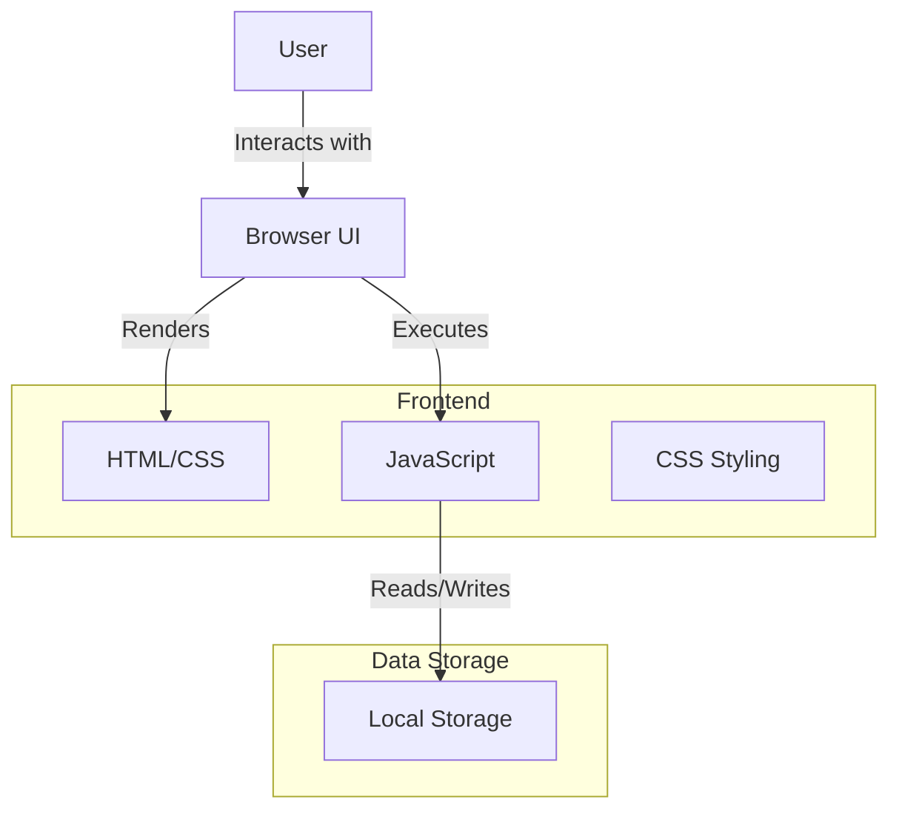
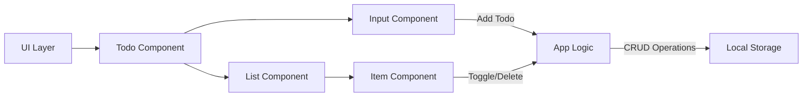
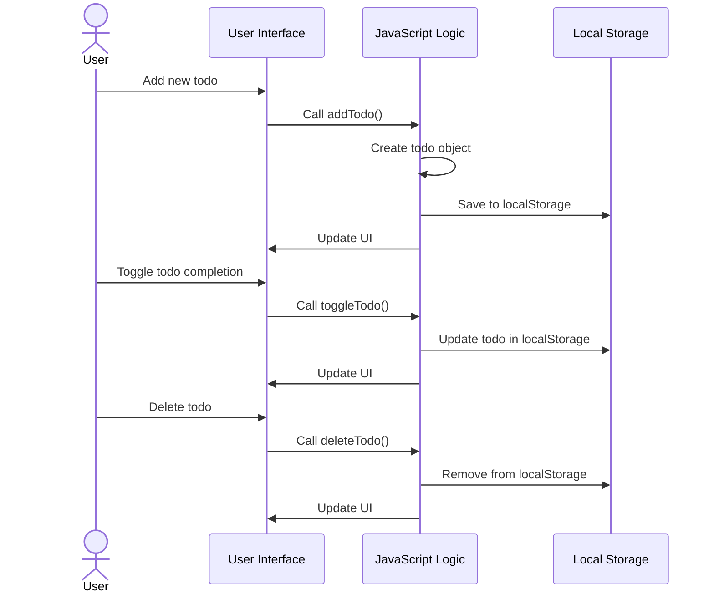

# Todo App Technical Architecture

## Overview
This document outlines the technical architecture of the Todo App, a simple web application for managing tasks.

## System Architecture



## Component Diagram



## Data Flow



## File Structure

```
src/
├── index.html    # Main HTML file
├── css/          # Stylesheet directory
│   └── styles.css
└── js/           # JavaScript directory
    └── app.js
```

## Technologies
- HTML5 for structure
- CSS3 for styling
- JavaScript (ES6+) for logic
- LocalStorage API for data persistence

## Future Considerations
- Add user authentication
- Implement backend storage
- Add categories/tags for todos
- Support for due dates
- Mobile app support