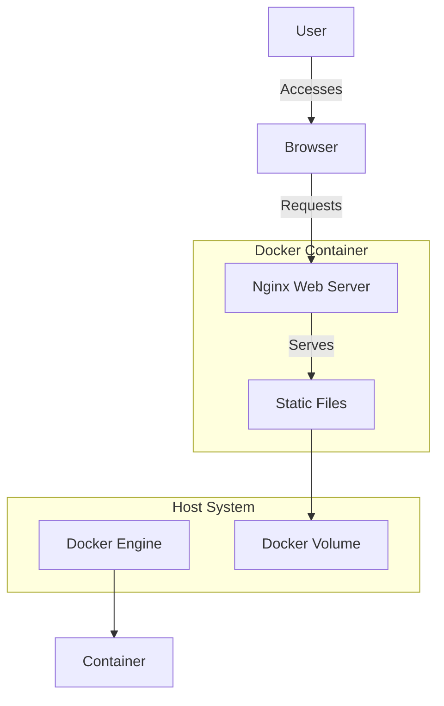
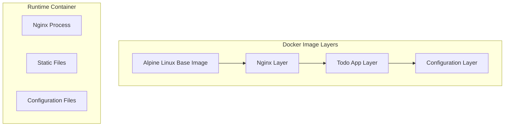
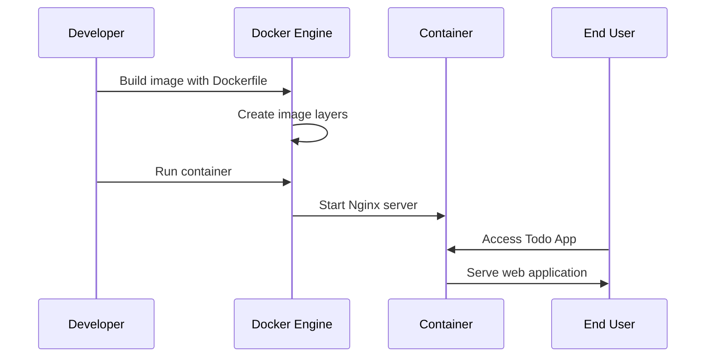
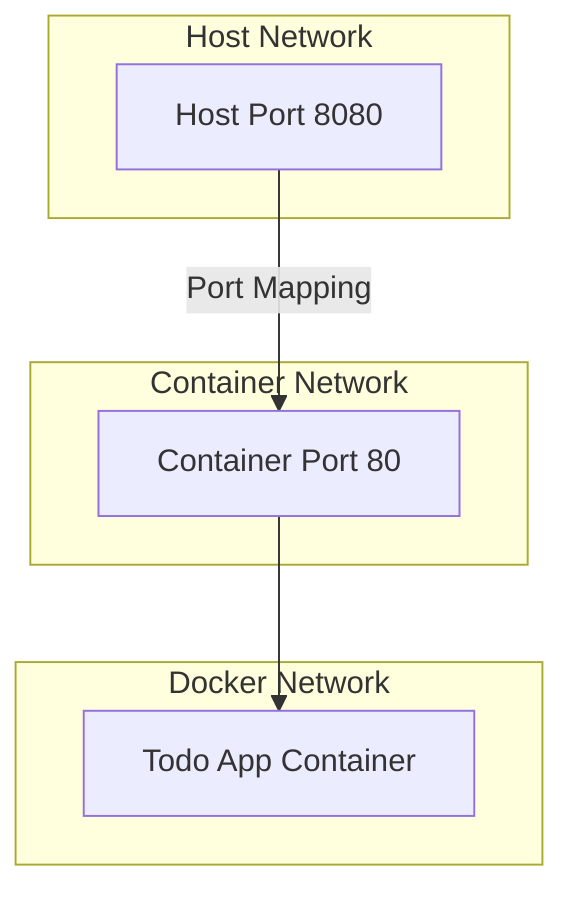
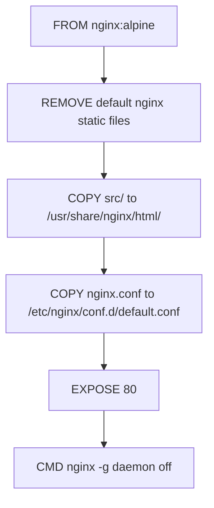
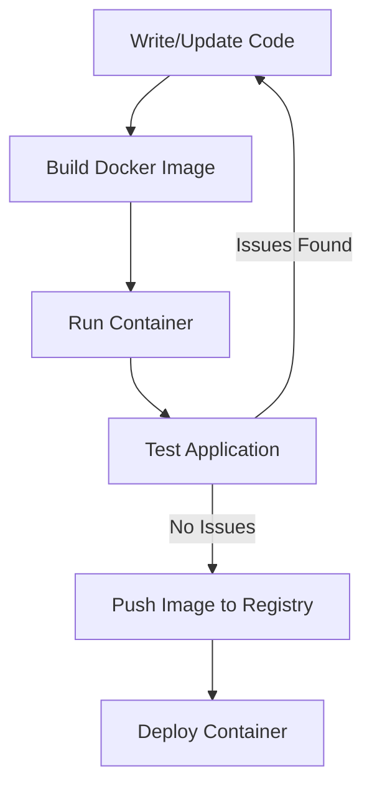

# Docker Implementation Technical Architecture

## Overview
This document outlines the architecture for containerizing the Todo App using Docker. This will enable consistent deployment across different environments and simplify the setup process for developers and users.

## System Architecture



## Container Architecture



## Deployment Flow



## Volume Mapping

```mermaid
graph LR
    subgraph "Host System"
        HostFiles[App Files]
        HostConfig[Configuration]
    end
    
    subgraph "Docker Container"
        ContainerFiles[/usr/share/nginx/html]
        ContainerConfig[/etc/nginx/conf.d]
    end
    
    HostFiles -->|Volume Mount| ContainerFiles
    HostConfig -->|Volume Mount| ContainerConfig
```

## Network Architecture



## Dockerfile Structure



## Development Workflow



## Configuration Files

### Nginx Configuration

The Nginx configuration will be optimized for serving static files with the following features:
- Gzip compression
- Cache control headers
- Security headers
- SPA routing support (fallback to index.html)

```
server {
    listen 80;
    server_name localhost;
    root /usr/share/nginx/html;
    index index.html;

    # Compression
    gzip on;
    gzip_types text/plain text/css application/javascript;
    
    # Security headers
    add_header X-Content-Type-Options nosniff;
    add_header X-Frame-Options DENY;
    add_header X-XSS-Protection "1; mode=block";
    
    # Cache static assets
    location ~* \.(js|css|png|jpg|jpeg|gif|ico)$ {
        expires 30d;
        add_header Cache-Control "public, no-transform";
    }

    # SPA routing
    location / {
        try_files $uri $uri/ /index.html;
    }
}
```

## Docker Compose Configuration

For local development, we'll use Docker Compose to simplify the setup process:

```yaml
version: '3'
services:
  todo-app:
    build: .
    ports:
      - "8080:80"
    volumes:
      - ./src:/usr/share/nginx/html
```

## Build and Deployment Scripts

### Build Script

```bash
#!/bin/bash
docker build -t todo-app:latest .
```

### Run Script

```bash
#!/bin/bash
docker run -d -p 8080:80 --name todo-app todo-app:latest
```

## Performance Considerations

1. Use Alpine Linux base image for smaller footprint
2. Implement multi-stage builds if needed in the future
3. Configure appropriate caching headers in Nginx
4. Optimize static assets for production

## Security Considerations

1. Run Nginx as non-root user
2. Implement security headers
3. Keep base images updated
4. Scan images for vulnerabilities
5. No sensitive data in image layers

## Future Enhancements

1. Multi-stage build for optimized production assets
2. Kubernetes deployment manifests
3. CI/CD pipeline integration
4. Health checks and monitoring
5. Backup and restore procedures for data