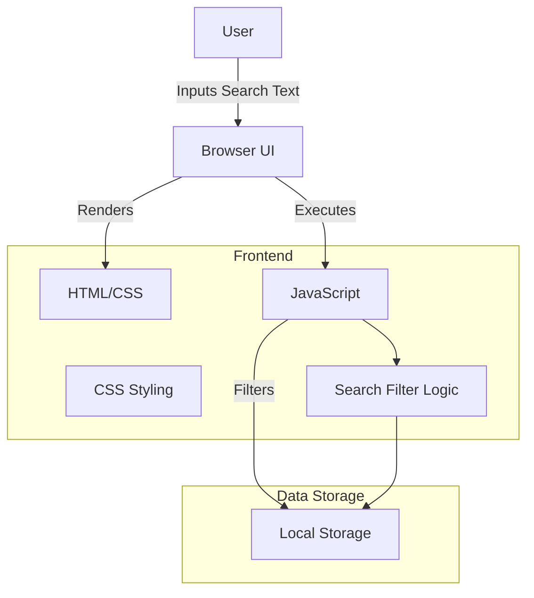
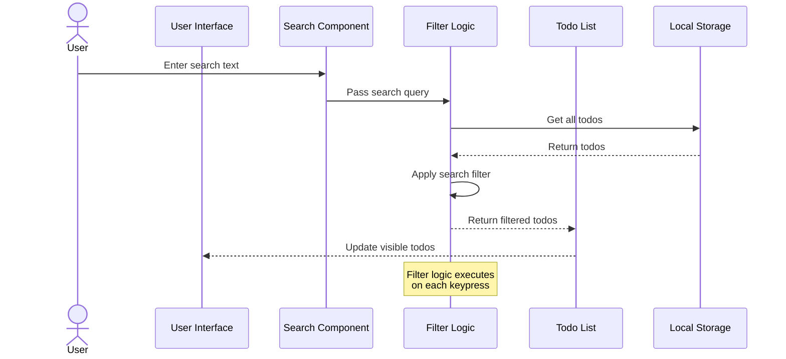
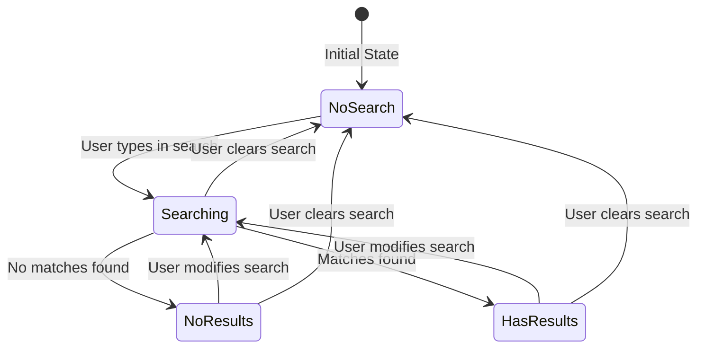
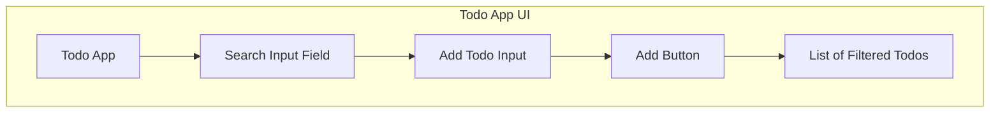

# Search Functionality Technical Architecture

## Overview
This document outlines the architecture for adding search functionality to the Todo App. The search feature will allow users to filter their todo items by text content in real-time.

## System Architecture



## Component Diagram

```mermaid
graph LR
    UI[UI Layer] --> Todo[Todo Component]
    Todo --> TodoInput[Input Component]
    Todo --> SearchInput[Search Component] %% New component
    Todo --> TodoList[List Component]
    TodoList --> TodoItem[Item Component]
    
    TodoInput -->|Add Todo| Logic[App Logic]
    SearchInput -->|Filter Todos| Filter[Search Filter] %% New component
    Filter -->|Filtered Results| TodoList
    TodoItem -->|Toggle/Delete| Logic
    Logic -->|CRUD Operations| Storage[Local Storage]
```

## Data Flow



## State Diagram



## UI Design



## API Design

New JavaScript functions to be added:

```javascript
/**
 * Filters todo items based on search text
 * @param {string} searchText - Text to search for
 * @param {Array} todos - Array of todo objects
 * @returns {Array} Filtered array of todo objects
 */
function filterTodos(searchText, todos) { ... }

/**
 * Updates the UI to show filtered todos
 * @param {Array} filteredTodos - Array of filtered todo objects
 */
function updateFilteredTodoList(filteredTodos) { ... }

/**
 * Event handler for search input changes
 * @param {Event} event - Input event object
 */
function handleSearchInput(event) { ... }
```

## Data Models

No new data models are required. The existing todo item structure remains unchanged:

```javascript
{
    id: Number,       // Unique identifier
    text: String,     // Todo text content (will be searched)
    completed: Boolean // Completion status
}
```

## Dependencies

No new external dependencies are required. The feature will be implemented using:
- Vanilla JavaScript
- Existing CSS for styling
- HTML DOM manipulation

## Performance Considerations

1. Search filtering will happen client-side to ensure quick response
2. Debounce technique will be used to prevent excessive filtering on each keystroke
3. Case-insensitive search for better user experience

## Security Considerations

Since all processing happens client-side with data already available to the user, there are no new security concerns.

## Future Enhancements

1. Advanced search with multiple criteria (completed status, date range)
2. Highlight matching text in search results
3. Save recent searches
4. Filter by categories/tags (if implemented in the future)