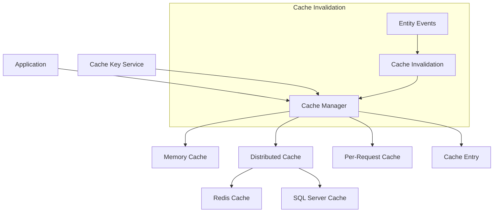
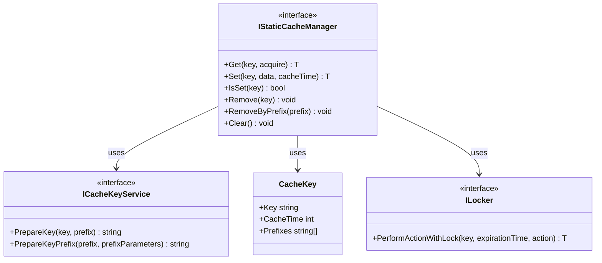
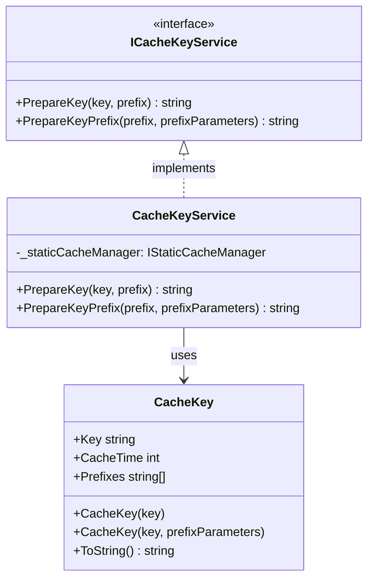
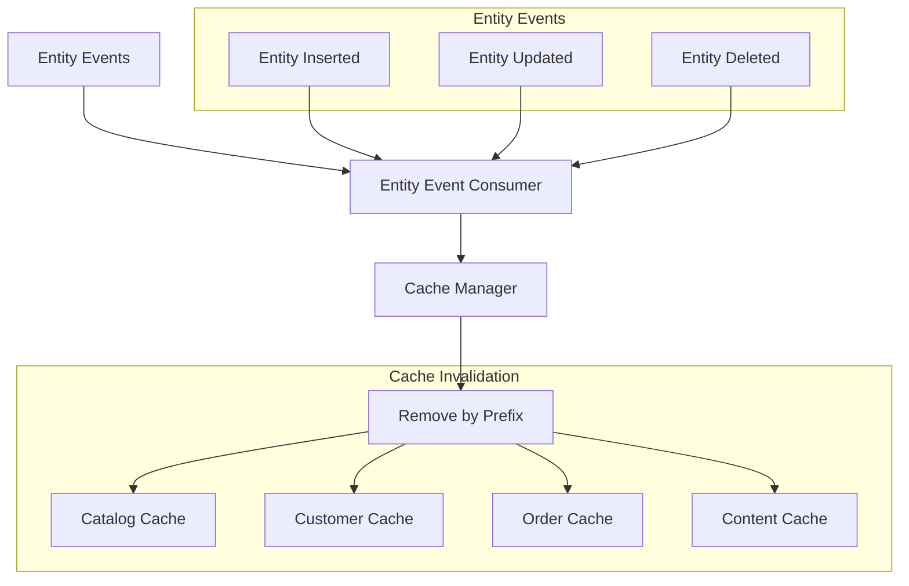

# nopCommerce Caching System

[Home](../../index.md) | [Core Framework](index.md) | [Previous: Infrastructure](infrastructure.md) | [Next: Events System](events.md)

## Introduction

The nopCommerce caching system is a crucial component for optimizing performance. It reduces database load and improves response times by storing frequently accessed data in memory. This document explores the architecture of the caching system, which is primarily defined in the `Nop.Core.Caching` namespace.

## Caching Architecture Overview

nopCommerce implements a multi-level caching architecture with support for various caching mechanisms:



## Core Caching Interfaces

The caching system is built around several key interfaces:



### ICacheKeyService

This interface is responsible for generating and managing cache keys:

```csharp
public interface ICacheKeyService
{
    /// <summary>
    /// Prepare a cache key
    /// </summary>
    /// <param name="key">Initial key</param>
    /// <param name="prefix">Key prefix</param>
    /// <returns>Cache key</returns>
    string PrepareKey(CacheKey key, string prefix = null);

    /// <summary>
    /// Prepare a cache key prefix
    /// </summary>
    /// <param name="prefix">Key prefix</param>
    /// <param name="prefixParameters">Key prefix parameters</param>
    /// <returns>Cache key prefix</returns>
    string PrepareKeyPrefix(string prefix, params object[] prefixParameters);
}
```

### IStaticCacheManager

This is the main interface for cache operations:

```csharp
public interface IStaticCacheManager
{
    /// <summary>
    /// Get a cached item. If it's not in the cache yet, then load and cache it
    /// </summary>
    /// <typeparam name="T">Type of cached item</typeparam>
    /// <param name="key">Cache key</param>
    /// <param name="acquire">Function to load item if it's not in the cache yet</param>
    /// <returns>Cached item</returns>
    T Get<T>(CacheKey key, Func<T> acquire);

    /// <summary>
    /// Adds the specified key and object to the cache
    /// </summary>
    /// <param name="key">Key of cached item</param>
    /// <param name="data">Value for caching</param>
    /// <param name="cacheTime">Cache time in minutes</param>
    /// <returns>Cached item</returns>
    T Set<T>(CacheKey key, T data, int cacheTime = 60);

    /// <summary>
    /// Gets a value indicating whether the value associated with the specified key is cached
    /// </summary>
    /// <param name="key">Key of cached item</param>
    /// <returns>True if item already is in cache; otherwise false</returns>
    bool IsSet(CacheKey key);

    /// <summary>
    /// Removes the value with the specified key from the cache
    /// </summary>
    /// <param name="key">Key of cached item</param>
    void Remove(CacheKey key);

    /// <summary>
    /// Removes items by key prefix
    /// </summary>
    /// <param name="prefix">String key prefix</param>
    void RemoveByPrefix(string prefix);

    /// <summary>
    /// Clear all cache data
    /// </summary>
    void Clear();
}
```

### ILocker

This interface provides locking mechanisms for thread-safe cache operations:

```csharp
public interface ILocker
{
    /// <summary>
    /// Perform some action with exclusive lock
    /// </summary>
    /// <param name="key">Resource key</param>
    /// <param name="expirationTime">Expiration time of the lock</param>
    /// <param name="action">Action to perform</param>
    /// <returns>Action result</returns>
    T PerformActionWithLock<T>(string key, TimeSpan expirationTime, Func<T> action);
}
```

## Cache Key Management

Cache keys are managed through the `CacheKey` class and the `ICacheKeyService` interface.



### CacheKey Implementation

The `CacheKey` class encapsulates a cache key with its associated metadata:

```csharp
public sealed class CacheKey
{
    public CacheKey(string key, params string[] prefixes)
    {
        Key = key;
        Prefixes = prefixes;
        CacheTime = 60; // Default cache time in minutes
    }

    /// <summary>
    /// Gets or sets a cache key
    /// </summary>
    public string Key { get; set; }

    /// <summary>
    /// Gets or sets a cache time in minutes
    /// </summary>
    public int CacheTime { get; set; }

    /// <summary>
    /// Gets or sets prefixes for cache key
    /// </summary>
    public string[] Prefixes { get; set; }

    /// <summary>
    /// Conversion to string
    /// </summary>
    /// <returns>String representation of cache key</returns>
    public override string ToString()
    {
        return Key;
    }
}
```

### CacheKeyService Implementation

The `CacheKeyService` class implements the `ICacheKeyService` interface:

```csharp
public class CacheKeyService : ICacheKeyService
{
    private readonly IStaticCacheManager _staticCacheManager;

    public CacheKeyService(IStaticCacheManager staticCacheManager)
    {
        _staticCacheManager = staticCacheManager;
    }

    public string PrepareKey(CacheKey key, string prefix = null)
    {
        if (key == null)
            throw new ArgumentNullException(nameof(key));

        var keyBuilder = new StringBuilder(key.Key);

        if (!string.IsNullOrEmpty(prefix))
            keyBuilder.Insert(0, $"{prefix}-");

        return keyBuilder.ToString();
    }

    public string PrepareKeyPrefix(string prefix, params object[] prefixParameters)
    {
        if (string.IsNullOrEmpty(prefix))
            throw new ArgumentNullException(nameof(prefix));

        return prefixParameters?.Any() ?? false
            ? string.Format(prefix, prefixParameters)
            : prefix;
    }
}
```

## Cache Manager Implementations

nopCommerce provides several implementations of the `IStaticCacheManager` interface for different caching scenarios.

### Memory Cache Manager

The `MemoryCacheManager` class provides in-memory caching:

```csharp
public class MemoryCacheManager : CacheKeyService, IStaticCacheManager, ILocker
{
    private readonly IMemoryCache _memoryCache;
    private readonly IMemoryCache _perRequestCache;
    private readonly IStaticCacheManager _distributedCacheManager;
    private readonly bool _distributedCacheEnabled;
    private readonly SemaphoreSlim _locker;

    public MemoryCacheManager(
        IMemoryCache memoryCache,
        IMemoryCache perRequestCache,
        DistributedCacheConfig distributedCacheConfig,
        IStaticCacheManager distributedCacheManager = null)
        : base(null)
    {
        _memoryCache = memoryCache;
        _perRequestCache = perRequestCache;
        _distributedCacheManager = distributedCacheManager;
        _distributedCacheEnabled = distributedCacheConfig.Enabled;
        _locker = new SemaphoreSlim(1, 1);
    }

    public T Get<T>(CacheKey key, Func<T> acquire)
    {
        // Check per-request cache first
        if (_perRequestCache.TryGetValue(key.Key, out T result))
            return result;

        // Check memory cache
        if (!_memoryCache.TryGetValue(key.Key, out result))
        {
            // Get from distributed cache if enabled
            if (_distributedCacheEnabled && _distributedCacheManager.IsSet(key))
            {
                result = _distributedCacheManager.Get(key, () => default);
                if (result != null)
                {
                    // Store in memory cache
                    _memoryCache.Set(key.Key, result, GetMemoryCacheEntryOptions(TimeSpan.FromMinutes(key.CacheTime)));
                    
                    // Store in per-request cache
                    _perRequestCache.Set(key.Key, result, GetPerRequestCacheEntryOptions());
                    
                    return result;
                }
            }

            // Get from acquire function
            result = acquire();

            // Store in caches
            if (result != null)
            {
                _memoryCache.Set(key.Key, result, GetMemoryCacheEntryOptions(TimeSpan.FromMinutes(key.CacheTime)));
                _perRequestCache.Set(key.Key, result, GetPerRequestCacheEntryOptions());
                
                if (_distributedCacheEnabled)
                    _distributedCacheManager.Set(key, result, key.CacheTime);
            }
        }
        else
        {
            // Store in per-request cache
            _perRequestCache.Set(key.Key, result, GetPerRequestCacheEntryOptions());
        }

        return result;
    }

    public T Set<T>(CacheKey key, T data, int cacheTime = 60)
    {
        if (data != null)
        {
            _memoryCache.Set(key.Key, data, GetMemoryCacheEntryOptions(TimeSpan.FromMinutes(cacheTime)));
            _perRequestCache.Set(key.Key, data, GetPerRequestCacheEntryOptions());
            
            if (_distributedCacheEnabled)
                _distributedCacheManager.Set(key, data, cacheTime);
        }

        return data;
    }

    public bool IsSet(CacheKey key)
    {
        return _memoryCache.TryGetValue(key.Key, out _) || 
               (_distributedCacheEnabled && _distributedCacheManager.IsSet(key));
    }

    public void Remove(CacheKey key)
    {
        _memoryCache.Remove(key.Key);
        _perRequestCache.Remove(key.Key);
        
        if (_distributedCacheEnabled)
            _distributedCacheManager.Remove(key);
    }

    public void RemoveByPrefix(string prefix)
    {
        // Get all cache keys that match the prefix
        var keysToRemove = _memoryCache.GetKeys<string>()
            .Where(key => key.StartsWith(prefix, StringComparison.OrdinalIgnoreCase))
            .ToList();

        // Remove matching keys
        foreach (var key in keysToRemove)
        {
            _memoryCache.Remove(key);
            _perRequestCache.Remove(key);
        }
        
        if (_distributedCacheEnabled)
            _distributedCacheManager.RemoveByPrefix(prefix);
    }

    public void Clear()
    {
        // Clear all memory cache
        _memoryCache.GetKeys<string>().ToList().ForEach(key => _memoryCache.Remove(key));
        
        // Clear all per-request cache
        _perRequestCache.GetKeys<string>().ToList().ForEach(key => _perRequestCache.Remove(key));
        
        if (_distributedCacheEnabled)
            _distributedCacheManager.Clear();
    }

    public T PerformActionWithLock<T>(string key, TimeSpan expirationTime, Func<T> action)
    {
        // Ensure exclusive execution
        _locker.Wait();
        try
        {
            return action();
        }
        finally
        {
            _locker.Release();
        }
    }

    private MemoryCacheEntryOptions GetMemoryCacheEntryOptions(TimeSpan cacheTime)
    {
        var options = new MemoryCacheEntryOptions()
            .SetAbsoluteExpiration(cacheTime);
        
        return options;
    }

    private MemoryCacheEntryOptions GetPerRequestCacheEntryOptions()
    {
        return new MemoryCacheEntryOptions();
    }
}
```

### Redis Cache Manager

For distributed caching, nopCommerce provides a Redis implementation:

```csharp
public class RedisCacheManager : CacheKeyService, IStaticCacheManager, ILocker
{
    private readonly IRedisConnectionWrapper _connectionWrapper;
    private readonly IDatabase _db;
    
    public RedisCacheManager(IRedisConnectionWrapper connectionWrapper)
        : base(null)
    {
        _connectionWrapper = connectionWrapper;
        _db = connectionWrapper.GetDatabase();
    }

    public T Get<T>(CacheKey key, Func<T> acquire)
    {
        // Check if key exists in Redis
        if (!_db.KeyExists(key.Key))
        {
            // If not, get data using acquire function
            var data = acquire();
            
            // Store in Redis if not null
            if (data != null)
                Set(key, data, key.CacheTime);
            
            return data;
        }

        // Get from Redis and deserialize
        var serializedData = _db.StringGet(key.Key);
        var result = JsonConvert.DeserializeObject<T>(serializedData);
        
        return result;
    }

    public T Set<T>(CacheKey key, T data, int cacheTime = 60)
    {
        if (data != null)
        {
            // Serialize and store in Redis
            var serializedData = JsonConvert.SerializeObject(data);
            _db.StringSet(key.Key, serializedData, TimeSpan.FromMinutes(cacheTime));
            
            // Store key prefixes for later invalidation
            if (key.Prefixes?.Any() ?? false)
            {
                foreach (var prefix in key.Prefixes)
                {
                    var prefixKey = $"{prefix}:keys";
                    _db.SetAdd(prefixKey, key.Key);
                }
            }
        }

        return data;
    }

    public bool IsSet(CacheKey key)
    {
        return _db.KeyExists(key.Key);
    }

    public void Remove(CacheKey key)
    {
        // Remove key from Redis
        _db.KeyDelete(key.Key);
        
        // Remove key from prefix sets
        if (key.Prefixes?.Any() ?? false)
        {
            foreach (var prefix in key.Prefixes)
            {
                var prefixKey = $"{prefix}:keys";
                _db.SetRemove(prefixKey, key.Key);
            }
        }
    }

    public void RemoveByPrefix(string prefix)
    {
        // Get all keys with the prefix
        var prefixKey = $"{prefix}:keys";
        var keysToRemove = _db.SetMembers(prefixKey).Select(k => (string)k).ToList();
        
        if (keysToRemove.Any())
        {
            // Remove keys
            foreach (var key in keysToRemove)
                _db.KeyDelete(key);
            
            // Remove the prefix key itself
            _db.KeyDelete(prefixKey);
        }
    }

    public void Clear()
    {
        // Clear all keys from the current database
        _connectionWrapper.FlushDatabase();
    }

    public T PerformActionWithLock<T>(string key, TimeSpan expirationTime, Func<T> action)
    {
        // Implement distributed lock using Redis
        var lockKey = $"lock:{key}";
        var lockValue = Guid.NewGuid().ToString();
        
        // Try to acquire lock
        var acquired = _db.LockTake(lockKey, lockValue, expirationTime);
        
        if (acquired)
        {
            try
            {
                // Execute action with lock
                return action();
            }
            finally
            {
                // Release lock
                _db.LockRelease(lockKey, lockValue);
            }
        }
        
        // Wait and retry if lock not acquired
        Thread.Sleep(100);
        return PerformActionWithLock(key, expirationTime, action);
    }
}
```

### SQL Server Cache Manager

For environments without Redis, SQL Server can be used for distributed caching:

```csharp
public class MsSqlServerCacheManager : CacheKeyService, IStaticCacheManager, ILocker
{
    private readonly IDistributedCache _distributedCache;
    
    public MsSqlServerCacheManager(IDistributedCache distributedCache)
        : base(null)
    {
        _distributedCache = distributedCache;
    }

    public T Get<T>(CacheKey key, Func<T> acquire)
    {
        // Try to get from cache
        var cachedData = _distributedCache.Get(key.Key);
        
        if (cachedData != null)
        {
            // Deserialize and return
            return JsonConvert.DeserializeObject<T>(Encoding.UTF8.GetString(cachedData));
        }
        
        // Get data using acquire function
        var result = acquire();
        
        if (result != null)
        {
            // Set cache entry
            Set(key, result, key.CacheTime);
        }
        
        return result;
    }

    public T Set<T>(CacheKey key, T data, int cacheTime = 60)
    {
        if (data != null)
        {
            // Serialize data
            var serializedData = Encoding.UTF8.GetBytes(JsonConvert.SerializeObject(data));
            
            // Set cache options
            var options = new DistributedCacheEntryOptions
            {
                AbsoluteExpirationRelativeToNow = TimeSpan.FromMinutes(cacheTime)
            };
            
            // Store in distributed cache
            _distributedCache.Set(key.Key, serializedData, options);
            
            // Store key in prefix lists for later invalidation
            if (key.Prefixes?.Any() ?? false)
            {
                foreach (var prefix in key.Prefixes)
                {
                    var prefixKey = $"{prefix}:keys";
                    var prefixList = Get<List<string>>(new CacheKey(prefixKey), () => new List<string>());
                    
                    if (!prefixList.Contains(key.Key))
                    {
                        prefixList.Add(key.Key);
                        var prefixOptions = new DistributedCacheEntryOptions
                        {
                            AbsoluteExpirationRelativeToNow = TimeSpan.FromDays(30) // Long expiration for prefix lists
                        };
                        
                        var serializedList = Encoding.UTF8.GetBytes(JsonConvert.SerializeObject(prefixList));
                        _distributedCache.Set(prefixKey, serializedList, prefixOptions);
                    }
                }
            }
        }
        
        return data;
    }

    public bool IsSet(CacheKey key)
    {
        return _distributedCache.Get(key.Key) != null;
    }

    public void Remove(CacheKey key)
    {
        _distributedCache.Remove(key.Key);
        
        // Remove key from prefix lists
        if (key.Prefixes?.Any() ?? false)
        {
            foreach (var prefix in key.Prefixes)
            {
                var prefixKey = $"{prefix}:keys";
                var prefixList = Get<List<string>>(new CacheKey(prefixKey), () => new List<string>());
                
                if (prefixList.Contains(key.Key))
                {
                    prefixList.Remove(key.Key);
                    var serializedList = Encoding.UTF8.GetBytes(JsonConvert.SerializeObject(prefixList));
                    _distributedCache.Set(prefixKey, serializedList);
                }
            }
        }
    }

    public void RemoveByPrefix(string prefix)
    {
        var prefixKey = $"{prefix}:keys";
        var cachedData = _distributedCache.Get(prefixKey);
        
        if (cachedData != null)
        {
            var prefixList = JsonConvert.DeserializeObject<List<string>>(Encoding.UTF8.GetString(cachedData));
            
            foreach (var key in prefixList)
            {
                _distributedCache.Remove(key);
            }
            
            _distributedCache.Remove(prefixKey);
        }
    }

    public void Clear()
    {
        // SQL Server distributed cache doesn't support clearing all entries
        // This is typically handled by database management
    }

    public T PerformActionWithLock<T>(string key, TimeSpan expirationTime, Func<T> action)
    {
        // Implement simple locking mechanism
        var lockKey = $"lock:{key}";
        var lockValue = Guid.NewGuid().ToString();
        
        // Try to acquire lock
        var options = new DistributedCacheEntryOptions
        {
            AbsoluteExpirationRelativeToNow = expirationTime
        };
        
        try
        {
            _distributedCache.SetString(lockKey, lockValue, options);
            return action();
        }
        finally
        {
            _distributedCache.Remove(lockKey);
        }
    }
}
```

## Cache Invalidation

Cache invalidation is a crucial aspect of the caching system, ensuring that cached data remains consistent with the underlying data source.



### Entity Event Consumers

Entity event consumers handle entity events and invalidate relevant cache entries:

```csharp
public class EntityCacheEventConsumer : 
    IConsumer<EntityInsertedEvent<Product>>,
    IConsumer<EntityUpdatedEvent<Product>>,
    IConsumer<EntityDeletedEvent<Product>>
{
    private readonly IStaticCacheManager _staticCacheManager;
    
    public EntityCacheEventConsumer(IStaticCacheManager staticCacheManager)
    {
        _staticCacheManager = staticCacheManager;
    }
    
    public void HandleEvent(EntityInsertedEvent<Product> eventMessage)
    {
        // Clear cache for products
        _staticCacheManager.RemoveByPrefix(NopEntityCacheDefaults.ProductsPrefix);
    }
    
    public void HandleEvent(EntityUpdatedEvent<Product> eventMessage)
    {
        // Clear cache for products
        _staticCacheManager.RemoveByPrefix(NopEntityCacheDefaults.ProductsPrefix);
    }
    
    public void HandleEvent(EntityDeletedEvent<Product> eventMessage)
    {
        // Clear cache for products
        _staticCacheManager.RemoveByPrefix(NopEntityCacheDefaults.ProductsPrefix);
    }
}
```

### Cache Key Prefixes

Cache key prefixes are defined in constant classes for each entity type:

```csharp
public static class NopEntityCacheDefaults
{
    /// <summary>
    /// Gets a prefix for caching products
    /// </summary>
    public static string ProductsPrefix => "Nop.product.";
    
    /// <summary>
    /// Gets a prefix for caching categories
    /// </summary>
    public static string CategoriesPrefix => "Nop.category.";
    
    /// <summary>
    /// Gets a prefix for caching manufacturers
    /// </summary>
    public static string ManufacturersPrefix => "Nop.manufacturer.";
    
    /// <summary>
    /// Gets a prefix for caching customers
    /// </summary>
    public static string CustomersPrefix => "Nop.customer.";
    
    /// <summary>
    /// Gets a prefix for caching orders
    /// </summary>
    public static string OrdersPrefix => "Nop.order.";
    
    // Additional entity prefixes
}
```

## Caching Best Practices

When working with the nopCommerce caching system, consider the following best practices:

### 1. Use Appropriate Cache Keys

```csharp
// Define cache keys with appropriate prefixes
private readonly CacheKey _allCategoriesKey = new CacheKey("Nop.category.all", NopEntityCacheDefaults.CategoriesPrefix);
private readonly CacheKey _categoryByIdKey = new CacheKey("Nop.category.id-{0}", NopEntityCacheDefaults.CategoriesPrefix);
```

### 2. Use Appropriate Cache Duration

```csharp
// Set appropriate cache duration based on data volatility
_allCategoriesKey.CacheTime = 60; // Cache for 60 minutes
_categoryByIdKey.CacheTime = 30; // Cache for 30 minutes
```

### 3. Include Cache Invalidation Logic

```csharp
// Implement event consumers for cache invalidation
public class CategoryEventConsumer :
    IConsumer<EntityInsertedEvent<Category>>,
    IConsumer<EntityUpdatedEvent<Category>>,
    IConsumer<EntityDeletedEvent<Category>>
{
    private readonly IStaticCacheManager _staticCacheManager;
    
    public CategoryEventConsumer(IStaticCacheManager staticCacheManager)
    {
        _staticCacheManager = staticCacheManager;
    }
    
    public void HandleEvent(EntityInsertedEvent<Category> eventMessage)
    {
        _staticCacheManager.RemoveByPrefix(NopEntityCacheDefaults.CategoriesPrefix);
    }
    
    // Similar implementations for update and delete events
}
```

### 4. Use Cache for Expensive Operations

```csharp
// Use caching for expensive operations
public virtual IList<Category> GetAllCategories()
{
    return _staticCacheManager.Get(_allCategoriesKey, () =>
    {
        var query = from c in _categoryRepository.Table
                    orderby c.DisplayOrder, c.Name
                    select c;
        
        return query.ToList();
    });
}
```

### 5. Consider Multi-Store Scenarios

```csharp
// Include store ID in cache keys for multi-store scenarios
private CacheKey GetCategoriesByStoreKey(int storeId)
{
    return new CacheKey($"Nop.category.by-store.{storeId}", NopEntityCacheDefaults.CategoriesPrefix);
}
```

## Conclusion

The nopCommerce caching system provides a robust and flexible approach to caching, with support for different caching mechanisms and intelligent cache invalidation. By effectively using this system, developers can significantly improve the performance of nopCommerce applications, particularly for operations that are computationally expensive or involve database access.

---

*Next: [Events System](events.md)*

---

*[Home](../../index.md) | [Core Framework](index.md) | [Previous: Infrastructure](infrastructure.md) | [Next: Events System](events.md)*