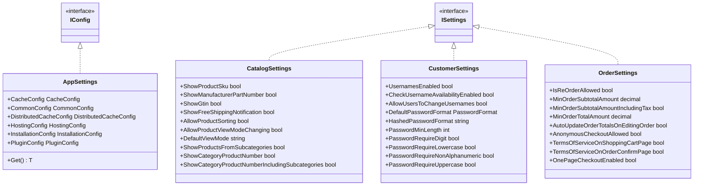
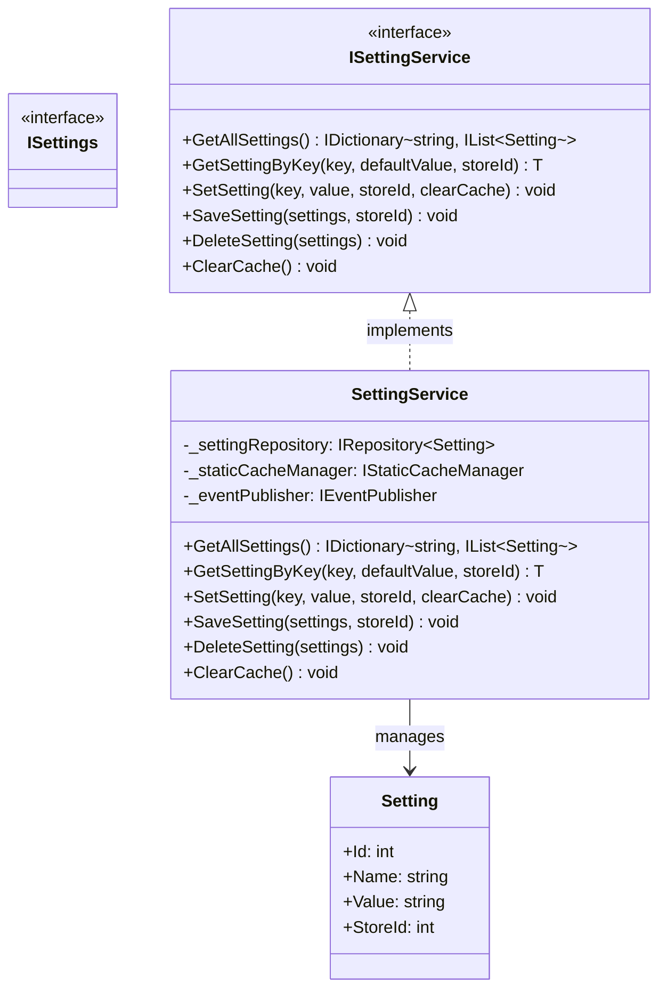
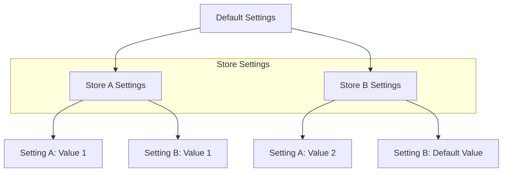

# nopCommerce Configuration System

[Home](../../index.md) | [Core Framework](index.md) | [Previous: Events System](events.md) | [Next: Data Access Layer](../data/index.md)

## Introduction

The nopCommerce configuration system manages application settings and provides a flexible way to store and retrieve configuration values. This document explores the architecture of the configuration system, which is primarily defined in the `Nop.Core.Configuration` namespace.

## Configuration System Overview

```mermaid
graph TD
    Application[Application] --> ConfigSystem[Configuration System]
    ConfigSystem --> AppSettings[App Settings]
    ConfigSystem --> Settings[Settings]
    
    AppSettings --> appsettings.json[appsettings.json]
    AppSettings --> appsettingsEnv[appsettings.{environment}.json]
    AppSettings --> EnvironmentVars[Environment Variables]
    AppSettings --> CommandLine[Command Line Args]
    
    Settings --> SettingsService[Settings Service]
    SettingsService --> Database[(Database)]
    
    subgraph "Configuration Sources"
        appsettings.json
        appsettingsEnv
        EnvironmentVars
        CommandLine
        Database
    end
```

## Configuration Types

nopCommerce uses two main types of configuration:

1. **App Settings**: Application-level settings stored in JSON files or environment variables
2. **Settings**: Store-specific settings stored in the database



## App Settings

App settings are loaded from various sources using the ASP.NET Core configuration system.

### AppSettings Class

The `AppSettings` class is the main container for application-level settings:

```csharp
/// <summary>
/// Represents the app settings
/// </summary>
public partial class AppSettings : IConfig
{
    #region Ctor

    public AppSettings()
    {
        CacheConfig = new CacheConfig();
        CommonConfig = new CommonConfig();
        DistributedCacheConfig = new DistributedCacheConfig();
        HostingConfig = new HostingConfig();
        InstallationConfig = new InstallationConfig();
        PluginConfig = new PluginConfig();
        // Other configs
    }

    #endregion

    #region Properties

    /// <summary>
    /// Gets or sets cache configuration parameters
    /// </summary>
    public CacheConfig CacheConfig { get; set; }

    /// <summary>
    /// Gets or sets common configuration parameters
    /// </summary>
    public CommonConfig CommonConfig { get; set; }

    /// <summary>
    /// Gets or sets distributed cache configuration parameters
    /// </summary>
    public DistributedCacheConfig DistributedCacheConfig { get; set; }

    /// <summary>
    /// Gets or sets hosting configuration parameters
    /// </summary>
    public HostingConfig HostingConfig { get; set; }

    /// <summary>
    /// Gets or sets installation configuration parameters
    /// </summary>
    public InstallationConfig InstallationConfig { get; set; }

    /// <summary>
    /// Gets or sets plugin configuration parameters
    /// </summary>
    public PluginConfig PluginConfig { get; set; }

    // Other configuration properties

    #endregion

    #region Methods

    /// <summary>
    /// Get configuration value by name
    /// </summary>
    /// <typeparam name="T">Type of configuration value</typeparam>
    /// <param name="name">Configuration value name</param>
    /// <returns>Configuration value</returns>
    public virtual T Get<T>() where T : IConfig, new()
    {
        // Get property with type T
        var property = GetType().GetProperties()
            .FirstOrDefault(p => typeof(T).IsAssignableFrom(p.PropertyType));

        // Return value or create new instance
        if (property != null)
            return (T)property.GetValue(this);

        return new T();
    }

    #endregion
}
```

### Configuration Sections

nopCommerce uses configuration sections for different aspects of the application:

```csharp
/// <summary>
/// Represents the cache configuration
/// </summary>
public partial class CacheConfig : IConfig
{
    /// <summary>
    /// Gets or sets the default cache time in minutes
    /// </summary>
    public int DefaultCacheTime { get; set; } = 60;

    /// <summary>
    /// Gets or sets the short term cache time in minutes
    /// </summary>
    public int ShortTermCacheTime { get; set; } = 3;
}

/// <summary>
/// Represents the distributed cache configuration
/// </summary>
public partial class DistributedCacheConfig : IConfig
{
    /// <summary>
    /// Gets or sets a value indicating whether the distributed cache is enabled
    /// </summary>
    public bool Enabled { get; set; } = false;

    /// <summary>
    /// Gets or sets the distributed cache type
    /// </summary>
    public DistributedCacheType DistributedCacheType { get; set; } = DistributedCacheType.Redis;

    /// <summary>
    /// Gets or sets the connection string for Redis
    /// </summary>
    public string ConnectionString { get; set; } = "127.0.0.1:6379,ssl=False";

    /// <summary>
    /// Gets or sets the schema name for SQL Server
    /// </summary>
    public string SchemaName { get; set; } = "dbo";

    /// <summary>
    /// Gets or sets the table name for SQL Server
    /// </summary>
    public string TableName { get; set; } = "DistributedCache";
}

/// <summary>
/// Represents the hosting configuration parameters
/// </summary>
public partial class HostingConfig : IConfig
{
    /// <summary>
    /// Gets or sets the forward proxy header name
    /// </summary>
    public string ForwardedProxyHeader { get; set; } = string.Empty;

    /// <summary>
    /// Gets or sets a value indicating whether to use the HTTP_CLUSTER_HTTPS header
    /// </summary>
    public bool UseHttpClusterHttps { get; set; } = false;

    /// <summary>
    /// Gets or sets a value indicating whether to use the HTTP_X_FORWARDED_PROTO header
    /// </summary>
    public bool UseHttpXForwardedProto { get; set; } = false;
}
```

### Loading App Settings

App settings are loaded during application startup:

```csharp
public static void ConfigureAppSettings(IServiceCollection services, IConfiguration configuration)
{
    // Load AppSettings from configuration
    var appSettings = configuration.Get<AppSettings>();
    if (appSettings != null)
    {
        // Register as singleton
        services.AddSingleton(appSettings);
    }
    else
    {
        // Log error
    }
}
```

### Accessing App Settings

App settings can be accessed using dependency injection:

```csharp
public class SomeService : ISomeService
{
    private readonly AppSettings _appSettings;
    
    public SomeService(AppSettings appSettings)
    {
        _appSettings = appSettings;
    }
    
    public void SomeMethod()
    {
        // Access app settings
        var defaultCacheTime = _appSettings.CacheConfig.DefaultCacheTime;
        
        // Or access specific config
        var cacheConfig = _appSettings.Get<CacheConfig>();
        var defaultCacheTime2 = cacheConfig.DefaultCacheTime;
    }
}
```

## Settings System

Settings are store-specific configurations stored in the database.



### Setting Entity

Settings are stored in the database using the `Setting` entity:

```csharp
/// <summary>
/// Represents a setting
/// </summary>
public partial class Setting : BaseEntity
{
    /// <summary>
    /// Gets or sets the name
    /// </summary>
    public string Name { get; set; }

    /// <summary>
    /// Gets or sets the value
    /// </summary>
    public string Value { get; set; }

    /// <summary>
    /// Gets or sets the store identifier
    /// </summary>
    public int StoreId { get; set; }
}
```

### ISettings Interface

Settings classes implement the `ISettings` interface, which is a marker interface:

```csharp
/// <summary>
/// Represents settings
/// </summary>
public interface ISettings
{
}
```

### Setting Classes

Each settings class represents a group of related settings:

```csharp
/// <summary>
/// Catalog settings
/// </summary>
public class CatalogSettings : ISettings
{
    /// <summary>
    /// Gets or sets a value indicating whether to display product SKU
    /// </summary>
    public bool ShowProductSku { get; set; } = true;

    /// <summary>
    /// Gets or sets a value indicating whether to display manufacturer part number of a product
    /// </summary>
    public bool ShowManufacturerPartNumber { get; set; } = false;

    /// <summary>
    /// Gets or sets a value indicating whether to display GTIN of a product
    /// </summary>
    public bool ShowGtin { get; set; } = false;

    /// <summary>
    /// Gets or sets a value indicating whether product sorting is enabled
    /// </summary>
    public bool AllowProductSorting { get; set; } = true;

    /// <summary>
    /// Gets or sets a value indicating whether customers are allowed to change product view mode
    /// </summary>
    public bool AllowProductViewModeChanging { get; set; } = true;

    /// <summary>
    /// Gets or sets the default view mode for products
    /// </summary>
    public string DefaultViewMode { get; set; } = "grid";
    
    // Other catalog settings
}

/// <summary>
/// Customer settings
/// </summary>
public class CustomerSettings : ISettings
{
    /// <summary>
    /// Gets or sets a value indicating whether usernames are used instead of emails
    /// </summary>
    public bool UsernamesEnabled { get; set; } = false;

    /// <summary>
    /// Gets or sets a value indicating whether customers can check the availability of usernames
    /// </summary>
    public bool CheckUsernameAvailabilityEnabled { get; set; } = false;

    /// <summary>
    /// Gets or sets a value indicating whether customers are allowed to change their usernames
    /// </summary>
    public bool AllowUsersToChangeUsernames { get; set; } = false;

    /// <summary>
    /// Gets or sets a value indicating the default password format for customers
    /// </summary>
    public PasswordFormat DefaultPasswordFormat { get; set; } = PasswordFormat.Hashed;
    
    // Other customer settings
}
```

### Settings Service

The `SettingService` class is responsible for managing settings:

```csharp
/// <summary>
/// Setting service
/// </summary>
public partial class SettingService : ISettingService
{
    #region Fields

    private readonly IRepository<Setting> _settingRepository;
    private readonly IStaticCacheManager _staticCacheManager;
    private readonly IEventPublisher _eventPublisher;

    #endregion

    #region Ctor

    public SettingService(IRepository<Setting> settingRepository,
        IStaticCacheManager staticCacheManager,
        IEventPublisher eventPublisher)
    {
        _settingRepository = settingRepository;
        _staticCacheManager = staticCacheManager;
        _eventPublisher = eventPublisher;
    }

    #endregion

    #region Methods

    /// <summary>
    /// Gets all settings
    /// </summary>
    /// <returns>Settings</returns>
    public virtual IDictionary<string, IList<Setting>> GetAllSettings()
    {
        // Get settings from cache
        return _staticCacheManager.Get(NopSettingsDefaults.SettingsAllCacheKey, () =>
        {
            // Get all settings from the database
            var settings = _settingRepository.Table.ToList();
            
            // Group by name
            var dictionary = new Dictionary<string, IList<Setting>>();
            foreach (var s in settings)
            {
                if (!dictionary.ContainsKey(s.Name))
                    dictionary[s.Name] = new List<Setting>();
                
                dictionary[s.Name].Add(s);
            }
            
            return dictionary;
        });
    }

    /// <summary>
    /// Gets a setting by key
    /// </summary>
    /// <typeparam name="T">Type</typeparam>
    /// <param name="key">Key</param>
    /// <param name="defaultValue">Default value</param>
    /// <param name="storeId">Store identifier</param>
    /// <returns>Setting value</returns>
    public virtual T GetSettingByKey<T>(string key, T defaultValue = default, int storeId = 0)
    {
        if (string.IsNullOrEmpty(key))
            return defaultValue;

        // Get settings for the specified key
        var settings = GetSettingsByKey(key);
        if (settings == null)
            return defaultValue;

        // Get setting for the specified store
        var setting = settings.FirstOrDefault(x => x.StoreId == storeId);

        // If not found, get the setting for all stores
        if (setting == null && storeId > 0)
            setting = settings.FirstOrDefault(x => x.StoreId == 0);

        if (setting == null)
            return defaultValue;

        // Convert value to the requested type
        return CommonHelper.To<T>(setting.Value);
    }

    /// <summary>
    /// Set setting value
    /// </summary>
    /// <typeparam name="T">Type</typeparam>
    /// <param name="key">Key</param>
    /// <param name="value">Value</param>
    /// <param name="storeId">Store identifier</param>
    /// <param name="clearCache">A value indicating whether to clear cache after setting update</param>
    public virtual void SetSetting<T>(string key, T value, int storeId = 0, bool clearCache = true)
    {
        if (key == null)
            throw new ArgumentNullException(nameof(key));
        
        var settings = GetSettingsByKey(key);
        var setting = settings?.FirstOrDefault(x => x.StoreId == storeId);

        if (setting != null)
        {
            // Update existing setting
            var valueStr = value != null ? value.ToString() : string.Empty;
            
            if (setting.Value != valueStr)
            {
                setting.Value = valueStr;
                UpdateSetting(setting, clearCache);
            }
        }
        else
        {
            // Insert new setting
            var valueStr = value != null ? value.ToString() : string.Empty;
            
            setting = new Setting
            {
                Name = key,
                Value = valueStr,
                StoreId = storeId
            };
            
            InsertSetting(setting, clearCache);
        }
    }

    /// <summary>
    /// Save settings object
    /// </summary>
    /// <typeparam name="T">Type</typeparam>
    /// <param name="settings">Settings object</param>
    /// <param name="storeId">Store identifier</param>
    public virtual void SaveSetting<T>(T settings, int storeId = 0) where T : ISettings, new()
    {
        if (settings == null)
            throw new ArgumentNullException(nameof(settings));

        // Get properties of the settings object
        var properties = typeof(T).GetProperties();
        
        foreach (var prop in properties)
        {
            // Get property name
            var key = typeof(T).Name + "." + prop.Name;
            
            // Get property value
            var value = prop.GetValue(settings);
            
            // Set setting
            SetSetting(key, value, storeId, false);
        }

        // Clear cache
        ClearCache();
    }

    /// <summary>
    /// Delete settings object
    /// </summary>
    /// <typeparam name="T">Type</typeparam>
    /// <param name="settings">Settings object</param>
    public virtual void DeleteSetting<T>(T settings) where T : ISettings, new()
    {
        if (settings == null)
            throw new ArgumentNullException(nameof(settings));

        // Get settings type
        var settingsType = typeof(T);
        
        // Get all settings with the specified type name prefix
        var settingsDictionary = GetAllSettings();
        var settingsToDelete = settingsDictionary
            .Where(x => x.Key.StartsWith(settingsType.Name + ".", StringComparison.OrdinalIgnoreCase))
            .Select(x => x.Value)
            .SelectMany(x => x)
            .ToList();

        // Delete settings
        foreach (var setting in settingsToDelete)
        {
            _settingRepository.Delete(setting);
        }

        // Clear cache
        ClearCache();
    }

    /// <summary>
    /// Clear cache
    /// </summary>
    public virtual void ClearCache()
    {
        _staticCacheManager.Remove(NopSettingsDefaults.SettingsAllCacheKey);
    }

    #endregion

    #region Utilities

    /// <summary>
    /// Gets all settings with specified key
    /// </summary>
    /// <param name="key">Key</param>
    /// <returns>Settings</returns>
    protected virtual IList<Setting> GetSettingsByKey(string key)
    {
        if (string.IsNullOrEmpty(key))
            return null;

        var settings = GetAllSettings();
        if (!settings.ContainsKey(key))
            return null;

        return settings[key];
    }

    /// <summary>
    /// Insert a setting
    /// </summary>
    /// <param name="setting">Setting</param>
    /// <param name="clearCache">A value indicating whether to clear cache after setting update</param>
    protected virtual void InsertSetting(Setting setting, bool clearCache = true)
    {
        if (setting == null)
            throw new ArgumentNullException(nameof(setting));

        _settingRepository.Insert(setting);

        // Clear cache
        if (clearCache)
            ClearCache();
    }

    /// <summary>
    /// Update a setting
    /// </summary>
    /// <param name="setting">Setting</param>
    /// <param name="clearCache">A value indicating whether to clear cache after setting update</param>
    protected virtual void UpdateSetting(Setting setting, bool clearCache = true)
    {
        if (setting == null)
            throw new ArgumentNullException(nameof(setting));

        _settingRepository.Update(setting);

        // Clear cache
        if (clearCache)
            ClearCache();
    }

    #endregion
}
```

### Accessing Settings

Settings are accessed using the `ISettingService` interface:

```csharp
public class CatalogController : Controller
{
    private readonly ISettingService _settingService;
    
    public CatalogController(ISettingService settingService)
    {
        _settingService = settingService;
    }
    
    public IActionResult Index()
    {
        // Load settings
        var catalogSettings = _settingService.LoadSetting<CatalogSettings>();
        
        // Use settings
        var showProductSku = catalogSettings.ShowProductSku;
        
        // Return view
        return View();
    }
}
```

### Loading Settings

Settings can be loaded using extension methods on the `ISettingService` interface:

```csharp
public static class SettingServiceExtensions
{
    /// <summary>
    /// Load settings
    /// </summary>
    /// <typeparam name="T">Type</typeparam>
    /// <param name="settingService">Setting service</param>
    /// <param name="storeId">Store identifier</param>
    /// <returns>Settings</returns>
    public static T LoadSetting<T>(this ISettingService settingService, int storeId = 0) where T : ISettings, new()
    {
        // Create settings instance
        var settings = Activator.CreateInstance<T>();
        
        // Get properties
        var properties = typeof(T).GetProperties();
        
        foreach (var prop in properties)
        {
            // Get property name
            var key = typeof(T).Name + "." + prop.Name;
            
            // Get property type
            var type = prop.PropertyType;
            
            // Get property default value
            var defaultValue = prop.GetValue(settings);
            
            // Load setting value
            var value = settingService.GetSettingByKey(key, defaultValue, storeId);
            
            // Set property value
            prop.SetValue(settings, value);
        }
        
        return settings;
    }
}
```

## Overriding Settings

nopCommerce allows settings to be overridden for specific stores, which is essential for multi-store deployments.



### Store-Specific Settings

Store-specific settings are implemented by storing the store ID with each setting:

```csharp
// Get setting for a specific store
var catalogSettings = _settingService.LoadSetting<CatalogSettings>(storeId: 1);

// Override a setting for a specific store
_settingService.SetSetting("CatalogSettings.ShowProductSku", true, storeId: 1);

// Save all settings for a specific store
_settingService.SaveSetting(catalogSettings, storeId: 1);
```

## Setting Events

nopCommerce publishes events when settings are saved, allowing other components to respond to configuration changes:

```csharp
/// <summary>
/// Settings saved event
/// </summary>
public class SettingsSavedEvent
{
    /// <summary>
    /// Settings type
    /// </summary>
    public Type SettingsType { get; }

    /// <summary>
    /// Ctor
    /// </summary>
    /// <param name="settingsType">Settings type</param>
    public SettingsSavedEvent(Type settingsType)
    {
        SettingsType = settingsType;
    }
}
```

### Publishing Setting Events

Events are published when settings are saved:

```csharp
public virtual void SaveSetting<T>(T settings, int storeId = 0) where T : ISettings, new()
{
    // Save settings
    
    // Publish event
    _eventPublisher.Publish(new SettingsSavedEvent(typeof(T)));
}
```

### Consuming Setting Events

Components can respond to setting changes by implementing event consumers:

```csharp
public class SettingsEventConsumer : IConsumer<SettingsSavedEvent>
{
    private readonly IStaticCacheManager _staticCacheManager;
    
    public SettingsEventConsumer(IStaticCacheManager staticCacheManager)
    {
        _staticCacheManager = staticCacheManager;
    }
    
    public void HandleEvent(SettingsSavedEvent eventMessage)
    {
        // Clear relevant cache based on settings type
        if (eventMessage.SettingsType == typeof(CatalogSettings))
        {
            _staticCacheManager.RemoveByPrefix(NopEntityCacheDefaults.CategoriesPrefix);
            _staticCacheManager.RemoveByPrefix(NopEntityCacheDefaults.ProductsPrefix);
        }
        else if (eventMessage.SettingsType == typeof(CustomerSettings))
        {
            _staticCacheManager.RemoveByPrefix(NopEntityCacheDefaults.CustomersPrefix);
        }
    }
}
```

## Configuration Best Practices

When working with nopCommerce configuration, consider the following best practices:

### 1. Use App Settings for Application-Level Configuration

Use app settings for configuration that is the same for all stores:

```csharp
public class CacheService : ICacheService
{
    private readonly AppSettings _appSettings;
    
    public CacheService(AppSettings appSettings)
    {
        _appSettings = appSettings;
    }
    
    public void SomeMethod()
    {
        // Use app settings
        var defaultCacheTime = _appSettings.CacheConfig.DefaultCacheTime;
    }
}
```

### 2. Use Settings for Store-Specific Configuration

Use settings for configuration that can vary by store:

```csharp
public class CatalogService : ICatalogService
{
    private readonly ISettingService _settingService;
    private readonly IStoreContext _storeContext;
    
    public CatalogService(ISettingService settingService, IStoreContext storeContext)
    {
        _settingService = settingService;
        _storeContext = storeContext;
    }
    
    public void SomeMethod()
    {
        // Get current store
        var storeId = _storeContext.CurrentStore.Id;
        
        // Load settings for current store
        var catalogSettings = _settingService.LoadSetting<CatalogSettings>(storeId);
        
        // Use settings
        var showProductSku = catalogSettings.ShowProductSku;
    }
}
```

### 3. Group Related Settings

Group related settings into settings classes:

```csharp
public class TaxSettings : ISettings
{
    /// <summary>
    /// Gets or sets tax provider system name
    /// </summary>
    public string ActiveTaxProviderSystemName { get; set; }

    /// <summary>
    /// Gets or sets a value indicating whether to enable tax calculation
    /// </summary>
    public bool EnableTaxCalculation { get; set; } = true;

    /// <summary>
    /// Gets or sets a value indicating whether to display tax suffix
    /// </summary>
    public bool DisplayTaxSuffix { get; set; }

    /// <summary>
    /// Gets or sets a value indicating whether prices include tax
    /// </summary>
    public bool PricesIncludeTax { get; set; }

    /// <summary>
    /// Gets or sets a value indicating whether to display tax rates in product details
    /// </summary>
    public bool DisplayTaxRates { get; set; }
    
    // Other tax settings
}
```

### 4. Use Default Values

Provide default values for settings:

```csharp
public class ShippingSettings : ISettings
{
    /// <summary>
    /// Gets or sets a value indicating whether to allow free shipping
    /// </summary>
    public bool AllowFreeShipping { get; set; } = true;

    /// <summary>
    /// Gets or sets a value indicating whether to check gift card for free shipping
    /// </summary>
    public bool CheckGiftCardToFreeShipping { get; set; } = true;

    /// <summary>
    /// Gets or sets free shipping over X enabled
    /// </summary>
    public bool FreeShippingOverXEnabled { get; set; } = false;

    /// <summary>
    /// Gets or sets free shipping over X value
    /// </summary>
    public decimal FreeShippingOverXValue { get; set; } = 0;

    /// <summary>
    /// Gets or sets a value indicating whether free shipping over X includes tax
    /// </summary>
    public bool FreeShippingOverXIncludingTax { get; set; } = false;
    
    // Other shipping settings
}
```

### 5. Use Settings Service Extensions

Use extension methods on the `ISettingService` interface for common operations:

```csharp
public static class SettingServiceExtensions
{
    /// <summary>
    /// Get setting value from cache
    /// </summary>
    /// <typeparam name="T">Type</typeparam>
    /// <param name="settingService">Setting service</param>
    /// <param name="key">Key</param>
    /// <param name="storeId">Store identifier</param>
    /// <returns>Setting value</returns>
    public static T GetSettingValueFromCache<T>(this ISettingService settingService, string key, int storeId = 0)
    {
        // Get key
        var keyWithPrefix = $"setting.{key}";
        
        // Get cache key
        var cacheKey = new CacheKey(keyWithPrefix, NopSettingsDefaults.SettingsCacheKey);
        
        // Get from cache
        return _staticCacheManager.Get(cacheKey, () =>
        {
            return settingService.GetSettingByKey<T>(key, defaultValue: default, storeId: storeId);
        });
    }
}
```

## Conclusion

The nopCommerce configuration system provides a flexible way to manage application settings at different levels. App settings are used for application-level configuration, while settings are used for store-specific configuration. This dual approach allows for great flexibility in configuring nopCommerce for different scenarios and deployments.

---

*Next: [Data Access Layer](../data/index.md)*

---

*[Home](../../index.md) | [Core Framework](index.md) | [Previous: Events System](events.md) | [Next: Data Access Layer](../data/index.md)*