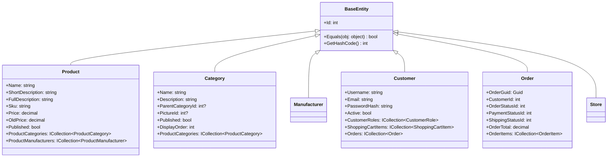
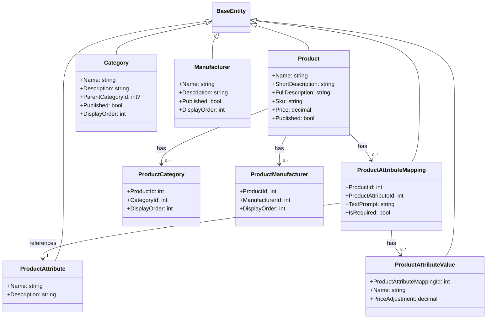
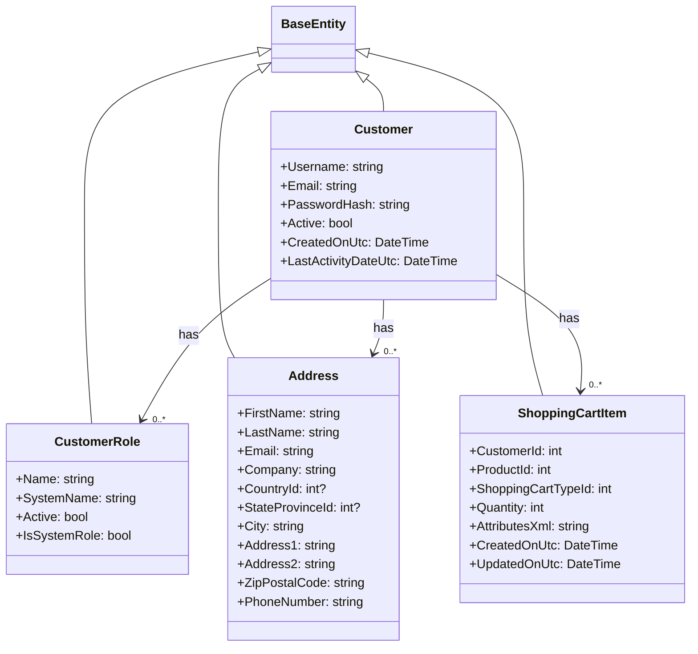
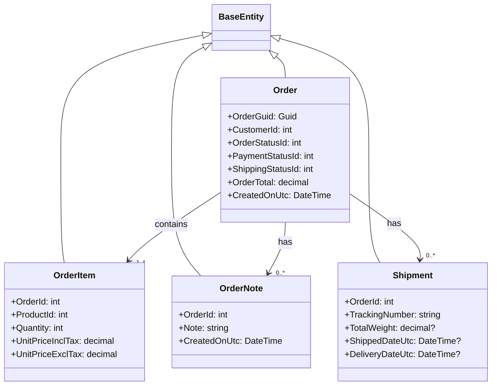
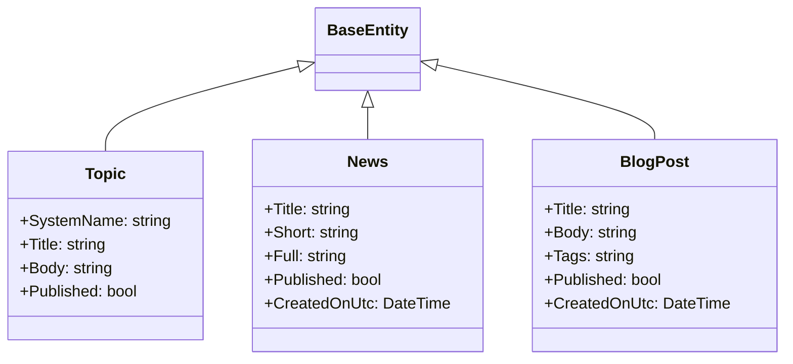
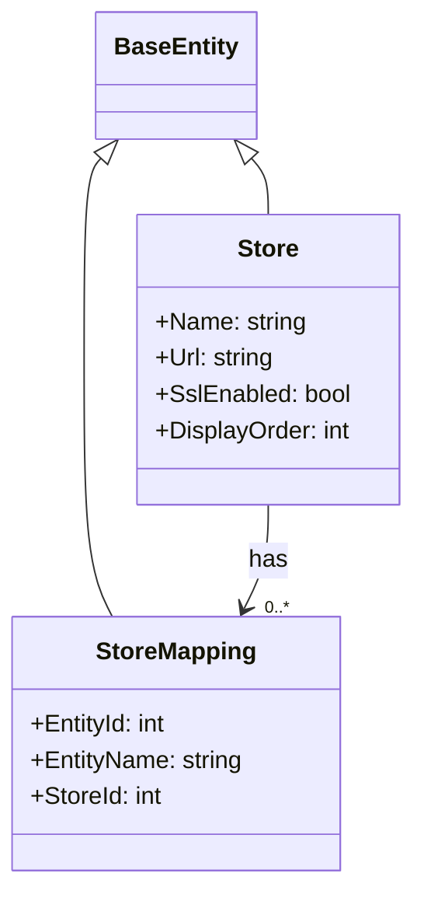

# nopCommerce Domain Model

[Home](../../index.md) | [Core Framework](index.md) | [Previous: Core Framework](index.md) | [Next: Infrastructure](infrastructure.md)

## Introduction

The domain model is the heart of the nopCommerce application, representing the core business entities and their relationships. This document describes the architecture of the domain model, which is defined in the `Nop.Core` project.

## Domain Model Overview

The nopCommerce domain model follows a rich domain model approach, where entities encapsulate both data and behavior. All domain entities inherit from the `BaseEntity` class, which provides basic identity and equality functionality.



## Core Domain Areas

The domain model is organized into several core areas:

### Catalog Domain

The catalog domain represents products and their organization.



### Customer Domain

The customer domain represents users and their roles.



### Order Domain

The order domain represents the purchasing process.



### Content Domain

The content domain represents informational content.



### Multi-Store Domain

The multi-store domain represents store configuration.



## Entity Relationships

nopCommerce entities are related in various ways, forming a complex object graph. The most common relationships are:

### One-to-Many Relationships

One-to-many relationships are represented by navigation properties in the parent entity and a foreign key in the child entity.

```csharp
// Parent entity
public class Category : BaseEntity
{
    public virtual ICollection<ProductCategory> ProductCategories { get; set; }
}

// Child entity
public class ProductCategory : BaseEntity
{
    public int CategoryId { get; set; }
    public int ProductId { get; set; }
    public int DisplayOrder { get; set; }
    
    public virtual Category Category { get; set; }
    public virtual Product Product { get; set; }
}
```

### Many-to-Many Relationships

Many-to-many relationships are represented using junction tables, implemented as separate entities.

```csharp
// Entity 1
public class Product : BaseEntity
{
    public virtual ICollection<ProductCategory> ProductCategories { get; set; }
}

// Junction entity
public class ProductCategory : BaseEntity
{
    public int CategoryId { get; set; }
    public int ProductId { get; set; }
    
    public virtual Category Category { get; set; }
    public virtual Product Product { get; set; }
}

// Entity 2
public class Category : BaseEntity
{
    public virtual ICollection<ProductCategory> ProductCategories { get; set; }
}
```

### Inheritance

Inheritance is used sparingly in the domain model, primarily through the `BaseEntity` class.

```csharp
public abstract class BaseEntity
{
    public int Id { get; set; }
}

public class Product : BaseEntity
{
    // Product-specific properties
}
```

## Domain Entity Design Principles

The nopCommerce domain model follows several key design principles:

### 1. Rich Domain Model

Entities encapsulate both data and behavior, with logic that pertains directly to the entity included within the entity class.

### 2. Persistence Ignorance

Domain entities are designed to be persistence-ignorant, meaning they don't have direct dependencies on the data access layer.

### 3. Immutable Identity

Entity identity is immutable once established, with the `Id` property serving as the primary identifier.

### 4. Value Objects

Value objects are used for concepts that don't have an identity, such as money, dates, and addresses.

### 5. Validation

Entity validation is primarily handled at the service layer, not within the entities themselves.

## Entity Configuration

Entity configuration is separated from the entities themselves and defined in the Data layer using Entity Framework Core's Fluent API.

```csharp
// In Nop.Data project
public class ProductMap : NopEntityTypeConfiguration<Product>
{
    public override void Configure(EntityTypeBuilder<Product> builder)
    {
        builder.ToTable(nameof(Product));
        builder.HasKey(product => product.Id);
        
        builder.Property(product => product.Name).HasMaxLength(400).IsRequired();
        builder.Property(product => product.Price).HasPrecision(18, 4);
        // Additional configuration
    }
}
```

## Settings and Configuration Entities

nopCommerce uses strongly-typed settings classes that inherit from `ISettings` to represent configuration:

```csharp
public class CatalogSettings : ISettings
{
    public bool ShowProductSku { get; set; }
    public bool ShowManufacturerPartNumber { get; set; }
    public bool ShowGtin { get; set; }
    // Additional settings
}
```

## Localization and Store Mapping

Entities that support localization and multi-store functionality implement specific interfaces:

```csharp
public interface ILocalizedEntity
{
    // Marker interface for localized entities
}

public interface IStoreMappingSupported
{
    // Marker interface for store-mapped entities
}

public class Product : BaseEntity, ILocalizedEntity, IStoreMappingSupported
{
    // Product properties
}
```

## Generic Attributes

nopCommerce uses a flexible approach to extend entities without modifying their structure, through generic attributes:

```csharp
public class GenericAttribute : BaseEntity
{
    public int EntityId { get; set; }
    public string EntityName { get; set; }
    public string KeyGroup { get; set; }
    public string Key { get; set; }
    public string Value { get; set; }
    public int StoreId { get; set; }
}
```

This allows for dynamic extension of entities without schema changes.

## Conclusion

The nopCommerce domain model provides a rich representation of the e-commerce domain, with entities that encapsulate both data and behavior. Understanding this model is essential for effective customization and extension of the platform.

---

*Next: [Infrastructure](infrastructure.md)*

---

*[Home](../../index.md) | [Core Framework](index.md) | [Previous: Core Framework](index.md) | [Next: Infrastructure](infrastructure.md)*