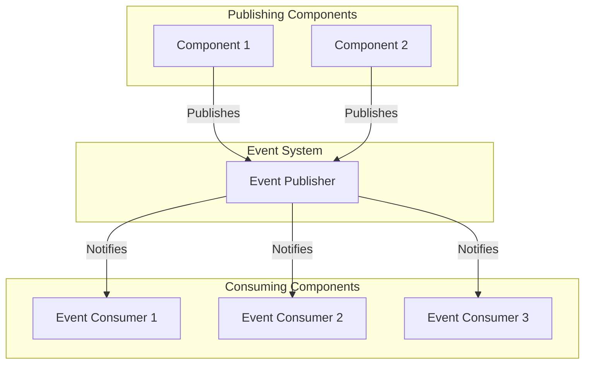
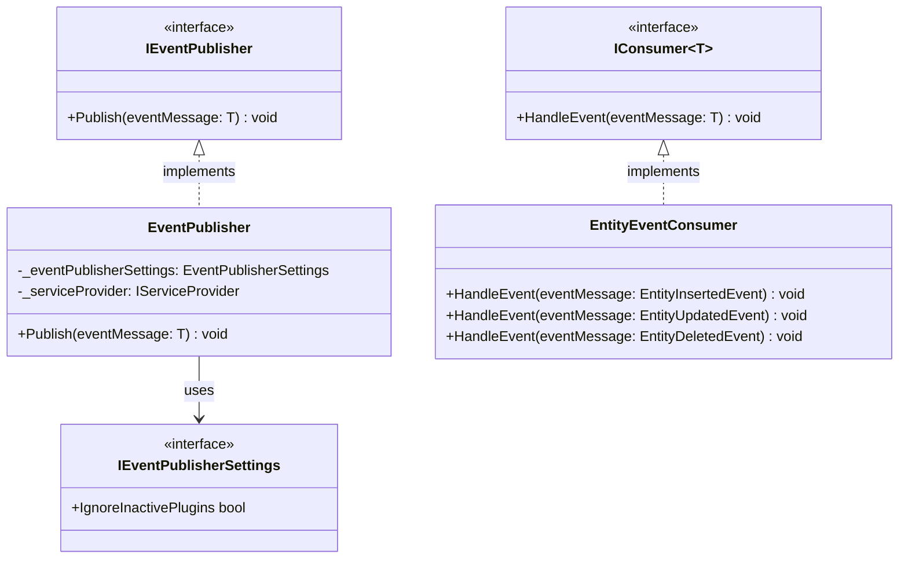
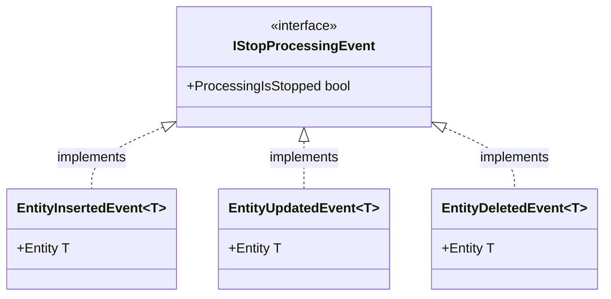
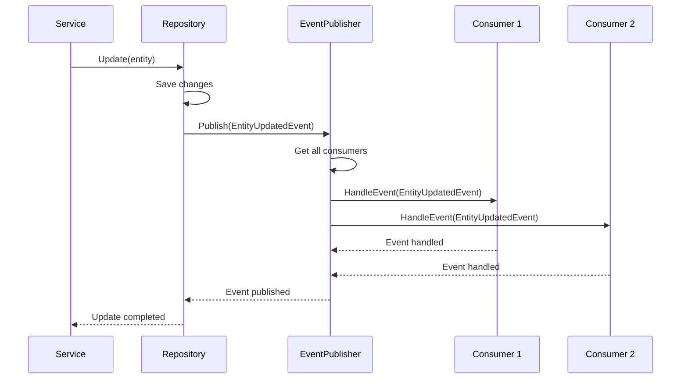

# nopCommerce Events System

[Home](../../index.md) | [Core Framework](index.md) | [Previous: Caching System](caching.md) | [Next: Configuration](configuration.md)

## Introduction

The nopCommerce events system enables loose coupling between components by allowing them to communicate through events rather than direct method calls. This document explores the architecture of the events system, which is defined in the `Nop.Core.Events` namespace.

## Events System Overview



## Core Event Interfaces

The events system is built around several key interfaces:



### IEventPublisher

This interface defines the method for publishing events:

```csharp
/// <summary>
/// Event publisher
/// </summary>
public interface IEventPublisher
{
    /// <summary>
    /// Publish event
    /// </summary>
    /// <typeparam name="TEvent">Type of event</typeparam>
    /// <param name="eventMessage">Event message</param>
    void Publish<TEvent>(TEvent eventMessage);
}
```

### IConsumer

This interface defines the method for consuming events:

```csharp
/// <summary>
/// Consumer interface
/// </summary>
/// <typeparam name="T">Type</typeparam>
public interface IConsumer<in T>
{
    /// <summary>
    /// Handle event
    /// </summary>
    /// <param name="eventMessage">Event message</param>
    void HandleEvent(T eventMessage);
}
```

## Event Publisher Implementation

The `EventPublisher` class implements the `IEventPublisher` interface:

```csharp
/// <summary>
/// Event publisher
/// </summary>
public class EventPublisher : IEventPublisher
{
    private readonly IServiceProvider _serviceProvider;
    private readonly IEventPublisherSettings _eventPublisherSettings;

    public EventPublisher(IServiceProvider serviceProvider, IEventPublisherSettings eventPublisherSettings)
    {
        _serviceProvider = serviceProvider;
        _eventPublisherSettings = eventPublisherSettings;
    }

    /// <summary>
    /// Publish event
    /// </summary>
    /// <typeparam name="TEvent">Type of event</typeparam>
    /// <param name="eventMessage">Event message</param>
    public virtual void Publish<TEvent>(TEvent eventMessage)
    {
        // Get all event consumers
        var consumers = _serviceProvider.GetServices<IConsumer<TEvent>>().ToList();

        if (!consumers.Any())
            return;

        // Handle the event in each consumer
        foreach (var consumer in consumers)
        {
            try
            {
                var eventConsumerInstance = consumer;

                // Check if consumer is from a plugin that is not active
                if (_eventPublisherSettings.IgnoreInactivePlugins && 
                    IsConsumerFromInactivePlugin(eventConsumerInstance))
                {
                    continue;
                }

                // Check if we should stop processing
                if (eventMessage is IStopProcessingEvent stopProcessingEvent && 
                    stopProcessingEvent.ProcessingIsStopped)
                {
                    break;
                }

                // Handle the event
                eventConsumerInstance.HandleEvent(eventMessage);
            }
            catch (Exception ex)
            {
                // Log error
                // Continue with other consumers
            }
        }
    }

    /// <summary>
    /// Check if consumer is from an inactive plugin
    /// </summary>
    /// <param name="consumer">Consumer</param>
    /// <returns>Result</returns>
    protected virtual bool IsConsumerFromInactivePlugin(object consumer)
    {
        // Get consumer type
        var consumerType = consumer.GetType();

        // Get assembly
        var assembly = consumerType.Assembly;

        // Check if it's a plugin assembly
        if (!assembly.FullName.Contains("Nop.Plugin."))
            return false;

        // Check if plugin is active
        // ...

        return false;
    }
}
```

## Entity Events

nopCommerce defines several event types for entity operations:



### Entity Event Classes

```csharp
/// <summary>
/// A container for entities that have been inserted
/// </summary>
/// <typeparam name="T">Entity type</typeparam>
public class EntityInsertedEvent<T> : IStopProcessingEvent where T : BaseEntity
{
    /// <summary>
    /// Ctor
    /// </summary>
    /// <param name="entity">Entity</param>
    public EntityInsertedEvent(T entity)
    {
        Entity = entity;
    }

    /// <summary>
    /// Entity
    /// </summary>
    public T Entity { get; }

    /// <summary>
    /// Gets or sets a value indicating whether to stop processing the event
    /// </summary>
    public bool ProcessingIsStopped { get; set; }
}

/// <summary>
/// A container for entities that have been updated
/// </summary>
/// <typeparam name="T">Entity type</typeparam>
public class EntityUpdatedEvent<T> : IStopProcessingEvent where T : BaseEntity
{
    /// <summary>
    /// Ctor
    /// </summary>
    /// <param name="entity">Entity</param>
    public EntityUpdatedEvent(T entity)
    {
        Entity = entity;
    }

    /// <summary>
    /// Entity
    /// </summary>
    public T Entity { get; }

    /// <summary>
    /// Gets or sets a value indicating whether to stop processing the event
    /// </summary>
    public bool ProcessingIsStopped { get; set; }
}

/// <summary>
/// A container for entities that have been deleted
/// </summary>
/// <typeparam name="T">Entity type</typeparam>
public class EntityDeletedEvent<T> : IStopProcessingEvent where T : BaseEntity
{
    /// <summary>
    /// Ctor
    /// </summary>
    /// <param name="entity">Entity</param>
    public EntityDeletedEvent(T entity)
    {
        Entity = entity;
    }

    /// <summary>
    /// Entity
    /// </summary>
    public T Entity { get; }

    /// <summary>
    /// Gets or sets a value indicating whether to stop processing the event
    /// </summary>
    public bool ProcessingIsStopped { get; set; }
}
```

## Event Consumer Registration

Event consumers are registered with the dependency injection container during application startup:

```csharp
public static class ServiceCollectionExtensions
{
    public static IServiceCollection AddNopEvents(this IServiceCollection services, ITypeFinder typeFinder)
    {
        // Find all event consumers
        var consumerTypes = typeFinder.FindClassesOfType(typeof(IConsumer<>));
        
        // Register each consumer type
        foreach (var consumerType in consumerTypes)
        {
            // Get all interfaces implemented by the consumer
            var interfaces = consumerType.FindInterfaces((type, criteria) =>
            {
                var isMatch = type.IsGenericType && ((Type)criteria).IsAssignableFrom(type.GetGenericTypeDefinition());
                return isMatch;
            }, typeof(IConsumer<>));

            // Register for each event type
            foreach (var interfaceType in interfaces)
            {
                // Register as transient (new instance for each event)
                services.AddTransient(interfaceType, consumerType);
            }
        }
        
        return services;
    }
}
```

## Common Event Types

nopCommerce defines several common event types for various scenarios:

### Application Events

```csharp
/// <summary>
/// App started event
/// </summary>
public class AppStartedEvent
{
}
```

### Configuration Events

```csharp
/// <summary>
/// Settings saved event
/// </summary>
public class SettingsSavedEvent
{
    /// <summary>
    /// Settings type
    /// </summary>
    public Type SettingsType { get; }

    /// <summary>
    /// Ctor
    /// </summary>
    /// <param name="settingsType">Settings type</param>
    public SettingsSavedEvent(Type settingsType)
    {
        SettingsType = settingsType;
    }
}
```

### Order Events

```csharp
/// <summary>
/// Order placed event
/// </summary>
public class OrderPlacedEvent
{
    /// <summary>
    /// Ctor
    /// </summary>
    /// <param name="order">Order</param>
    public OrderPlacedEvent(Order order)
    {
        Order = order;
    }

    /// <summary>
    /// Order
    /// </summary>
    public Order Order { get; }
}
```

## Event Publishing

Events are published using the `IEventPublisher` interface:

```csharp
public class OrderService : IOrderService
{
    private readonly IEventPublisher _eventPublisher;
    private readonly IRepository<Order> _orderRepository;
    
    public OrderService(IEventPublisher eventPublisher, IRepository<Order> orderRepository)
    {
        _eventPublisher = eventPublisher;
        _orderRepository = orderRepository;
    }
    
    public virtual Order PlaceOrder(/*parameters*/)
    {
        // Create order
        var order = new Order
        {
            // Set order properties
        };
        
        // Save order
        _orderRepository.Insert(order);
        
        // Publish event
        _eventPublisher.Publish(new OrderPlacedEvent(order));
        
        return order;
    }
}
```

## Entity Event Publishing

Entity events are published automatically by the repository pattern implementation:

```csharp
public class EntityRepository<T> : IRepository<T> where T : BaseEntity
{
    private readonly IEventPublisher _eventPublisher;
    private readonly DbContext _context;
    private readonly DbSet<T> _entities;
    
    public EntityRepository(DbContext context, IEventPublisher eventPublisher)
    {
        _context = context;
        _eventPublisher = eventPublisher;
        _entities = context.Set<T>();
    }
    
    public void Insert(T entity)
    {
        if (entity == null)
            throw new ArgumentNullException(nameof(entity));
        
        _entities.Add(entity);
        _context.SaveChanges();
        
        // Publish event
        _eventPublisher.Publish(new EntityInsertedEvent<T>(entity));
    }
    
    public void Update(T entity)
    {
        if (entity == null)
            throw new ArgumentNullException(nameof(entity));
        
        _context.Entry(entity).State = EntityState.Modified;
        _context.SaveChanges();
        
        // Publish event
        _eventPublisher.Publish(new EntityUpdatedEvent<T>(entity));
    }
    
    public void Delete(T entity)
    {
        if (entity == null)
            throw new ArgumentNullException(nameof(entity));
        
        _entities.Remove(entity);
        _context.SaveChanges();
        
        // Publish event
        _eventPublisher.Publish(new EntityDeletedEvent<T>(entity));
    }
}
```

## Event Consumption

Event consumers implement the `IConsumer<T>` interface for each event type they want to handle:

```csharp
public class OrderEventConsumer : 
    IConsumer<OrderPlacedEvent>,
    IConsumer<OrderPaidEvent>,
    IConsumer<OrderCompletedEvent>
{
    private readonly IEmailService _emailService;
    
    public OrderEventConsumer(IEmailService emailService)
    {
        _emailService = emailService;
    }
    
    public void HandleEvent(OrderPlacedEvent eventMessage)
    {
        // Send order confirmation email
        _emailService.SendOrderConfirmationEmail(eventMessage.Order);
    }
    
    public void HandleEvent(OrderPaidEvent eventMessage)
    {
        // Send order paid notification
        _emailService.SendOrderPaidEmail(eventMessage.Order);
    }
    
    public void HandleEvent(OrderCompletedEvent eventMessage)
    {
        // Send order completed notification
        _emailService.SendOrderCompletedEmail(eventMessage.Order);
    }
}
```

## Event Processing Extension Methods

nopCommerce provides extension methods for the `IEventPublisher` interface to make event publishing more convenient:

```csharp
public static class EventPublisherExtensions
{
    /// <summary>
    /// Entity inserted
    /// </summary>
    /// <typeparam name="T">Entity type</typeparam>
    /// <param name="eventPublisher">Event publisher</param>
    /// <param name="entity">Entity</param>
    public static void EntityInserted<T>(this IEventPublisher eventPublisher, T entity) where T : BaseEntity
    {
        eventPublisher.Publish(new EntityInsertedEvent<T>(entity));
    }

    /// <summary>
    /// Entity updated
    /// </summary>
    /// <typeparam name="T">Entity type</typeparam>
    /// <param name="eventPublisher">Event publisher</param>
    /// <param name="entity">Entity</param>
    public static void EntityUpdated<T>(this IEventPublisher eventPublisher, T entity) where T : BaseEntity
    {
        eventPublisher.Publish(new EntityUpdatedEvent<T>(entity));
    }

    /// <summary>
    /// Entity deleted
    /// </summary>
    /// <typeparam name="T">Entity type</typeparam>
    /// <param name="eventPublisher">Event publisher</param>
    /// <param name="entity">Entity</param>
    public static void EntityDeleted<T>(this IEventPublisher eventPublisher, T entity) where T : BaseEntity
    {
        eventPublisher.Publish(new EntityDeletedEvent<T>(entity));
    }
}
```

## Event Flow

The following sequence diagram illustrates the flow of events in nopCommerce:



## Custom Events

Developers can create custom events for specific scenarios:

```csharp
/// <summary>
/// Customer registered event
/// </summary>
public class CustomerRegisteredEvent
{
    /// <summary>
    /// Ctor
    /// </summary>
    /// <param name="customer">Customer</param>
    public CustomerRegisteredEvent(Customer customer)
    {
        Customer = customer;
    }

    /// <summary>
    /// Customer
    /// </summary>
    public Customer Customer { get; }
}

/// <summary>
/// Customer registered event consumer
/// </summary>
public class CustomerRegisteredEventConsumer : IConsumer<CustomerRegisteredEvent>
{
    private readonly IEmailService _emailService;
    
    public CustomerRegisteredEventConsumer(IEmailService emailService)
    {
        _emailService = emailService;
    }
    
    public void HandleEvent(CustomerRegisteredEvent eventMessage)
    {
        // Send welcome email
        _emailService.SendWelcomeEmail(eventMessage.Customer);
    }
}
```

## Event Best Practices

When working with the nopCommerce events system, consider the following best practices:

### 1. Use Events for Cross-Cutting Concerns

Events are ideal for cross-cutting concerns like logging, caching, and notifications.

```csharp
public class ProductEventConsumer : 
    IConsumer<EntityInsertedEvent<Product>>,
    IConsumer<EntityUpdatedEvent<Product>>,
    IConsumer<EntityDeletedEvent<Product>>
{
    private readonly ILogger _logger;
    private readonly IStaticCacheManager _cacheManager;
    
    public ProductEventConsumer(ILogger logger, IStaticCacheManager cacheManager)
    {
        _logger = logger;
        _cacheManager = cacheManager;
    }
    
    public void HandleEvent(EntityInsertedEvent<Product> eventMessage)
    {
        // Log product insertion
        _logger.Information($"Product '{eventMessage.Entity.Name}' was inserted");
        
        // Clear cache
        _cacheManager.RemoveByPrefix(NopEntityCacheDefaults.ProductsPrefix);
    }
    
    // Similar implementations for update and delete events
}
```

### 2. Keep Event Handlers Lightweight

Event handlers should be lightweight and avoid complex operations that could block the event publisher.

```csharp
public void HandleEvent(OrderPlacedEvent eventMessage)
{
    // Don't do this:
    // _emailService.SendOrderConfirmationEmail(eventMessage.Order); // Might be slow
    
    // Instead, queue the operation:
    _backgroundJobManager.Enqueue<IEmailSender>(x => x.SendOrderConfirmationEmail(eventMessage.Order.Id));
}
```

### 3. Use the StopProcessingEvent Feature When Appropriate

The `IStopProcessingEvent` interface allows consumers to stop further processing of an event.

```csharp
public void HandleEvent(EntityInsertedEvent<Product> eventMessage)
{
    var product = eventMessage.Entity;
    
    // Check if product is valid
    if (!IsProductValid(product))
    {
        // Stop further processing
        eventMessage.ProcessingIsStopped = true;
        
        // Log warning
        _logger.Warning($"Invalid product '{product.Name}' was inserted");
    }
}
```

### 4. Organize Consumers by Domain

Organize event consumers by domain to improve maintainability.

```csharp
// Catalog domain consumers
public class CatalogEventConsumer : 
    IConsumer<EntityInsertedEvent<Product>>,
    IConsumer<EntityUpdatedEvent<Product>>,
    IConsumer<EntityDeletedEvent<Product>>
{
    // Implementation
}

// Order domain consumers
public class OrderEventConsumer : 
    IConsumer<OrderPlacedEvent>,
    IConsumer<OrderPaidEvent>,
    IConsumer<OrderCompletedEvent>
{
    // Implementation
}
```

### 5. Use Dependency Injection in Consumers

Inject dependencies into event consumers rather than creating them directly.

```csharp
public class CustomerEventConsumer : IConsumer<CustomerRegisteredEvent>
{
    private readonly IEmailService _emailService;
    private readonly ICustomerService _customerService;
    private readonly IRewardPointService _rewardPointService;
    
    public CustomerEventConsumer(
        IEmailService emailService,
        ICustomerService customerService,
        IRewardPointService rewardPointService)
    {
        _emailService = emailService;
        _customerService = customerService;
        _rewardPointService = rewardPointService;
    }
    
    public void HandleEvent(CustomerRegisteredEvent eventMessage)
    {
        // Use injected services
        _emailService.SendWelcomeEmail(eventMessage.Customer);
        _rewardPointService.AddWelcomePoints(eventMessage.Customer);
    }
}
```

## Conclusion

The nopCommerce events system provides a powerful mechanism for loose coupling between components. By using events, components can communicate without direct dependencies, making the system more maintainable and extensible. This is particularly important for plugins, which can respond to events from the core system without modifying it.

---

*Next: [Configuration](configuration.md)*

---

*[Home](../../index.md) | [Core Framework](index.md) | [Previous: Caching System](caching.md) | [Next: Configuration](configuration.md)*