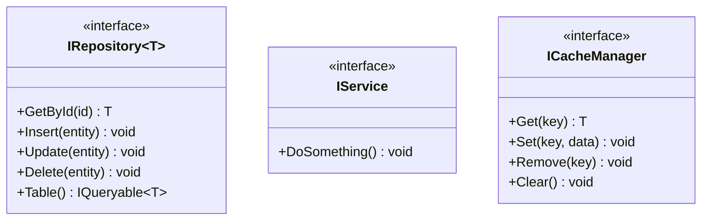
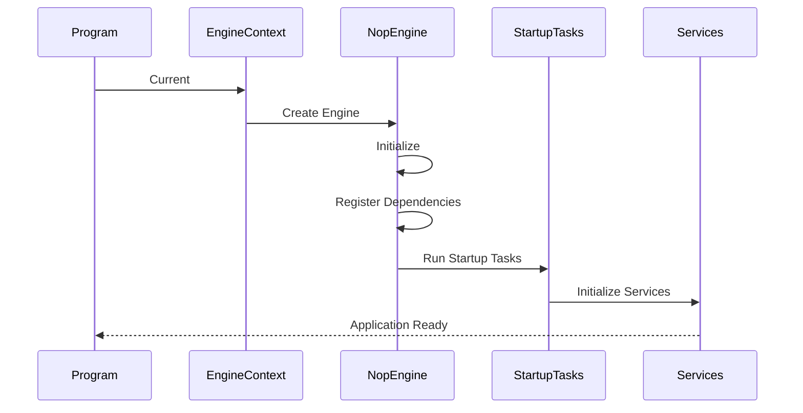

# nopCommerce Core Framework

[Home](../../index.md) | [Core Framework](index.md) | [Previous: Key Concepts](../overview/key-concepts.md) | [Next: Domain Model](domain-model.md)

## Introduction

The Core Framework provides the foundation for the entire nopCommerce platform. It contains the domain entities, interfaces, and core infrastructure components that are used throughout the application. This section explores the architecture of the Core Framework, which is implemented in the `Nop.Core` project.

## Core Framework Components

```mermaid
graph TD
    Core[Nop.Core] --> Domain[Domain Entities]
    Core --> Infrastructure[Infrastructure]
    Core --> Caching[Caching System]
    Core --> Events[Events System]
    Core --> Configuration[Configuration]
    Core --> Extensions[Extensions]
    Core --> Helpers[Helper Classes]
    
    Domain --> BaseEntity[BaseEntity]
    Domain --> Entities[Domain Entities]
    
    Infrastructure --> Engine[Engine]
    Infrastructure --> TypeFinder[Type Finder]
    Infrastructure --> FileProvider[File Provider]
    Infrastructure --> Singleton[Singleton]
    Infrastructure --> DependencyManagement[DI Infrastructure]
    
    Caching --> CacheKey[Cache Keys]
    Caching --> CacheManager[Cache Manager]
    Caching --> MemoryCache[Memory Cache]
    Caching --> DistributedCache[Distributed Cache]
    
    Events --> EventPublisher[Event Publisher]
    Events --> EventConsumer[Event Consumer]
    Events --> EntityEvents[Entity Events]
```



## In This Section

- [Domain Model](domain-model.md) - Core entities and domain objects
- [Infrastructure](infrastructure.md) - Engine, type finder, and other infrastructure components
- [Caching System](caching.md) - Multi-level caching architecture
- [Events System](events.md) - Event publishing and consumption
- [Configuration](configuration.md) - Configuration management

## Core Responsibilities

The Nop.Core project has several key responsibilities within the nopCommerce architecture:

### 1. Domain Model Definition

The Core project defines the domain entities that represent the core business objects of the application, such as:

- Products, Categories, Manufacturers
- Customers, Orders, Shopping Carts
- Stores, Vendors, Affiliates

These entities are implemented as POCO (Plain Old CLR Objects) classes that inherit from the `BaseEntity` class.

### 2. Infrastructure Services

The Core project provides infrastructure services that are used throughout the application:

- **Engine**: Manages service resolution and initialization
- **Type Finder**: Discovers types at runtime
- **File Provider**: Abstracts file system operations
- **Application Context**: Provides application-level context

### 3. Caching Infrastructure

The Core project defines the caching infrastructure that is used to improve performance:

- **Cache Manager**: Manages cache operations
- **Cache Key Management**: Standardizes cache key generation
- **Memory Cache**: In-memory caching
- **Distributed Cache**: Support for distributed caching (Redis, SQL Server)

### 4. Event System

The Core project defines the event system that enables loose coupling between components:

- **Event Publisher**: Publishes events to subscribers
- **Event Consumers**: Receive and handle events
- **Entity Events**: Standard events for entity operations

### 5. Configuration Management

The Core project defines the configuration system that manages application settings:

- **App Settings**: Application-level settings
- **Settings Interface**: Interface for typed settings
- **Configuration Providers**: Sources of configuration data

## Architectural Principles

The Core framework is designed according to several key architectural principles:

### 1. Separation of Concerns

The Core project focuses solely on defining the domain model and core infrastructure, without including business logic (which belongs in the Services layer) or data access logic (which belongs in the Data layer).

### 2. Dependency Inversion

The Core project defines interfaces that are implemented by other projects, following the Dependency Inversion Principle. This allows higher-level components to depend on abstractions rather than concrete implementations.

### 3. Interface-Based Design

Core services are defined through interfaces, allowing for different implementations and easier testing.



### 4. Minimizing Dependencies

The Core project has minimal external dependencies, making it more maintainable and less susceptible to external changes.

### 5. Cross-Cutting Concerns

The Core project provides infrastructure for cross-cutting concerns such as caching, events, and configuration that are used throughout the application.

## Core Project Structure

The Nop.Core project is organized into the following directory structure:

```
Nop.Core/
├── Domain/             # Domain entities
├── Infrastructure/     # Core infrastructure
│   ├── Engine/         # Application engine
│   ├── DependencyManagement/ # DI infrastructure
│   ├── TypeFinder/     # Type discovery
│   └── FileProvider/   # File system abstraction
├── Caching/            # Caching infrastructure
├── Events/             # Event system
├── Configuration/      # Configuration management
├── Data/               # Data-related interfaces
├── Http/               # HTTP-related utilities
├── ComponentModel/     # Component model extensions
└── Extensions/         # Extension methods
```

## Key Abstractions

The Core framework defines several key abstractions that are implemented throughout the application:

- **IEngine**: Core engine interface
- **ITypeFinder**: Type discovery interface
- **INopFileProvider**: File system abstraction
- **IRepository<T>**: Data access abstraction
- **IStaticCacheManager**: Caching abstraction
- **IEventPublisher**: Event publishing abstraction
- **ISettingService**: Settings management abstraction
- **IWorkContext**: Work context abstraction
- **IStoreContext**: Store context abstraction

## Startup Process

The Core framework includes infrastructure for application startup, with the following key components:

- **IEngine**: Manages service resolution and initialization
- **EngineContext**: Provides access to the engine
- **INopStartup**: Interface for startup classes
- **IStartupTask**: Interface for tasks that run at startup



## Conclusion

The Core Framework provides the foundation for the entire nopCommerce platform. By understanding its architecture and components, developers can effectively extend and customize nopCommerce while maintaining compatibility with the core framework.

---

*Next: [Domain Model](domain-model.md)*

---

*[Home](../../index.md) | [Core Framework](index.md) | [Previous: Key Concepts](../overview/key-concepts.md) | [Next: Domain Model](domain-model.md)*