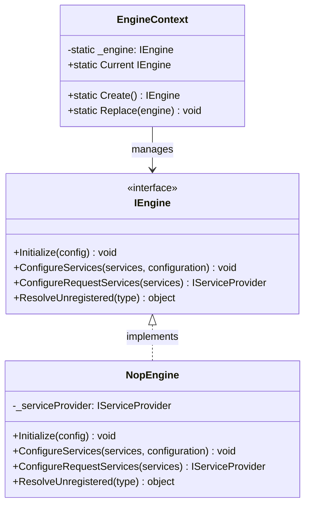
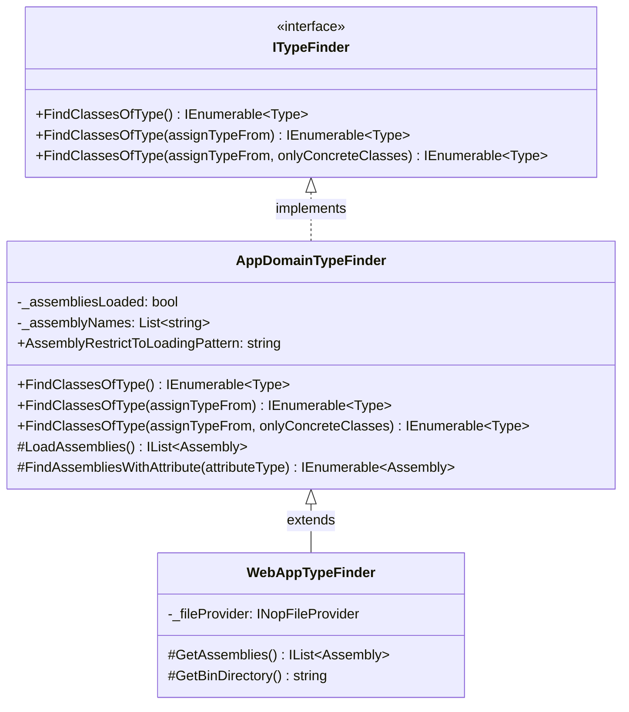
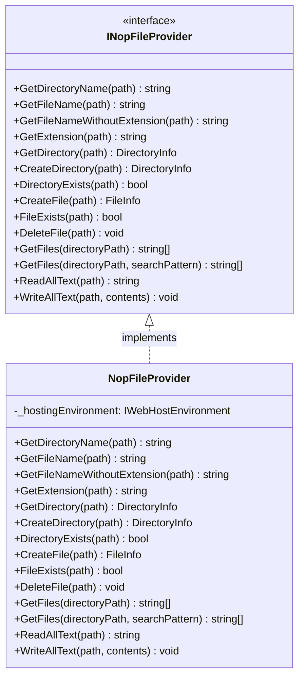
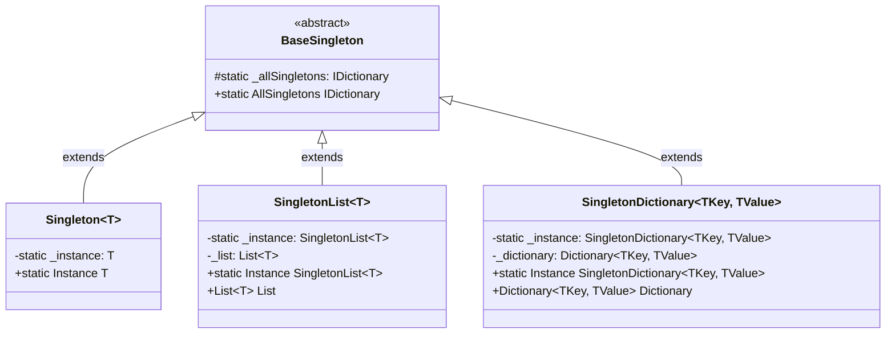
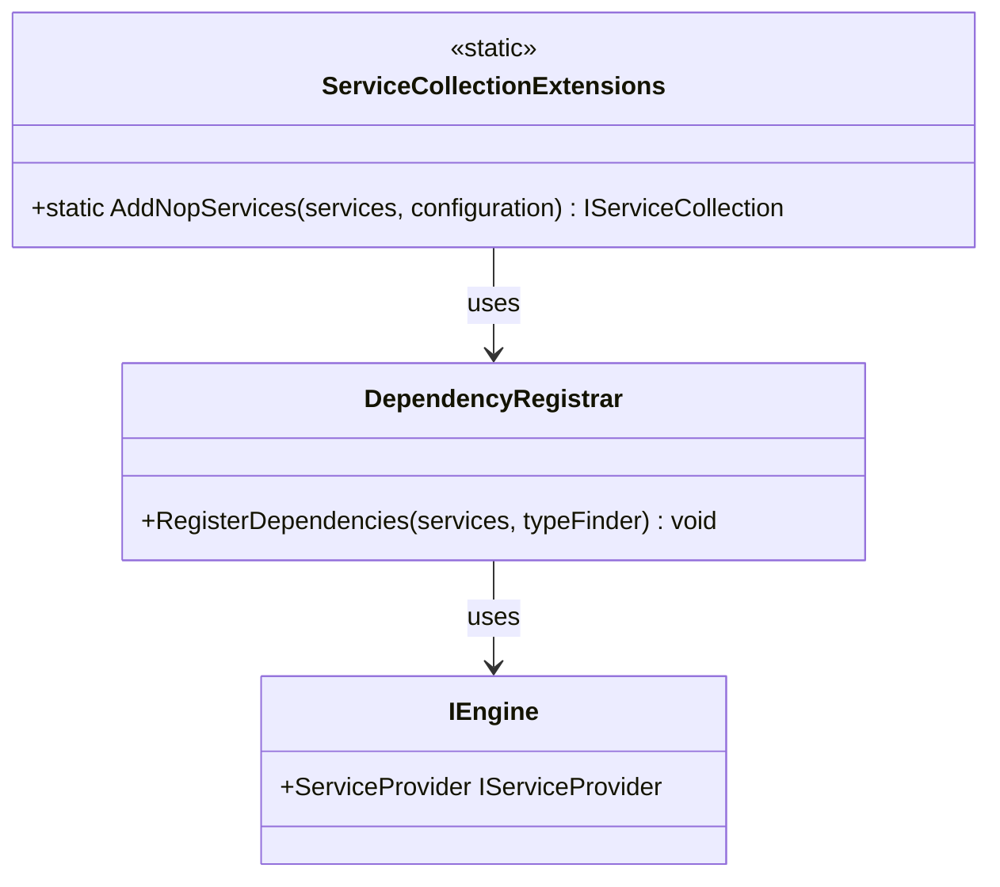
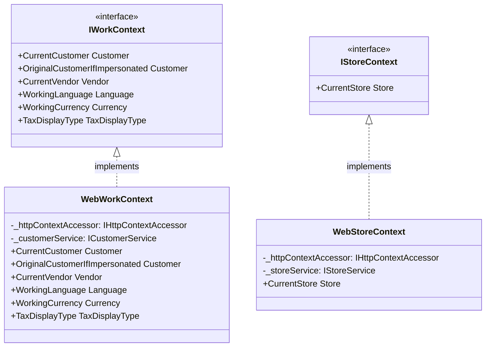
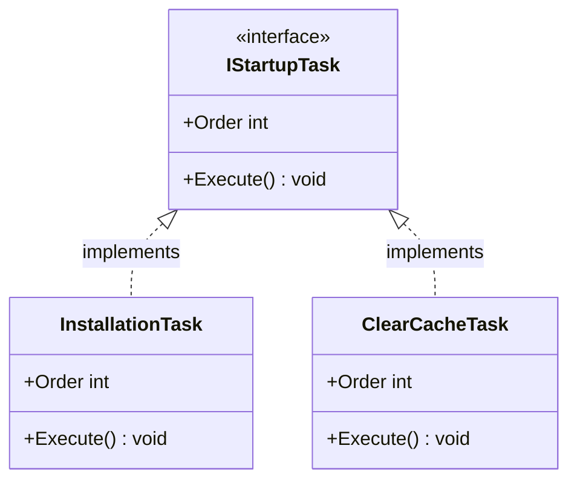

# nopCommerce Infrastructure

[Home](../../index.md) | [Core Framework](index.md) | [Previous: Domain Model](domain-model.md) | [Next: Caching System](caching.md)

## Introduction

The infrastructure components in nopCommerce provide the foundational services that support the entire application. These components are primarily defined in the `Nop.Core` project, in the `Infrastructure` namespace. This document explores the architecture of these critical infrastructure components.

## Infrastructure Overview

```mermaid
graph TD
    Infrastructure[Infrastructure Components]
    Infrastructure --> Engine[Engine]
    Infrastructure --> TypeFinder[Type Finder]
    Infrastructure --> FileProvider[File Provider]
    Infrastructure --> Singleton[Singleton Pattern]
    Infrastructure --> DependencyManagement[Dependency Management]
    Infrastructure --> AppContext[Application Context]
    Infrastructure --> StartupTasks[Startup Tasks]
    
    Engine --> ServiceProvider[Service Provider]
    Engine --> ConfigureServices[Service Configuration]
    
    TypeFinder --> AppDomainTypeFinder[AppDomain Type Finder]
    TypeFinder --> WebAppTypeFinder[Web App Type Finder]
    
    FileProvider --> PhysicalFileProvider[Physical File Provider]
    FileProvider --> RobotsFileProvider[Robots.txt Provider]
    
    Singleton --> BaseSingleton[Base Singleton]
    Singleton --> SingletonList[Singleton List]
    Singleton --> SingletonDictionary[Singleton Dictionary]
    
    DependencyManagement --> AutofacContainer[Autofac Container]
    DependencyManagement --> ContainerManager[Container Manager]
    
    AppContext --> WebContext[Web Context]
    AppContext --> WebHelper[Web Helper]
    
    StartupTasks --> IStartupTask[IStartupTask Interface]
    StartupTasks --> RunTasks[Task Runner]
```



## Engine Architecture

The Engine is the central component of nopCommerce infrastructure, responsible for managing services and providing access to them throughout the application.



### Engine Responsibilities

1. **Service Registration**: Registers all services with the dependency injection container
2. **Service Resolution**: Resolves services from the container
3. **Application Initialization**: Initializes the application and runs startup tasks
4. **Request Pipeline Configuration**: Configures the HTTP request pipeline

### Engine Implementation

The `NopEngine` class implements the `IEngine` interface:

```csharp
public class NopEngine : IEngine
{
    private IServiceProvider _serviceProvider;

    public virtual IServiceProvider ServiceProvider => _serviceProvider;

    public virtual void Initialize(IServiceCollection services)
    {
        // Register dependencies
        RegisterDependencies(services);
        
        // Build service provider
        _serviceProvider = services.BuildServiceProvider();
        
        // Run startup tasks
        RunStartupTasks();
    }

    public virtual void ConfigureServices(IServiceCollection services, IConfiguration configuration)
    {
        // Configure service collection
    }

    public virtual IServiceProvider ConfigureRequestServices(IServiceCollection services)
    {
        // Configure request-specific services
        return services.BuildServiceProvider();
    }

    public virtual object ResolveUnregistered(Type type)
    {
        // Resolve unregistered service types
    }

    protected virtual void RegisterDependencies(IServiceCollection services)
    {
        // Register core dependencies
    }

    protected virtual void RunStartupTasks()
    {
        // Execute startup tasks
        var typeFinder = _serviceProvider.GetRequiredService<ITypeFinder>();
        var startupTasks = typeFinder.FindClassesOfType<IStartupTask>();
        
        // Execute tasks in order
        foreach (var task in startupTasks)
        {
            var instance = _serviceProvider.GetRequiredService(task) as IStartupTask;
            instance?.Execute();
        }
    }
}
```

### Engine Context

The `EngineContext` class provides access to the current engine instance:

```csharp
public class EngineContext
{
    private static IEngine _engine;

    public static IEngine Current
    {
        get
        {
            if (_engine == null)
            {
                _engine = Create();
            }
            return _engine;
        }
    }

    public static IEngine Create()
    {
        return new NopEngine();
    }

    public static void Replace(IEngine engine)
    {
        _engine = engine;
    }
}
```

## Type Finder

The Type Finder component discovers types at runtime, which is essential for the plugin system and other dynamic features.



### Type Finder Responsibilities

1. **Type Discovery**: Finds types in loaded assemblies
2. **Plugin Discovery**: Discovers plugin assemblies and types
3. **Startup Task Discovery**: Finds startup tasks to execute at startup
4. **Dependency Registration**: Supports auto-registration of dependencies

### Implementation Details

The `AppDomainTypeFinder` class is the base implementation:

```csharp
public class AppDomainTypeFinder : ITypeFinder
{
    private bool _assembliesLoaded;
    private readonly List<string> _assemblyNames = new();

    public string AssemblyRestrictToLoadingPattern { get; set; } = ".*";
    public bool LoadAppDomainAssemblies { get; set; } = true;

    public virtual IEnumerable<Type> FindClassesOfType<T>()
    {
        return FindClassesOfType(typeof(T));
    }

    public virtual IEnumerable<Type> FindClassesOfType(Type assignTypeFrom)
    {
        return FindClassesOfType(assignTypeFrom, true);
    }

    public virtual IEnumerable<Type> FindClassesOfType(Type assignTypeFrom, bool onlyConcreteClasses)
    {
        // Load assemblies if not already loaded
        if (!_assembliesLoaded)
        {
            LoadAssemblies();
            _assembliesLoaded = true;
        }

        // Search for types in all loaded assemblies
        var result = new List<Type>();
        foreach (var assembly in GetAssemblies())
        {
            Type[] types;
            try
            {
                types = assembly.GetTypes();
            }
            catch
            {
                // Assembly could not be loaded
                continue;
            }

            // Filter types based on criteria
            foreach (var type in types)
            {
                if (assignTypeFrom.IsAssignableFrom(type) || 
                    (assignTypeFrom.IsGenericTypeDefinition && 
                     DoesTypeImplementOpenGeneric(type, assignTypeFrom)))
                {
                    if (!onlyConcreteClasses || 
                        (!type.IsInterface && !type.IsAbstract))
                    {
                        result.Add(type);
                    }
                }
            }
        }
        
        return result;
    }

    protected virtual IList<Assembly> LoadAssemblies()
    {
        // Load assemblies from the AppDomain
        var assemblies = AppDomain.CurrentDomain.GetAssemblies().ToList();
        
        // Load additional assemblies if needed
        return assemblies;
    }
}
```

The `WebAppTypeFinder` extends this for web applications:

```csharp
public class WebAppTypeFinder : AppDomainTypeFinder
{
    private readonly INopFileProvider _fileProvider;

    public WebAppTypeFinder(INopFileProvider fileProvider)
    {
        _fileProvider = fileProvider;
    }

    protected override IList<Assembly> GetAssemblies()
    {
        var assemblies = base.GetAssemblies();
        
        // Add additional assemblies from bin directory
        var binPath = GetBinDirectory();
        if (!string.IsNullOrEmpty(binPath))
        {
            var binFiles = _fileProvider.GetFiles(binPath, "*.dll");
            foreach (var file in binFiles)
            {
                try
                {
                    var assembly = Assembly.LoadFrom(file);
                    assemblies.Add(assembly);
                }
                catch
                {
                    // Could not load assembly
                }
            }
        }
        
        return assemblies;
    }

    protected virtual string GetBinDirectory()
    {
        return AppContext.BaseDirectory;
    }
}
```

## File Provider

The File Provider component abstracts file system operations, making it easier to work with files and directories.



### File Provider Responsibilities

1. **File Operations**: Read, write, and delete files
2. **Directory Operations**: Create, check, and manage directories
3. **Path Management**: Work with file and directory paths
4. **Abstraction**: Abstract physical file system for testability

### Implementation Details

The `NopFileProvider` class implements the `INopFileProvider` interface:

```csharp
public class NopFileProvider : INopFileProvider
{
    private readonly IWebHostEnvironment _hostingEnvironment;

    public NopFileProvider(IWebHostEnvironment hostingEnvironment)
    {
        _hostingEnvironment = hostingEnvironment;
    }

    public virtual string GetDirectoryName(string path)
    {
        return Path.GetDirectoryName(path);
    }

    public virtual string GetFileName(string path)
    {
        return Path.GetFileName(path);
    }

    public virtual string GetFileNameWithoutExtension(string path)
    {
        return Path.GetFileNameWithoutExtension(path);
    }

    public virtual string GetExtension(string path)
    {
        return Path.GetExtension(path);
    }

    public virtual DirectoryInfo GetDirectory(string path)
    {
        return new DirectoryInfo(path);
    }

    public virtual DirectoryInfo CreateDirectory(string path)
    {
        return Directory.CreateDirectory(path);
    }

    public virtual bool DirectoryExists(string path)
    {
        return Directory.Exists(path);
    }

    public virtual FileInfo CreateFile(string path)
    {
        var fileInfo = new FileInfo(path);
        using var stream = fileInfo.Create();
        return fileInfo;
    }

    public virtual bool FileExists(string path)
    {
        return File.Exists(path);
    }

    public virtual void DeleteFile(string path)
    {
        File.Delete(path);
    }

    public virtual string[] GetFiles(string directoryPath)
    {
        return Directory.GetFiles(directoryPath);
    }

    public virtual string[] GetFiles(string directoryPath, string searchPattern)
    {
        return Directory.GetFiles(directoryPath, searchPattern);
    }

    public virtual string ReadAllText(string path)
    {
        return File.ReadAllText(path);
    }

    public virtual void WriteAllText(string path, string contents)
    {
        File.WriteAllText(path, contents);
    }
}
```

## Singleton Pattern

nopCommerce implements the Singleton pattern to ensure that certain classes have only one instance throughout the application lifecycle.



### Singleton Implementations

The `BaseSingleton` class is the foundation:

```csharp
public abstract class BaseSingleton
{
    private static readonly IDictionary<Type, object> _allSingletons = new Dictionary<Type, object>();
    
    public static IDictionary<Type, object> AllSingletons => _allSingletons;
}
```

The `Singleton<T>` class provides a type-safe singleton:

```csharp
public class Singleton<T> : BaseSingleton
{
    private static T _instance;

    public static T Instance
    {
        get => _instance;
        set
        {
            _instance = value;
            AllSingletons[typeof(T)] = value;
        }
    }
}
```

## Dependency Management

nopCommerce uses dependency injection extensively, with a custom container management infrastructure.



### Dependency Registration

Dependencies are registered in the `ConfigureServices` method of the application startup:

```csharp
public static class ServiceCollectionExtensions
{
    public static IServiceCollection AddNopServices(this IServiceCollection services, IConfiguration configuration)
    {
        // Register common services
        services.AddSingleton<ITypeFinder, WebAppTypeFinder>();
        services.AddSingleton<INopFileProvider, NopFileProvider>();
        
        // Get instance of engine
        var engine = EngineContext.Current;
        
        // Register engine
        services.AddSingleton<IEngine>(engine);
        
        // Find dependency registrars
        var typeFinder = engine.Resolve<ITypeFinder>();
        var dependencyRegistrars = typeFinder
            .FindClassesOfType<IDependencyRegistrar>()
            .Select(t => (IDependencyRegistrar)Activator.CreateInstance(t));
        
        // Register dependencies
        foreach (var dependencyRegistrar in dependencyRegistrars)
        {
            dependencyRegistrar.Register(services, typeFinder);
        }
        
        return services;
    }
}
```

## Application Context

nopCommerce provides context objects that encapsulate information about the current request and application state.



### Work Context

The Work Context provides information about the current customer, language, currency, etc.:

```csharp
public interface IWorkContext
{
    Customer CurrentCustomer { get; }
    Customer OriginalCustomerIfImpersonated { get; }
    Vendor CurrentVendor { get; }
    Language WorkingLanguage { get; }
    Currency WorkingCurrency { get; }
    TaxDisplayType TaxDisplayType { get; }
}
```

### Store Context

The Store Context provides information about the current store:

```csharp
public interface IStoreContext
{
    Store CurrentStore { get; }
}
```

## Startup Tasks

Startup Tasks are executed during application initialization to perform one-time setup operations.



### Startup Task Interface

```csharp
public interface IStartupTask
{
    int Order { get; }
    void Execute();
}
```

### Example Implementation

```csharp
public class InstallationTask : IStartupTask
{
    private readonly IInstallationService _installationService;

    public InstallationTask(IInstallationService installationService)
    {
        _installationService = installationService;
    }

    public int Order => 0; // Execute first

    public void Execute()
    {
        // Check if database is installed
        if (!_installationService.DatabaseIsInstalled())
        {
            // Perform automatic installation if configured
            _installationService.InstallData();
        }
    }
}
```

## Conclusion

The infrastructure components of nopCommerce provide a solid foundation for the entire application. They handle essential services like type discovery, file operations, dependency management, and application initialization. Understanding these components is crucial for effective customization and extension of the platform.

---

*Next: [Caching System](caching.md)*

---

*[Home](../../index.md) | [Core Framework](index.md) | [Previous: Domain Model](domain-model.md) | [Next: Caching System](caching.md)*