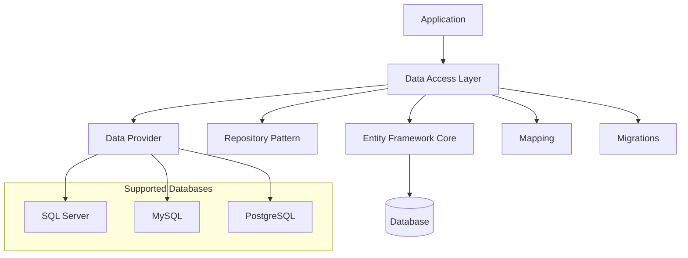
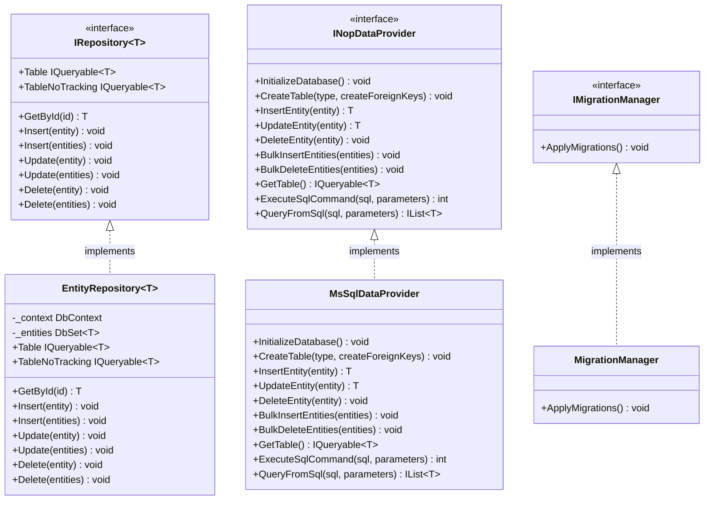
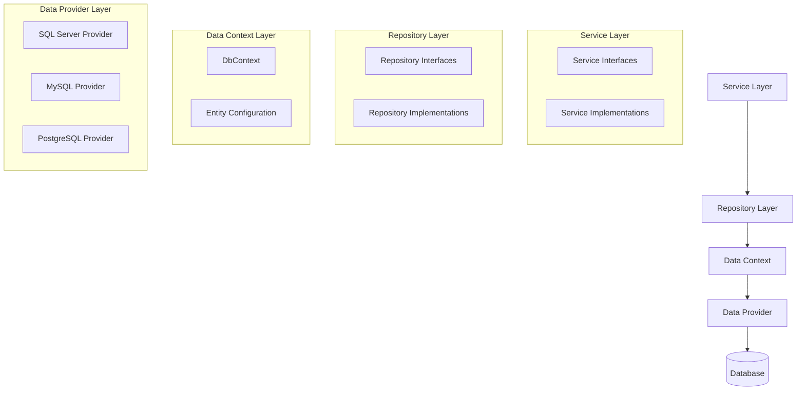

# nopCommerce Data Access Layer

[Home](../../index.md) | [Data Access Layer](index.md) | [Previous: Configuration](../core/configuration.md) | [Next: ORM Architecture](orm-architecture.md)

## Introduction

The Data Access Layer (DAL) in nopCommerce is responsible for all interactions with the database. It provides a clean abstraction over the underlying data storage, making it easier to work with data while maintaining separation of concerns. This document explores the architecture of the Data Access Layer, which is primarily implemented in the `Nop.Data` project.

## Data Access Layer Overview



## Core Components of the Data Access Layer

The Data Access Layer in nopCommerce consists of several key components:



## In This Section

- [ORM Architecture](orm-architecture.md) - Entity Framework Core integration
- [Data Providers](data-providers.md) - SQL Server, MySQL, and PostgreSQL support
- [Migrations](migrations.md) - Database migrations and schema management
- [Repository Pattern](repository-pattern.md) - Data access abstraction
- [Database Schema](database-schema.md) - Database structure and relationships

## Core Responsibilities

The Data Access Layer in nopCommerce has several key responsibilities:

### 1. Data Access Abstraction

The DAL provides a clean abstraction over the database, allowing the rest of the application to work with data without knowledge of the underlying storage mechanism.

```csharp
// Service layer code uses the repository pattern
public class ProductService : IProductService
{
    private readonly IRepository<Product> _productRepository;
    
    public ProductService(IRepository<Product> productRepository)
    {
        _productRepository = productRepository;
    }
    
    public IList<Product> GetAllProducts()
    {
        var query = _productRepository.Table;
        return query.ToList();
    }
}
```

### 2. Database Provider Support

The DAL supports multiple database providers, allowing nopCommerce to work with different database systems.

```csharp
// Data provider factory
public class DataProviderManager : IDataProviderManager
{
    private readonly DataProviderType _dataProviderType;
    
    public DataProviderManager(DataConfig config)
    {
        _dataProviderType = config.DataProvider;
    }
    
    public INopDataProvider DataProvider
    {
        get
        {
            return _dataProviderType switch
            {
                DataProviderType.SqlServer => new MsSqlDataProvider(),
                DataProviderType.MySql => new MySqlDataProvider(),
                DataProviderType.PostgreSQL => new PostgreSqlDataProvider(),
                _ => throw new NotSupportedException($"Data provider type '{_dataProviderType}' is not supported")
            };
        }
    }
}
```

### 3. Entity Mapping

The DAL maps entity classes to database tables using Entity Framework Core's fluent API.

```csharp
// Entity mapping configuration
public class ProductMap : NopEntityTypeConfiguration<Product>
{
    public override void Configure(EntityTypeBuilder<Product> builder)
    {
        builder.ToTable(nameof(Product));
        builder.HasKey(p => p.Id);
        
        builder.Property(p => p.Name).HasMaxLength(400).IsRequired();
        builder.Property(p => p.ShortDescription).HasMaxLength(750);
        builder.Property(p => p.FullDescription);
        builder.Property(p => p.AdminComment).HasMaxLength(500);
        builder.Property(p => p.MetaKeywords).HasMaxLength(400);
        builder.Property(p => p.MetaDescription);
        builder.Property(p => p.MetaTitle).HasMaxLength(400);
        builder.Property(p => p.Sku).HasMaxLength(400);
        builder.Property(p => p.ManufacturerPartNumber).HasMaxLength(400);
        builder.Property(p => p.Gtin).HasMaxLength(400);
        
        // Relationships
        builder.HasOne(p => p.ProductType)
            .WithMany()
            .HasForeignKey(p => p.ProductTypeId);
        
        builder.HasOne(p => p.DeliveryDate)
            .WithMany()
            .HasForeignKey(p => p.DeliveryDateId);
        
        // ... other relationships
    }
}
```

### 4. Database Migrations

The DAL manages database schema changes through migrations.

```csharp
// Migration manager
public class MigrationManager : IMigrationManager
{
    private readonly ITypeFinder _typeFinder;
    private readonly IServiceProvider _serviceProvider;
    
    public MigrationManager(ITypeFinder typeFinder, IServiceProvider serviceProvider)
    {
        _typeFinder = typeFinder;
        _serviceProvider = serviceProvider;
    }
    
    public void ApplyMigrations()
    {
        // Find all migrations
        var migrationTypes = _typeFinder.FindClassesOfType<NopMigration>();
        
        // Apply migrations
        foreach (var migrationType in migrationTypes)
        {
            var migration = (NopMigration)_serviceProvider.GetService(migrationType);
            migration.Up();
        }
    }
}
```

### 5. Raw SQL Support

The DAL provides access to raw SQL when needed, although this is generally discouraged in favor of the repository pattern.

```csharp
// Raw SQL execution
public int ExecuteSqlCommand(string sql, params object[] parameters)
{
    using var command = _dbContext.Database.GetDbConnection().CreateCommand();
    command.CommandText = sql;
    
    // Add parameters
    if (parameters != null)
    {
        for (var i = 0; i < parameters.Length; i++)
        {
            var parameter = command.CreateParameter();
            parameter.ParameterName = $"@p{i}";
            parameter.Value = parameters[i];
            command.Parameters.Add(parameter);
        }
    }
    
    _dbContext.Database.OpenConnection();
    return command.ExecuteNonQuery();
}
```

## Data Access Architecture

The nopCommerce Data Access Layer follows a layered architecture:



### Key Design Decisions

Several key design decisions shape the nopCommerce Data Access Layer:

1. **Repository Pattern**: Abstracts data access logic from business logic
2. **Entity Framework Core**: ORM for database interactions
3. **Multiple Database Support**: Supports different database providers
4. **Code-First Approach**: Defines database schema through entity classes
5. **Migrations**: Manages database schema changes
6. **Eager Loading**: Uses eager loading for related entities when appropriate
7. **Caching Integration**: Integrates with the caching system for performance

## Repository Pattern

The repository pattern is a key component of the nopCommerce Data Access Layer. It provides a collection-like interface for accessing domain objects:

```csharp
// Repository interface
public interface IRepository<T> where T : BaseEntity
{
    /// <summary>
    /// Gets a table
    /// </summary>
    IQueryable<T> Table { get; }
    
    /// <summary>
    /// Gets a table with "no tracking" enabled (EF feature) Use it only when you load record(s) only for read-only operations
    /// </summary>
    IQueryable<T> TableNoTracking { get; }
    
    /// <summary>
    /// Get entity by identifier
    /// </summary>
    /// <param name="id">Identifier</param>
    /// <returns>Entity</returns>
    T GetById(object id);
    
    /// <summary>
    /// Insert entity
    /// </summary>
    /// <param name="entity">Entity</param>
    void Insert(T entity);
    
    /// <summary>
    /// Insert entities
    /// </summary>
    /// <param name="entities">Entities</param>
    void Insert(IEnumerable<T> entities);
    
    /// <summary>
    /// Update entity
    /// </summary>
    /// <param name="entity">Entity</param>
    void Update(T entity);
    
    /// <summary>
    /// Update entities
    /// </summary>
    /// <param name="entities">Entities</param>
    void Update(IEnumerable<T> entities);
    
    /// <summary>
    /// Delete entity
    /// </summary>
    /// <param name="entity">Entity</param>
    void Delete(T entity);
    
    /// <summary>
    /// Delete entities
    /// </summary>
    /// <param name="entities">Entities</param>
    void Delete(IEnumerable<T> entities);
}
```

## Data Providers

nopCommerce supports multiple database providers:

```csharp
/// <summary>
/// Represents the data provider manager
/// </summary>
public class DataProviderManager : IDataProviderManager
{
    private readonly DataProviderType _dataProviderType;
    
    public DataProviderManager(DataConfig config)
    {
        _dataProviderType = config.DataProvider;
    }
    
    /// <summary>
    /// Gets a data provider
    /// </summary>
    public INopDataProvider DataProvider
    {
        get
        {
            return _dataProviderType switch
            {
                DataProviderType.SqlServer => new MsSqlDataProvider(),
                DataProviderType.MySql => new MySqlDataProvider(),
                DataProviderType.PostgreSQL => new PostgreSqlDataProvider(),
                _ => throw new NotSupportedException($"Data provider type '{_dataProviderType}' is not supported")
            };
        }
    }
}
```

## Database Context

The database context is the bridge between entity classes and the database:

```csharp
/// <summary>
/// Represents the database context
/// </summary>
public class NopDbContext : DbContext
{
    public NopDbContext(DbContextOptions<NopDbContext> options) : base(options)
    {
    }
    
    protected override void OnModelCreating(ModelBuilder modelBuilder)
    {
        // Apply entity configurations
        modelBuilder.ApplyConfiguration(new ProductMap());
        modelBuilder.ApplyConfiguration(new CategoryMap());
        modelBuilder.ApplyConfiguration(new ManufacturerMap());
        modelBuilder.ApplyConfiguration(new CustomerMap());
        modelBuilder.ApplyConfiguration(new OrderMap());
        // ... other configurations
        
        base.OnModelCreating(modelBuilder);
    }
}
```

## Data Access Examples

### Basic CRUD Operations

```csharp
// Create
var product = new Product
{
    Name = "Sample Product",
    Price = 19.99m,
    Published = true
};
_productRepository.Insert(product);

// Read
var allProducts = _productRepository.Table.ToList();
var publishedProducts = _productRepository.Table.Where(p => p.Published).ToList();
var product = _productRepository.GetById(1);

// Update
product.Price = 29.99m;
_productRepository.Update(product);

// Delete
_productRepository.Delete(product);
```

### Complex Queries

```csharp
// Get products with category and manufacturer
var query = from p in _productRepository.Table
            join pc in _productCategoryRepository.Table on p.Id equals pc.ProductId
            join c in _categoryRepository.Table on pc.CategoryId equals c.Id
            join pm in _productManufacturerRepository.Table on p.Id equals pm.ProductId
            join m in _manufacturerRepository.Table on pm.ManufacturerId equals m.Id
            where p.Published && c.Published && m.Published
            select p;

// Get products with specific attributes
var query = from p in _productRepository.Table
            join pam in _productAttributeMappingRepository.Table on p.Id equals pam.ProductId
            join pav in _productAttributeValueRepository.Table on pam.Id equals pav.ProductAttributeMappingId
            where pav.Name.Contains("Color") && pav.Name.Contains("Red")
            select p;
```

## Conclusion

The nopCommerce Data Access Layer provides a robust foundation for data operations in the application. It abstracts the details of data storage and retrieval, supports multiple database providers, and integrates seamlessly with the rest of the application. By understanding this layer, developers can effectively work with data in nopCommerce and extend its functionality.

---

*Next: [ORM Architecture](orm-architecture.md)*

---

*[Home](../../index.md) | [Data Access Layer](index.md) | [Previous: Configuration](../core/configuration.md) | [Next: ORM Architecture](orm-architecture.md)*