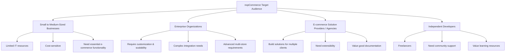
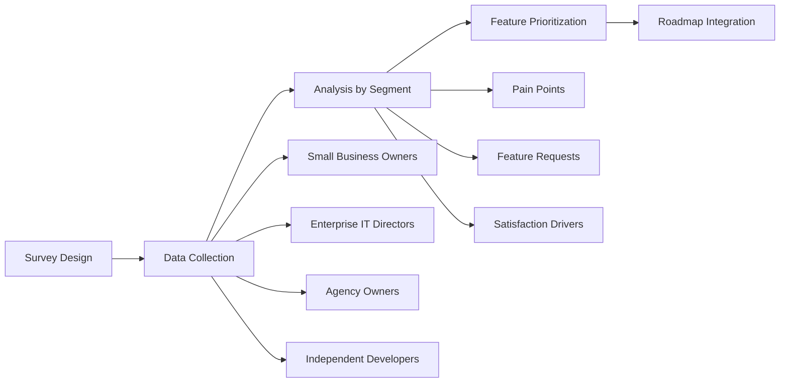
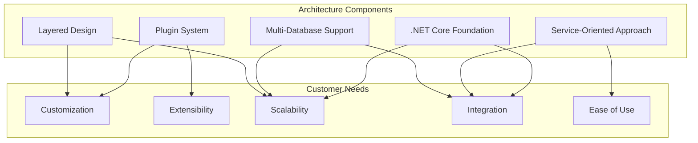
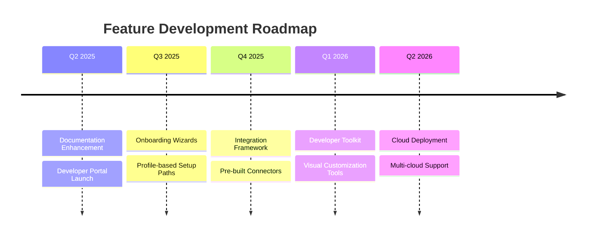

# nopCommerce Audience Analysis and Customer Research

## Executive Summary

This document provides a comprehensive analysis of nopCommerce's target audience, typical customer profiles, and a methodology for gathering customer feedback through surveys. Based on the platform's architecture and capabilities, we've identified key audience segments, created detailed personas, and designed a structured approach to understanding customer needs and preferences.

## Table of Contents

1. [Target Audience Analysis](#target-audience-analysis)
2. [Customer Profiles](#customer-profiles)
3. [Customer Survey Methodology](#customer-survey-methodology)
4. [Architecture Alignment](#architecture-alignment)
5. [Recommendations](#recommendations)

## Target Audience Analysis

nopCommerce serves four primary audience segments:



The platform's architecture, with its layered design, plugin system, and multi-database support, is particularly well-suited to serve these diverse segments. The extensibility provided by the plugin architecture appeals to developers and agencies, while the comprehensive out-of-the-box functionality serves the needs of SMBs.

## Customer Profiles

We've created four detailed customer profiles that represent the typical users of nopCommerce:

1. **Sarah - The Small Business Owner**
   - Limited technical knowledge but needs comprehensive e-commerce functionality
   - Values ease of use, cost-effectiveness, and basic marketing tools

2. **Michael - The Enterprise IT Director**
   - Strong technical background with focus on integration and scalability
   - Requires advanced B2B capabilities and custom workflow implementation

3. **Elena - The E-commerce Agency Owner**
   - Manages multiple client implementations with a technical team
   - Needs extensibility, white-label capabilities, and efficient development

4. **David - The Independent Developer**
   - Experienced developer working alone with multiple clients
   - Values documentation, community support, and reasonable learning curve

```mermaid
radar
    title Customer Profile Needs Comparison
    Technical Expertise: 30,80,75,70
    Budget Size: 40,85,65,35
    Customization Needs: 45,85,80,60
    Integration Requirements: 35,90,70,50
    Support Dependency: 75,40,30,55
```

*Legend: Sarah, Michael, Elena, David*

## Customer Survey Methodology

The customer survey is designed to gather specific feedback from each customer profile, with both common and tailored questions. The methodology includes:

- Distribution through multiple channels (forums, email, social media)
- Profile-specific question sets that address unique concerns
- Feature prioritization to guide product development
- Analysis framework to apply findings to the roadmap



## Architecture Alignment

The nopCommerce architecture aligns with customer needs in the following ways:



Key architectural strengths that support customer needs:

1. **Plugin System**: Enables extensibility without core modifications, ideal for agencies and developers
2. **Multi-Database Support**: Provides flexibility for enterprises with existing infrastructure
3. **Service-Oriented Design**: Facilitates customization and integration with external systems
4. **.NET Core Foundation**: Delivers performance and cross-platform capabilities
5. **Layered Architecture**: Separates concerns and allows targeted customization

## Recommendations

Based on the audience analysis and architectural assessment, we recommend:

1. **Documentation Enhancement**: Improve documentation with more examples and tutorials, especially for plugin development
2. **Onboarding Simplification**: Create specialized onboarding paths for each customer profile
3. **Integration Expansion**: Develop more pre-built integrations for popular business systems
4. **Developer Tools**: Invest in tools to accelerate development and customization
5. **Cloud Deployment**: Enhance cloud deployment options for easier scaling



By aligning product development with the needs of these customer profiles and leveraging the architectural strengths of nopCommerce, the platform can continue to serve its diverse audience effectively while expanding its market reach.