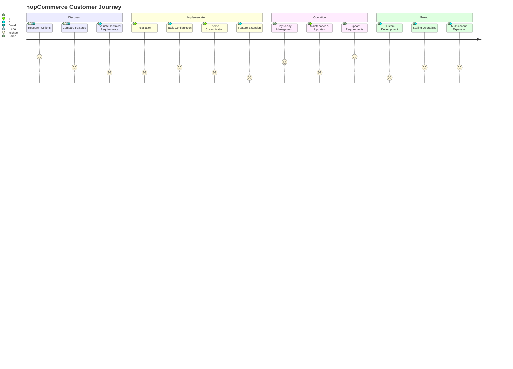

# nopCommerce Customer Profiles

This document outlines typical customer profiles for nopCommerce based on the platform's architecture and target audience analysis.

## Typical Customer Profiles

### 1. Sarah - The Small Business Owner

**Demographics:**
- 35-45 years old
- Owns a specialty retail business
- 5-15 employees
- Annual revenue: $500K-$2M

**Technical Profile:**
- Limited technical knowledge
- Relies on external developers or agencies
- Comfortable with basic admin tasks

**Business Needs:**
- Cost-effective e-commerce solution
- Easy-to-use admin interface
- Basic marketing tools
- Payment processing integration
- Inventory management

**Challenges:**
- Limited budget for technology
- Competing with larger retailers
- Lacks technical expertise for customization
- Time constraints for managing online store

### 2. Michael - The Enterprise IT Director

**Demographics:**
- 40-55 years old
- IT Director at mid-sized enterprise
- Manages team of 10-30 IT professionals
- Annual technology budget: $1M-$5M

**Technical Profile:**
- Strong technical background
- .NET development experience
- Enterprise systems integration expertise
- Security and compliance focused

**Business Needs:**
- Scalable multi-store solution
- Custom workflow implementation
- ERP/CRM integration
- Advanced B2B capabilities
- High performance and reliability

**Challenges:**
- Complex integration requirements
- High security and compliance standards
- Needs extensive customization
- Requires robust backup and disaster recovery

### 3. Elena - The E-commerce Agency Owner

**Demographics:**
- 30-45 years old
- Digital agency owner with 10-50 employees
- Builds solutions for multiple clients
- Annual revenue: $1M-$10M

**Technical Profile:**
- Strong development team with .NET expertise
- Solution architecture capabilities
- DevOps experience
- Frontend and UX design skills

**Business Needs:**
- Extensible, customizable platform
- White-label capabilities
- Multi-client management
- Efficient development process
- Consistent upgrade path

**Challenges:**
- Managing multiple client implementations
- Staying current with platform updates
- Balancing customization with maintainability
- Needing detailed documentation

### 4. David - The Independent Developer

**Demographics:**
- 25-40 years old
- Freelance developer
- Works with 5-15 clients
- Annual revenue: $80K-$150K

**Technical Profile:**
- Experienced .NET developer
- Full-stack capabilities
- Limited resources for complex projects
- Self-taught in many areas

**Business Needs:**
- Well-documented API
- Plugin development capability
- Active community support
- Reasonable learning curve
- Good performance on modest hosting

**Challenges:**
- Limited time for learning new platforms
- Handling all aspects of implementation alone
- Competitive pricing pressure
- Providing ongoing support to clients

## Customer Journey Map

