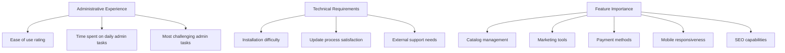
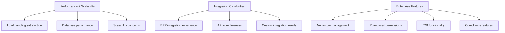
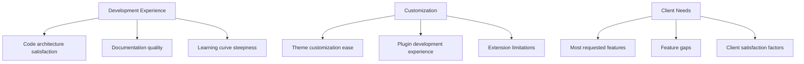
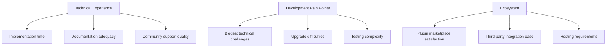
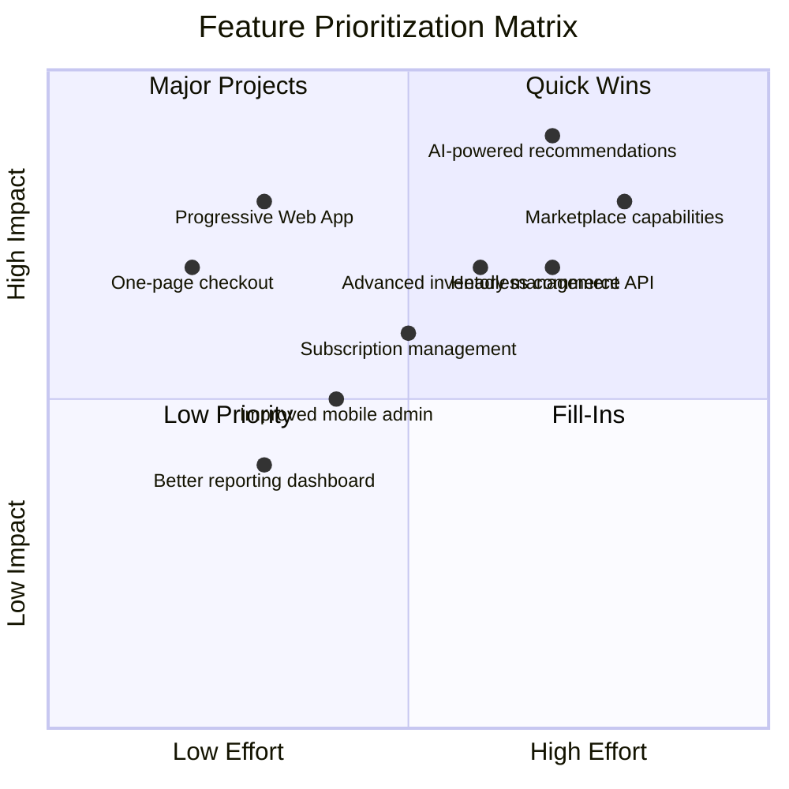
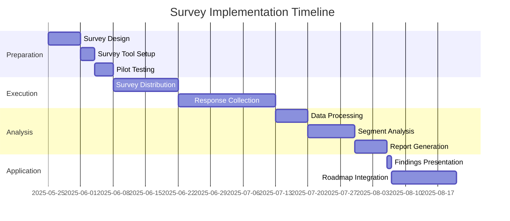

# nopCommerce Customer Survey Design

This document outlines a comprehensive customer survey approach to gather feedback on nopCommerce features based on the identified customer profiles.

## Survey Methodology

The survey is designed to gather feedback from different customer segments, with questions tailored to each profile's needs and technical capabilities. The survey will be distributed through:

1. nopCommerce community forums
2. Email to existing customers
3. Social media channels
4. Partner networks
5. Developer communities

## Survey Structure

### Common Questions (All Profiles)

1. **Demographics and Classification**
   - Business type and size
   - Role within organization
   - Experience with e-commerce platforms
   - Technical expertise level

2. **Usage Patterns**
   - Duration of nopCommerce use
   - Primary business purpose (B2C, B2B, marketplace)
   - Number of products/SKUs
   - Monthly transaction volume

3. **Overall Satisfaction**
   - NPS (Net Promoter Score)
   - Overall satisfaction rating
   - Likelihood to recommend

### Profile-Specific Questions

#### For Small Business Owners (Sarah)

1. **Administrative Experience**
   - How would you rate the ease of use of the admin interface? (1-10)
   - How much time do you spend on daily store management?
   - Which administrative tasks do you find most challenging?

2. **Technical Requirements**
   - How difficult was the initial setup process?
   - How satisfied are you with the update process?
   - Do you require external technical support for maintenance?

3. **Feature Importance**
   - Rate the importance of the following features (1-5):
     - Catalog management
     - Marketing tools
     - Payment processing options
     - Mobile responsiveness
     - SEO capabilities

#### For Enterprise IT Directors (Michael)

1. **Performance and Scalability**
   - How satisfied are you with performance under load?
   - How would you rate database performance?
   - What are your main scalability concerns?

2. **Integration Capabilities**
   - How would you rate the experience integrating with your ERP/CRM?
   - Is the API comprehensive enough for your needs?
   - What additional integration points would you need?

3. **Enterprise Features**
   - Rate the effectiveness of:
     - Multi-store management
     - Role-based permissions
     - B2B functionality
     - Compliance features
     - Reporting capabilities

#### For Agency Owners (Elena)

1. **Development Experience**
   - How would you rate the code architecture?
   - Is the documentation sufficient for your needs?
   - How steep is the learning curve for new developers?

2. **Customization and Extensibility**
   - How easy is it to customize themes?
   - Rate your experience developing plugins
   - What limitations have you encountered during customization?

3. **Client Requirements**
   - What features do clients most frequently request?
   - What feature gaps cause the most client dissatisfaction?
   - What aspects of nopCommerce most impress your clients?

#### For Independent Developers (David)

1. **Technical Experience**
   - What is your average implementation time for a new store?
   - Is the documentation adequate for self-learning?
   - How would you rate community support?

2. **Development Pain Points**
   - What are your biggest technical challenges?
   - How difficult is the upgrade process between versions?
   - What aspects of development take the most time?

3. **Ecosystem and Tools**
   - How satisfied are you with the plugin marketplace?
   - How easy is it to integrate third-party services?
   - What additional developer tools would you like to see?

## Feature Prioritization

The final section asks all participants to prioritize potential new features, with results to be visualized as follows:

## Analysis and Application

Survey results will be analyzed by segment to identify:

1. Common pain points across all profiles
2. Feature priorities by segment
3. Technical vs. business user needs
4. Satisfaction drivers and detractors
5. Competitive positioning opportunities

Findings will guide:
- Product roadmap development
- Documentation improvements
- Support resource allocation
- Marketing messaging refinement

## Survey Implementation Timeline

