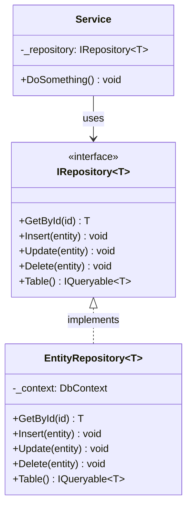
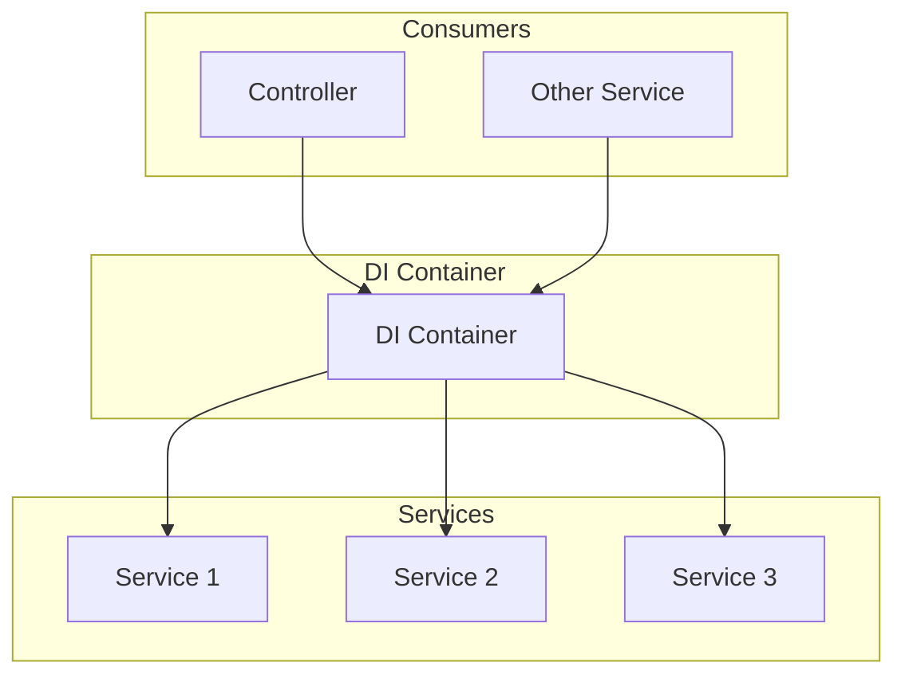
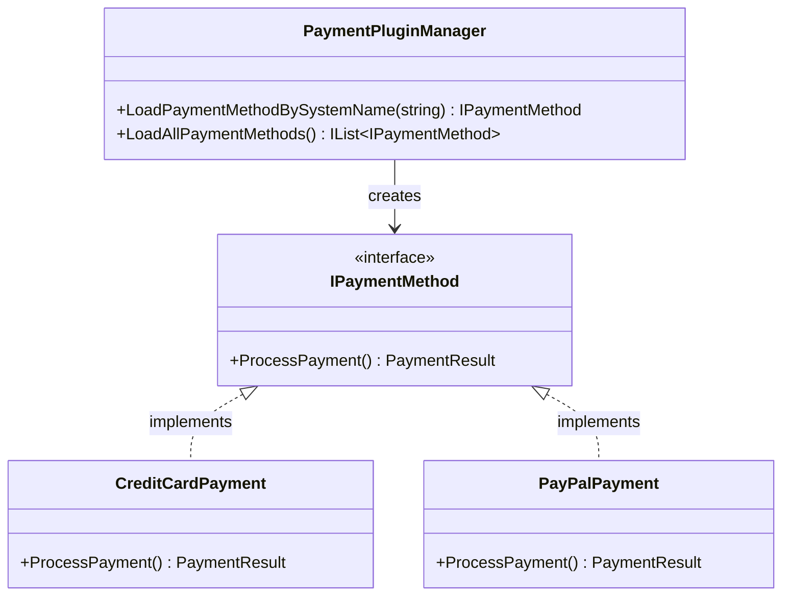
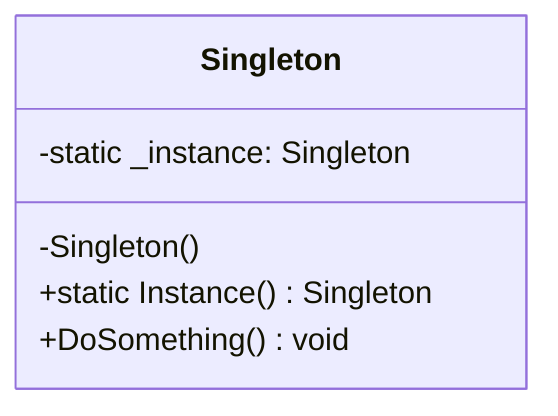
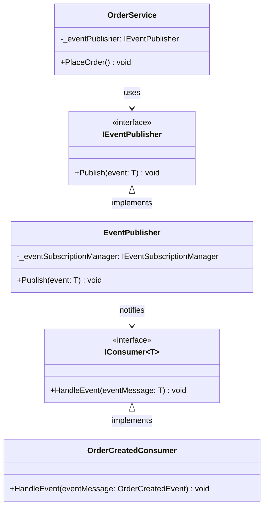
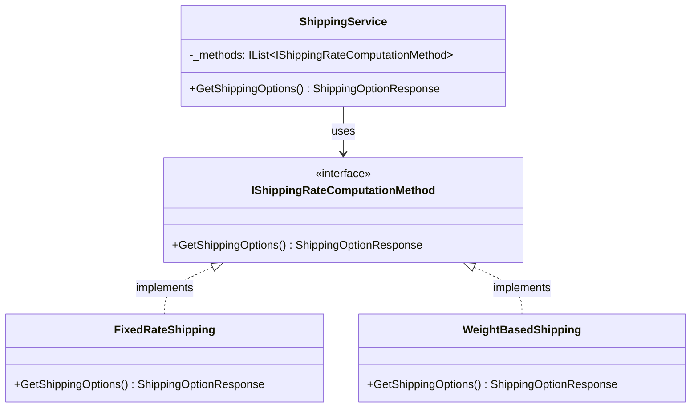
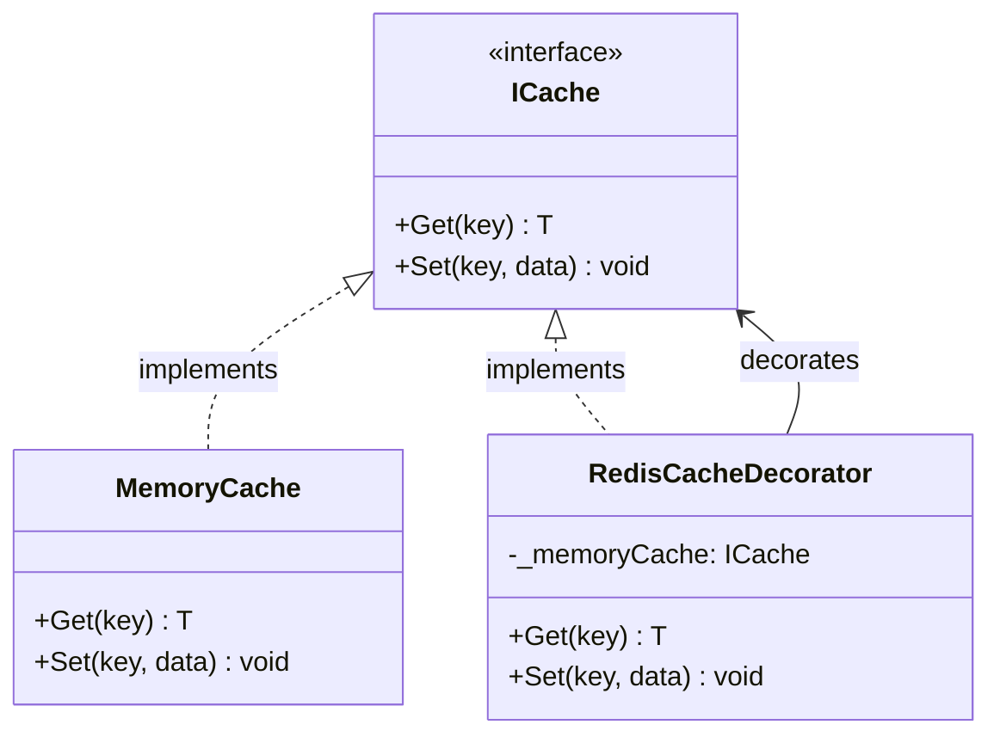

# Design Patterns in nopCommerce

[Home](../../index.md) | [Overview](index.md) | [Previous: System Architecture](system-architecture.md) | [Next: Technology Stack](technology-stack.md)

## Introduction

nopCommerce employs numerous design patterns to solve common software design problems. These patterns improve code quality, maintainability, and extensibility. This document outlines the key design patterns used throughout the nopCommerce architecture.

## Core Design Patterns

### Repository Pattern

The Repository pattern abstracts the data access logic and provides a collection-like interface for accessing domain objects.



#### Implementation Example:

```csharp
// Interface
public interface IRepository<T> where T : BaseEntity
{
    T GetById(object id);
    void Insert(T entity);
    void Update(T entity);
    void Delete(T entity);
    IQueryable<T> Table { get; }
}

// Implementation
public class EntityRepository<T> : IRepository<T> where T : BaseEntity
{
    private readonly DbContext _context;
    private readonly DbSet<T> _entities;
    
    public EntityRepository(DbContext context)
    {
        _context = context;
        _entities = context.Set<T>();
    }
    
    public T GetById(object id) => _entities.Find(id);
    public void Insert(T entity) => _entities.Add(entity);
    public void Update(T entity) => _context.Entry(entity).State = EntityState.Modified;
    public void Delete(T entity) => _entities.Remove(entity);
    public IQueryable<T> Table => _entities;
}
```

### Dependency Injection

nopCommerce uses dependency injection extensively to achieve loose coupling between components.



#### Implementation Example:

```csharp
// Service registration in Startup.cs
public void ConfigureServices(IServiceCollection services)
{
    // Register services
    services.AddScoped<ICustomerService, CustomerService>();
    services.AddScoped<IOrderService, OrderService>();
    services.AddScoped<IProductService, ProductService>();
    
    // Register repositories
    services.AddScoped(typeof(IRepository<>), typeof(EntityRepository<>));
}

// Service consumption
public class CustomerController : Controller
{
    private readonly ICustomerService _customerService;
    
    public CustomerController(ICustomerService customerService)
    {
        _customerService = customerService;
    }
    
    public IActionResult Index()
    {
        var customers = _customerService.GetAllCustomers();
        return View(customers);
    }
}
```

### Factory Pattern

nopCommerce uses the Factory pattern to create objects without exposing the creation logic.



#### Implementation Example:

```csharp
public interface IPluginManager<TPlugin>
{
    TPlugin LoadPluginBySystemName(string systemName);
    IList<TPlugin> LoadAllPlugins();
}

public class PaymentPluginManager : IPluginManager<IPaymentMethod>
{
    private readonly IPluginService _pluginService;
    
    public PaymentPluginManager(IPluginService pluginService)
    {
        _pluginService = pluginService;
    }
    
    public IPaymentMethod LoadPluginBySystemName(string systemName)
    {
        return _pluginService.LoadPluginBySystemName<IPaymentMethod>(systemName);
    }
    
    public IList<IPaymentMethod> LoadAllPlugins()
    {
        return _pluginService.LoadAllPlugins<IPaymentMethod>();
    }
}
```

### Singleton Pattern

Used for objects that should only have a single instance throughout the application lifecycle.



#### Implementation Example:

```csharp
public class EngineContext
{
    private static IEngine _engine;
    
    public static IEngine Current
    {
        get
        {
            if (_engine == null)
            {
                _engine = new NopEngine();
            }
            return _engine;
        }
    }
}
```

### Observer Pattern (Event-based Communication)

nopCommerce uses an event-based system for communication between components.



#### Implementation Example:

```csharp
// Event
public class OrderPlacedEvent
{
    public Order Order { get; set; }
}

// Publisher
public class EventPublisher : IEventPublisher
{
    private readonly IServiceProvider _serviceProvider;
    
    public EventPublisher(IServiceProvider serviceProvider)
    {
        _serviceProvider = serviceProvider;
    }
    
    public void Publish<T>(T eventMessage)
    {
        // Get all event consumers
        var consumers = _serviceProvider.GetServices<IConsumer<T>>();
        
        // Notify all consumers
        foreach (var consumer in consumers)
        {
            consumer.HandleEvent(eventMessage);
        }
    }
}

// Consumer
public class OrderPlacedEventConsumer : IConsumer<OrderPlacedEvent>
{
    private readonly IEmailService _emailService;
    
    public OrderPlacedEventConsumer(IEmailService emailService)
    {
        _emailService = emailService;
    }
    
    public void HandleEvent(OrderPlacedEvent eventMessage)
    {
        // Send order confirmation email
        _emailService.SendOrderConfirmationEmail(eventMessage.Order);
    }
}

// Usage
public class OrderService : IOrderService
{
    private readonly IEventPublisher _eventPublisher;
    
    public OrderService(IEventPublisher eventPublisher)
    {
        _eventPublisher = eventPublisher;
    }
    
    public void PlaceOrder(Order order)
    {
        // Process order
        
        // Publish event
        _eventPublisher.Publish(new OrderPlacedEvent { Order = order });
    }
}
```

### Strategy Pattern

Used for selecting algorithms at runtime, particularly in areas like shipping, payment, and tax calculation.



### Decorator Pattern

Used to extend functionality of objects without modifying their structure.



## Other Patterns Used

### Unit of Work

Manages database transactions and ensures consistency.

### Specification Pattern

Used for encapsulating query logic, particularly for filtering entities.

### Builder Pattern

Used for complex object construction, especially in areas like export/import functionality.

### Template Method

Defines the skeleton of an algorithm in a method, deferring some steps to subclasses.

### Adapter Pattern

Used to make incompatible interfaces work together, particularly when integrating with external systems.

### Composite Pattern

Used for treating individual objects and compositions of objects uniformly.

## Benefits of Pattern Usage

1. **Maintainability**: Patterns provide standard solutions to common problems
2. **Extensibility**: Many patterns facilitate extension without modification
3. **Testability**: Patterns like dependency injection improve testability
4. **Readability**: Using standard patterns makes code more understandable
5. **Reliability**: Patterns represent proven solutions to common problems

## Pattern Application Guidelines

When working with nopCommerce code:

1. **Recognize Existing Patterns**: Understand which patterns are used in existing code
2. **Follow Established Patterns**: Use the same patterns when extending functionality
3. **Consider Context**: Choose appropriate patterns based on the specific context
4. **Avoid Over-engineering**: Don't use patterns when simpler solutions would work
5. **Document Pattern Usage**: Make pattern usage clear in documentation

---

*Next: [Technology Stack](technology-stack.md)*

---

*[Home](../../index.md) | [Overview](index.md) | [Previous: System Architecture](system-architecture.md) | [Next: Technology Stack](technology-stack.md)*