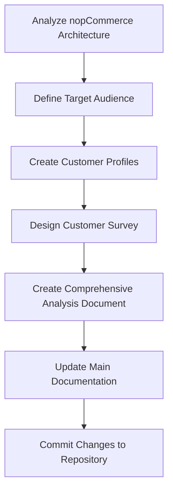

# nopCommerce Audience Analysis Documentation Process

[Home](../../index.md) | [Overview](index.md) | [Previous: Audience Analysis](audience-analysis.md) | [Next: System Architecture](system-architecture.md)

This document outlines the methodology and steps taken to create the nopCommerce audience analysis, customer profiles, and survey design documentation.

## Process Overview



## Step-by-Step Process

### 1. Analyze nopCommerce Architecture

**Prompt used:**
```
Analyze the nopCommerce architecture by exploring the codebase structure. Focus on:
1. Overall architecture pattern
2. Main components and services
3. Technology stack
4. Database approach
5. Plugin system

Use tools like Read, Glob, and Grep to explore the codebase. Check the architecture documentation in docs/nopcommerce/ directory. Look at core classes and components.

Return a concise summary of the nopCommerce architecture and how it's structured.
```

**Outcome:** Comprehensive understanding of nopCommerce's layered architecture, including:
- Core framework and domain model
- Data access layer using the repository pattern
- Service-oriented architecture
- Plugin system for extensibility
- Web layer using ASP.NET MVC

### 2. Define Target Audience

**Prompt used:**
```
Based on the nopCommerce architecture analysis, define the target audience for the platform. Consider:
1. What types of businesses would benefit most from this architecture
2. Technical skill requirements for different user types
3. Market positioning compared to competitors
4. Primary audience segments

Create a document with Mermaid diagrams showing market positioning and audience distribution.
```

**Outcome:** Created `target-audience.md` document identifying four key audience segments:
- Small to Medium-Sized Businesses (SMBs)
- Enterprise Organizations
- E-commerce Solution Providers / Development Agencies
- Independent Developers

Included Mermaid diagrams for market positioning and audience distribution.

### 3. Create Customer Profiles

**Prompt used:**
```
Create detailed customer profiles for the identified nopCommerce target audiences. For each profile, include:
1. Demographics
2. Technical profile
3. Business needs
4. Key challenges

Then create a customer journey map using Mermaid showing how each profile interacts with nopCommerce throughout the discovery, implementation, operation, and growth phases.
```

**Outcome:** Created `customer-profiles.md` with four detailed personas:
- Sarah - The Small Business Owner
- Michael - The Enterprise IT Director
- Elena - The E-commerce Agency Owner
- David - The Independent Developer

Each profile included demographic information, technical capabilities, business needs, and key challenges. Added a Mermaid customer journey map showing how each profile interacts with nopCommerce at different stages.

### 4. Design Customer Survey

**Prompt used:**
```
Design a comprehensive customer survey methodology to gather feedback on nopCommerce features from the identified customer profiles. Include:
1. Survey structure with common questions
2. Profile-specific question sections
3. Feature prioritization approach
4. Analysis framework
5. Implementation timeline

Use Mermaid diagrams to visualize the survey structure, feature prioritization, and implementation timeline.
```

**Outcome:** Created `customer-survey.md` with:
- Detailed survey methodology and distribution channels
- Common questions for all profiles
- Tailored question sets for each customer profile
- Feature prioritization matrix using Mermaid
- Analysis framework and implementation timeline

### 5. Create Comprehensive Analysis Document

**Prompt used:**
```
Create a comprehensive audience analysis document that synthesizes all findings about nopCommerce's target audience, customer profiles, and survey methodology. Include:
1. Executive summary
2. Key findings from architecture analysis
3. Audience segmentation visualization
4. Profile comparison
5. Architecture alignment with customer needs
6. Recommendations

Use Mermaid diagrams to visualize relationships between architecture components and customer needs.
```

**Outcome:** Created `audience-analysis.md` that ties together all previous documents with:
- Executive summary and table of contents
- Visual representation of target audience segments
- Radar chart comparing customer profile needs
- Architecture alignment diagram
- Strategic recommendations with timeline

### 6. Update Main Documentation

**Prompt used:**
```
Update the main nopCommerce documentation index to include the new audience analysis documents. Add links to the new documents in the appropriate section of the table of contents.
```

**Outcome:** Updated `index.md` to include links to:
- Target Audience
- Customer Profiles
- Customer Survey
- Audience Analysis

Added a Mermaid architecture diagram to visualize the overall structure.

### 7. Commit Changes to Repository

**Prompt used:**
```
Commit all the new documents to the repository with a detailed commit message explaining:
1. What documents were added
2. The purpose of each document
3. How they integrate with existing documentation
```

**Outcome:** Committed changes with detailed commit message:
```
Add nopCommerce audience analysis and customer profiles documents

- Add target audience analysis with market positioning
- Create detailed customer profiles with journey maps
- Design comprehensive customer survey methodology
- Update main documentation index with new sections
```

## Tools and Techniques Used

1. **Task Planning:** Used a structured todo list to plan and track progress:
   - Analyze nopCommerce architecture
   - Define target audience
   - Create customer profiles
   - Design customer survey
   - Document findings with Mermaid diagrams

2. **Architecture Analysis:** Examined code structure, design patterns, and existing documentation

3. **Visualization:** Used Mermaid diagrams for:
   - Market positioning quadrant chart
   - Audience distribution pie chart
   - Customer journey map
   - Survey question flowcharts
   - Feature prioritization matrix
   - Architecture alignment graph
   - Implementation timeline

4. **Documentation Integration:** Ensured new documents integrated with existing architecture documentation structure

5. **Version Control:** Used Git for tracking changes and maintaining documentation history

## Conclusion

This methodology demonstrates a systematic approach to understanding and documenting software architecture from both technical and audience perspectives. By combining technical analysis with user-centered documentation, we created comprehensive resources that serve both development teams and business stakeholders.

The resulting documentation provides a clear picture of who uses nopCommerce, their needs and challenges, and how the platform's architecture addresses those requirements.

---

*Previous: [Audience Analysis](audience-analysis.md) | [Next: System Architecture](system-architecture.md)*

---

*[Home](../../index.md) | [Overview](index.md) | [Previous: Audience Analysis](audience-analysis.md) | [Next: System Architecture](system-architecture.md)*

---

*Last updated: May 22, 2025*