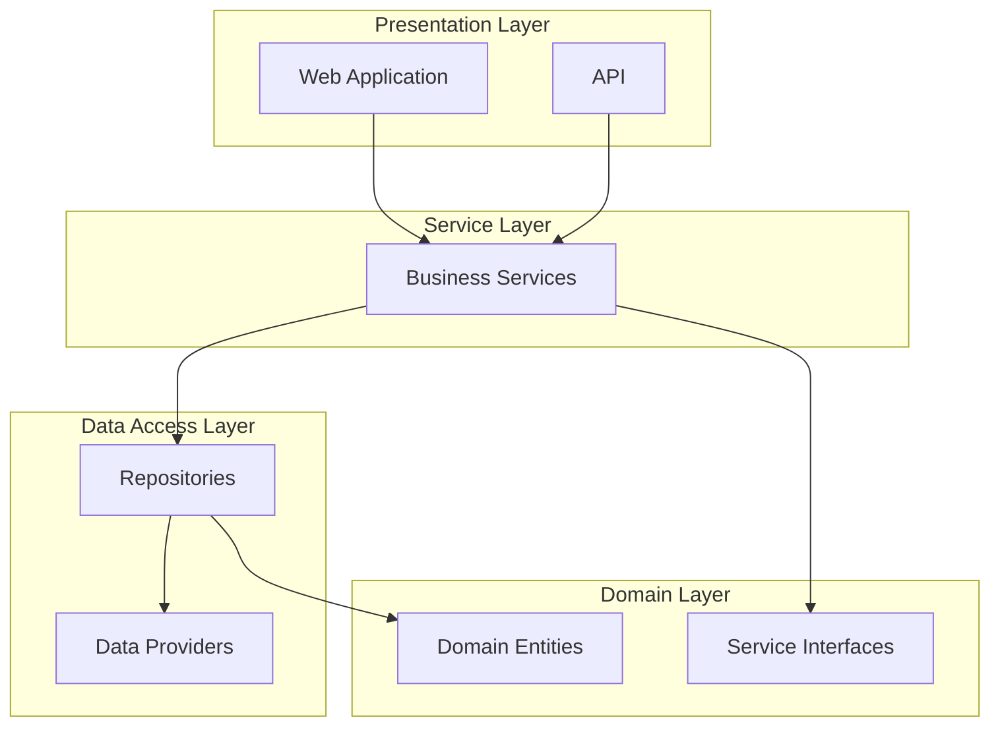

# nopCommerce Architecture Overview

[Home](../../index.md) | [Overview](index.md) | [Next: System Architecture](system-architecture.md)

## Introduction

This section provides a high-level overview of the nopCommerce architecture, explaining the fundamental architectural principles, design patterns, and technologies used throughout the platform.

nopCommerce is built on modern .NET Core technology with a modular, layered architecture that emphasizes:

- **Separation of concerns** - Keeping different aspects of the system separated
- **Modularity** - Building functionality in self-contained modules
- **Extensibility** - Making it easy to extend or replace components
- **Maintainability** - Creating code that is easy to understand and maintain
- **Testability** - Allowing components to be tested in isolation

## In This Section

- [System Architecture](system-architecture.md) - High-level architectural overview
- [Design Patterns](design-patterns.md) - Key patterns used throughout the codebase
- [Technology Stack](technology-stack.md) - Core technologies and frameworks
- [Solution Structure](solution-structure.md) - Organization of projects and files
- [Key Concepts](key-concepts.md) - Important concepts and terminology

## Architectural Layers

nopCommerce follows a layered architecture pattern with the following primary layers:

### Layer Responsibilities

1. **Presentation Layer** - Handles user interaction, renders views, processes requests
2. **Service Layer** - Implements business logic and orchestrates operations
3. **Data Access Layer** - Manages data persistence and retrieval operations
4. **Domain Layer** - Defines the core business entities and interfaces

## Key Architectural Features

- **Plugin System** - Extensible architecture that allows functionality to be added without modifying core code
- **Event-based Communication** - Publishers and subscribers communicate through events
- **Multi-tenant Support** - Architecture supports multiple stores from a single installation
- **Dependency Injection** - Components are loosely coupled through dependency injection
- **Caching System** - Comprehensive caching to optimize performance

## Guiding Principles

nopCommerce development follows these key principles:

1. **Open for Extension, Closed for Modification** - Extend functionality without changing existing code
2. **Don't Repeat Yourself (DRY)** - Avoid duplication through reusable components
3. **Convention over Configuration** - Reduce the need for explicit configuration
4. **Progressive Enhancement** - Provide basic functionality that can be enhanced incrementally
5. **Backward Compatibility** - Maintain compatibility with earlier versions when possible

---

*Next: [System Architecture](system-architecture.md)*

---

*[Home](../../index.md) | [Overview](index.md) | [Next: System Architecture](system-architecture.md)*