# nopCommerce Key Concepts

[Home](../../index.md) | [Overview](index.md) | [Previous: Solution Structure](solution-structure.md) | [Next: Core Framework](../core/index.md)

## Introduction

This document explains the key concepts and terminology used throughout the nopCommerce architecture. Understanding these concepts is essential for working effectively with the platform.

## Domain Concepts

### Store

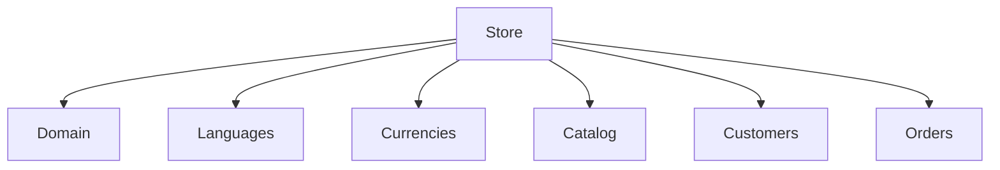

A store represents a single shop within the nopCommerce system. nopCommerce supports multi-store operation, allowing multiple stores to be managed from a single installation.

**Key Characteristics:**
- Unique domain name
- Specific theme and branding
- Dedicated catalog and pricing
- Separate customer base
- Individual settings

### Catalog

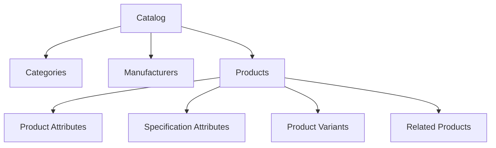

The catalog represents the products and their organization within the store.

**Key Components:**
- **Categories**: Hierarchical organization of products
- **Manufacturers**: Product brands or manufacturers
- **Products**: Items available for purchase
- **Attributes**: Customizable product features (size, color, etc.)
- **Specifications**: Technical characteristics of products

### Customer

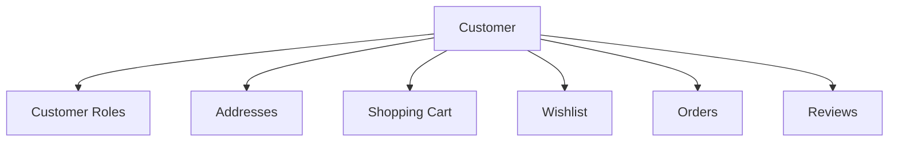

Customers are users who browse and purchase products from the store.

**Key Aspects:**
- **Registration**: Account creation process
- **Authentication**: Login and security
- **Roles**: Permission groups (Registered, Administrators, etc.)
- **Shopping Cart**: Items selected for potential purchase
- **Wishlist**: Saved products for future consideration
- **Orders**: Purchase history

### Order

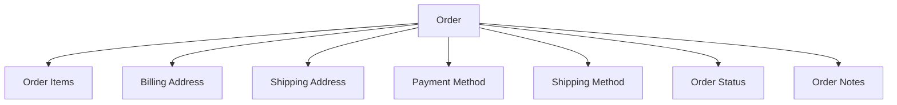

An order represents a customer's purchase transaction.

**Key Components:**
- **Order Items**: Products and quantities purchased
- **Billing/Shipping Addresses**: Customer addresses
- **Payment Method**: Selected payment option
- **Shipping Method**: Selected shipping option
- **Order Status**: Current status (Pending, Processing, Complete, etc.)
- **Order Total**: Sum of items, tax, shipping, etc.

### Content

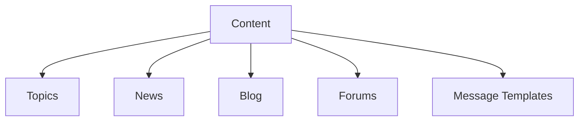

Content elements that provide information to customers.

**Key Types:**
- **Topics**: Static pages (About Us, Privacy Policy, etc.)
- **News**: News articles
- **Blog**: Blog posts
- **Forums**: Customer discussion forums
- **Message Templates**: Email templates

## Technical Concepts

### Plugin

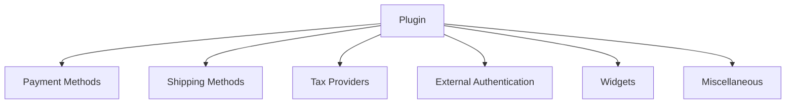

Plugins extend the functionality of nopCommerce without modifying the core code.

**Key Characteristics:**
- Self-contained modules
- Specific functionality extension
- Configuration through admin interface
- Can be installed/uninstalled at runtime
- Stored in the Plugins directory

### Theme

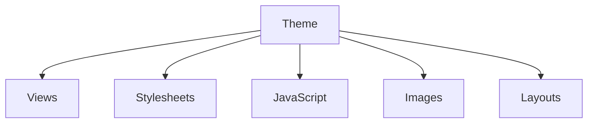

Themes control the visual appearance of the store.

**Key Components:**
- **Views**: Razor templates for rendering UI
- **Stylesheets**: CSS for styling
- **JavaScript**: Client-side functionality
- **Images**: Theme graphics
- **Layouts**: Page layouts and structures

### Localization

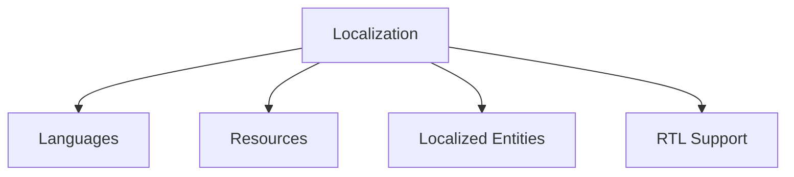

Localization allows the store to be presented in multiple languages.

**Key Aspects:**
- **Languages**: Supported languages
- **Resources**: Translated strings
- **Localized Entities**: Products, categories, etc. with translated properties
- **RTL Support**: Right-to-left language support

### Settings

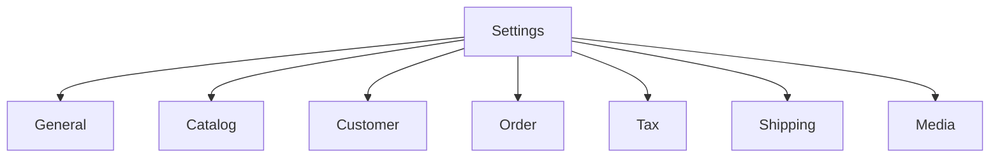

Settings control the behavior of various aspects of the store.

**Key Categories:**
- **General**: Store-wide settings
- **Catalog**: Product display and behavior
- **Customer**: Registration and account settings
- **Order**: Order processing settings
- **Tax**: Tax calculation settings
- **Shipping**: Shipping calculation settings
- **Media**: Image and media settings

### Dependency Injection

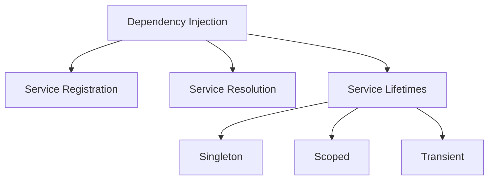

Dependency Injection is a core pattern used throughout nopCommerce.

**Key Concepts:**
- **Registration**: Services are registered with the DI container
- **Resolution**: Services are resolved when needed
- **Lifetimes**: Determine how long a service instance lives
  - **Singleton**: One instance for the application lifetime
  - **Scoped**: One instance per request
  - **Transient**: New instance each time

### Events

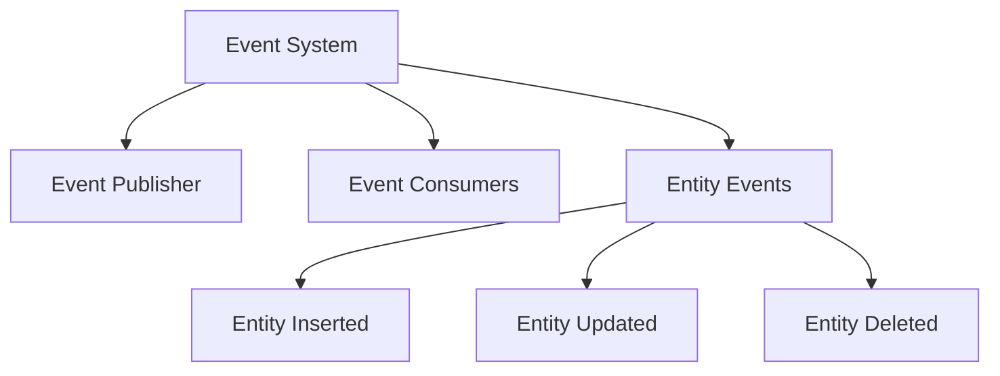

The event system enables loose coupling between components.

**Key Components:**
- **Event Publisher**: Publishes events
- **Event Consumers**: Handle published events
- **Entity Events**: Events triggered by entity operations
  - **Entity Inserted**: Triggered when an entity is created
  - **Entity Updated**: Triggered when an entity is updated
  - **Entity Deleted**: Triggered when an entity is deleted

### Caching

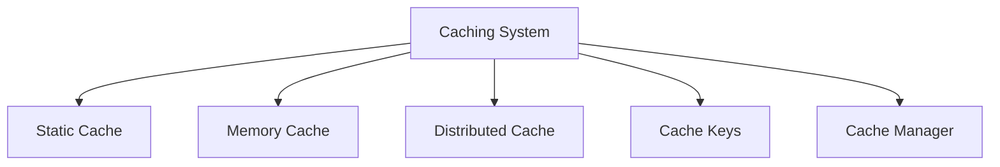

Caching improves performance by storing frequently accessed data.

**Key Components:**
- **Static Cache**: In-memory cache for static data
- **Memory Cache**: In-memory cache for dynamic data
- **Distributed Cache**: Redis or SQL Server-based cache for multi-server setups
- **Cache Keys**: Unique identifiers for cached items
- **Cache Manager**: Manages cache operations

### Repository

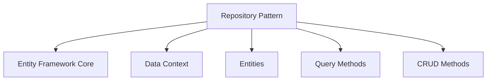

Repositories abstract data access operations.

**Key Aspects:**
- **Entity Framework Core**: ORM used for data access
- **Data Context**: Database context
- **Entities**: Domain objects mapped to database tables
- **Query Methods**: Methods for retrieving entities
- **CRUD Methods**: Create, Read, Update, Delete operations

### Task Scheduling

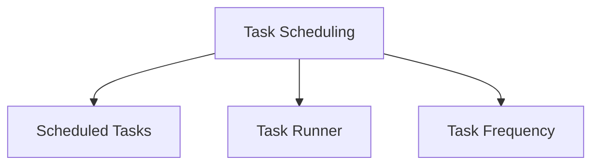

Task scheduling enables background processing of operations.

**Key Components:**
- **Scheduled Tasks**: Tasks registered for background execution
- **Task Runner**: Executes scheduled tasks
- **Task Frequency**: How often tasks run

## Multi-tenancy Concepts

### Multi-store

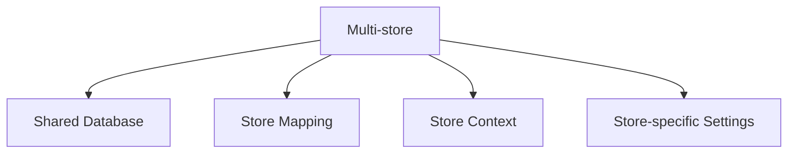

Multi-store allows running multiple stores from a single nopCommerce installation.

**Key Aspects:**
- **Shared Database**: All stores share the same database
- **Store Mapping**: Entities can be mapped to specific stores
- **Store Context**: Identifies the current store
- **Store-specific Settings**: Each store can have unique settings

### Multi-vendor

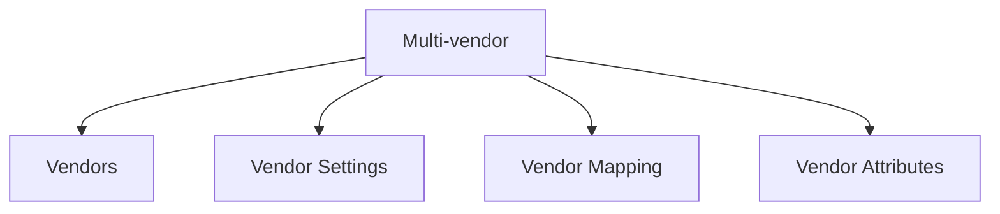

Multi-vendor allows multiple sellers to sell products through the same store.

**Key Components:**
- **Vendors**: Seller accounts
- **Vendor Settings**: Settings controlling vendor behavior
- **Vendor Mapping**: Products mapped to vendors
- **Vendor Attributes**: Custom attributes for vendors

## Security Concepts

### Authentication

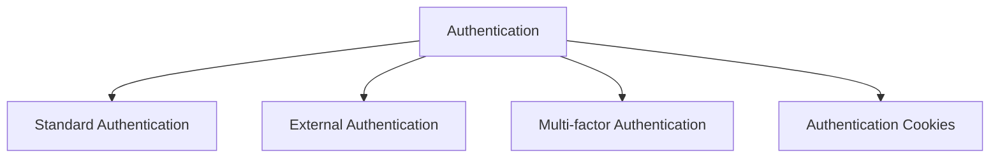

Authentication verifies user identity.

**Key Methods:**
- **Standard Authentication**: Username/password
- **External Authentication**: OAuth providers (Google, Facebook, etc.)
- **Multi-factor Authentication**: Additional verification steps
- **Authentication Cookies**: Session management

### Authorization

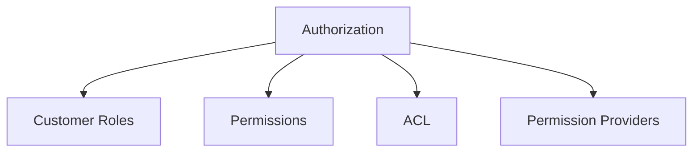

Authorization controls access to features and resources.

**Key Components:**
- **Customer Roles**: Groups with specific permissions
- **Permissions**: Access rights to features
- **ACL**: Access Control Lists for specific entities
- **Permission Providers**: Define available permissions

### Data Protection

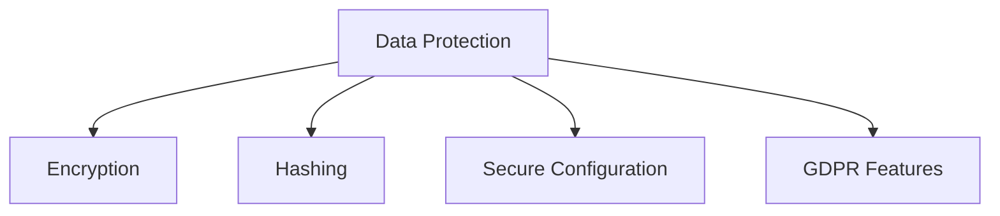

Data protection secures sensitive information.

**Key Aspects:**
- **Encryption**: Securing sensitive data
- **Hashing**: One-way transformation for passwords
- **Secure Configuration**: Protection of configuration values
- **GDPR Features**: Data privacy compliance features

## Glossary of Terms

| Term | Definition |
|------|------------|
| ACL | Access Control List, used to restrict entity access to specific customer roles |
| BaseEntity | Base class for all entities in nopCommerce |
| Catalog | Collection of products, categories, and manufacturers |
| Customer Role | Group that defines permissions for customers |
| GDPR | General Data Protection Regulation compliance features |
| IEngine | Interface for the nopCommerce engine that manages services |
| IRepository | Interface for data access using the repository pattern |
| IWorkContext | Interface providing context about the current customer, language, etc. |
| IStoreContext | Interface providing context about the current store |
| Plugin | Self-contained module that extends functionality |
| SEO | Search Engine Optimization features for products, categories, etc. |
| Store | A single shop within a nopCommerce installation |
| Theme | Collection of files that control the visual appearance |
| Widget | UI component that can be placed in widget zones |
| Widget Zone | Predefined area in the UI where widgets can be placed |

---

*Next: [Core Framework](../core/index.md)*

---

*[Home](../../index.md) | [Overview](index.md) | [Previous: Solution Structure](solution-structure.md) | [Next: Core Framework](../core/index.md)*