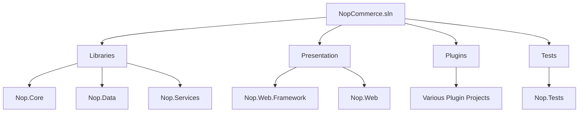
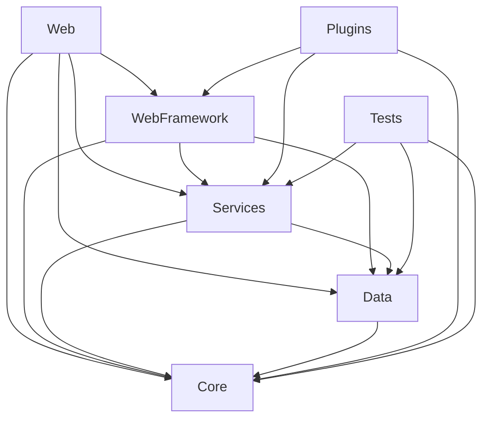

# nopCommerce Solution Structure

[Home](../../index.md) | [Overview](index.md) | [Previous: Technology Stack](technology-stack.md) | [Next: Key Concepts](key-concepts.md)

## Introduction

This document provides an overview of the nopCommerce solution structure, describing the organization of projects, directories, and files. Understanding this structure is essential for effective development and customization of nopCommerce.

## Solution Organization

The nopCommerce solution is organized into several projects, each with a specific responsibility in the overall architecture.



## Core Projects

### Nop.Core

The foundation of the application containing domain entities, interfaces, and core infrastructure.

**Key Directories:**
- **Domain/**: Contains entity classes that represent business objects
- **Infrastructure/**: Core infrastructure components
- **Caching/**: Caching infrastructure
- **Events/**: Event publishing and handling
- **Configuration/**: Application configuration

### Nop.Data

Handles data access and persistence operations.

**Key Directories:**
- **Mapping/**: Entity to database mapping
- **Migrations/**: Database migrations
- **Extensions/**: Data-related extension methods
- **DataProviders/**: Database provider implementations

### Nop.Services

Contains business logic and services that operate on domain entities.

**Key Directories:**
- **Catalog/**: Product catalog-related services
- **Customers/**: Customer management services
- **Orders/**: Order processing services
- **Authentication/**: Authentication services
- **Security/**: Security-related services
- **Tax/**: Tax calculation services
- **Shipping/**: Shipping calculation services
- **Payment/**: Payment processing services

## Presentation Projects

### Nop.Web.Framework

Contains framework components used by the web application.

**Key Directories:**
- **Controllers/**: Base controller classes
- **Mvc/**: MVC-specific components
- **UI/**: UI-related components
- **Security/**: Security components
- **Extensions/**: Web-related extension methods

### Nop.Web

The main web application project that handles HTTP requests and renders views.

**Key Directories:**
- **Areas/**: Feature areas (Admin, API)
- **Controllers/**: MVC controllers
- **Views/**: Razor views
- **Models/**: View models
- **Infrastructure/**: Web application infrastructure
- **Factories/**: Model factories
- **Components/**: View components
- **wwwroot/**: Static files (JS, CSS, images)
- **App_Data/**: Application data files

## Plugin Projects

Each plugin is contained in its own project, typically following a standard structure.

**Standard Plugin Directories:**
- **Controllers/**: Plugin-specific controllers
- **Models/**: Plugin-specific models
- **Views/**: Plugin-specific views
- **Infrastructure/**: Plugin infrastructure
- **Services/**: Plugin-specific services

## Test Projects

### Nop.Tests

Contains unit tests for the application.

**Key Directories:**
- **Nop.Core.Tests/**: Tests for core functionality
- **Nop.Services.Tests/**: Tests for service layer
- **Nop.Web.Tests/**: Tests for web layer

## Directory Structure

The following is a simplified directory structure of the nopCommerce solution:

```
NopCommerce/
├── src/
│   ├── Libraries/
│   │   ├── Nop.Core/
│   │   ├── Nop.Data/
│   │   └── Nop.Services/
│   ├── Presentation/
│   │   ├── Nop.Web.Framework/
│   │   └── Nop.Web/
│   ├── Plugins/
│   │   ├── Nop.Plugin.Payments.*
│   │   ├── Nop.Plugin.Shipping.*
│   │   ├── Nop.Plugin.Tax.*
│   │   └── Nop.Plugin.Widgets.*
│   └── Tests/
│       └── Nop.Tests/
├── upgradescripts/
└── build/
```

## Project References

The dependencies between projects reflect the layered architecture of nopCommerce.



Key points about project references:
- **Nop.Core**: Has no dependencies on other nopCommerce projects
- **Nop.Data**: Depends only on Nop.Core
- **Nop.Services**: Depends on Nop.Core and Nop.Data
- **Nop.Web.Framework**: Depends on Nop.Core, Nop.Data, and Nop.Services
- **Nop.Web**: Depends on all other core projects
- **Plugins**: May depend on any other projects

## Key Files

### Solution-Level Files

- **NopCommerce.sln**: Visual Studio solution file
- **Directory.Build.props**: Common build properties for all projects
- **global.json**: .NET SDK version configuration

### Project-Level Files

- **Nop.Core/NopVersion.cs**: Version information
- **Nop.Web/Program.cs**: Application entry point
- **Nop.Web/Startup.cs**: Application configuration
- **Nop.Web/web.config**: IIS configuration

### Plugin-Specific Files

- **plugin.json**: Plugin metadata and configuration
- **logo.jpg/png**: Plugin logo displayed in admin area

## Customization Points

When customizing nopCommerce, it's important to know where to make changes to avoid conflicts with future updates.

**Safe Customization Points:**
- Create new plugins for custom functionality
- Create custom theme in `Nop.Web/Themes/`
- Add new entities by creating plugin-specific entities
- Extend existing functionality through plugins

**Avoid Modifying:**
- Core libraries (Nop.Core, Nop.Data, Nop.Services)
- Web framework (Nop.Web.Framework)
- Default views in Nop.Web/Views
- Default controllers in Nop.Web/Controllers

## Build Output Structure

When the solution is built, the output is organized as follows:

```
[Output Directory]/
├── Nop.Web/                  # Main web application
│   ├── bin/                  # Compiled assemblies
│   ├── Plugins/              # Plugin assemblies
│   ├── App_Data/             # Application data
│   │   ├── Localization/     # Language resources
│   │   ├── Logs/             # Log files
│   │   └── DataProtection/   # Data protection keys
│   ├── Areas/                # Feature areas
│   ├── Themes/               # UI themes
│   └── wwwroot/              # Static files
```

## Development Workflow

When working with the nopCommerce solution, the typical workflow is:

1. **Clone/Download** the repository
2. **Restore** NuGet packages
3. **Build** the solution
4. **Run** the Nop.Web project
5. **Develop** new features or customizations
6. **Test** changes
7. **Deploy** to production

## Solution Exploration Tips

To effectively navigate the nopCommerce solution:

1. **Use Solution Explorer** to understand the project structure
2. **Use Search** to find specific files or code
3. **Use Go To Definition** to navigate to implementations
4. **Use Find All References** to see where entities/methods are used
5. **Check Dependencies Diagram** to understand relationships between projects

## Conclusion

Understanding the nopCommerce solution structure is essential for effective development and customization. The layered architecture provides clear separation of concerns, and the plugin system allows for extensions without modifying core code.

---

*Next: [Key Concepts](key-concepts.md)*

---

*[Home](../../index.md) | [Overview](index.md) | [Previous: Technology Stack](technology-stack.md) | [Next: Key Concepts](key-concepts.md)*