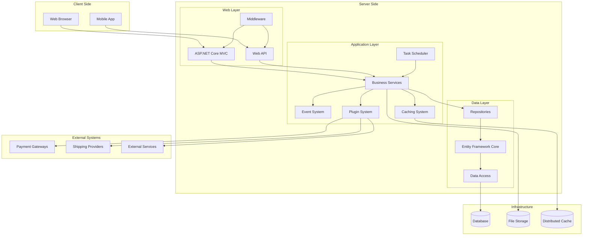
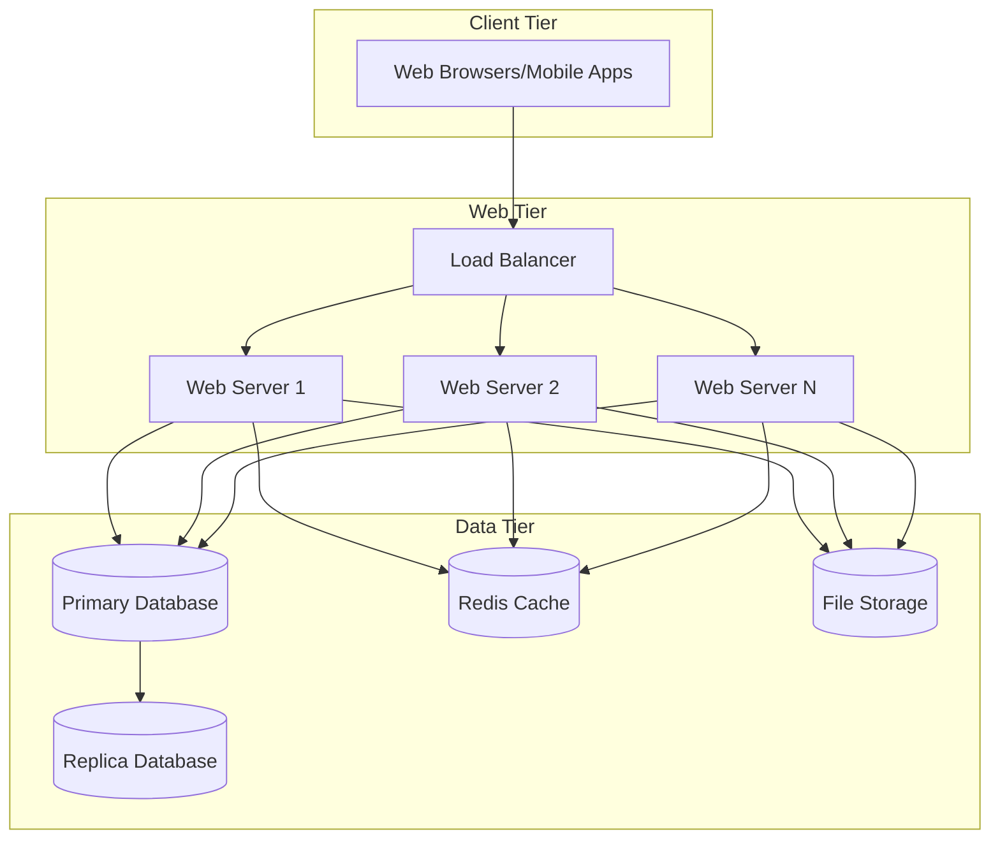
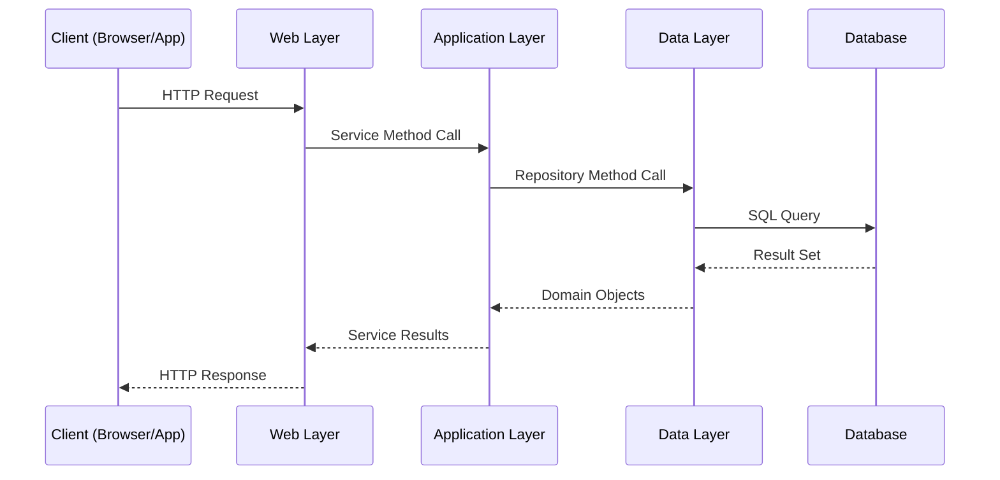

# nopCommerce System Architecture

[Home](../../index.md) | [Overview](index.md) | [Previous: Overview](index.md) | [Next: Design Patterns](design-patterns.md)

## High-Level Architecture

nopCommerce implements a layered architecture that separates concerns and promotes modularity and extensibility. The system is composed of multiple interconnected components that work together to provide a complete e-commerce solution.

## Component Overview

### Web Layer

The Web Layer serves as the entry point for all client interactions with the nopCommerce system.

- **ASP.NET Core MVC**: Handles HTTP requests, renders views, and manages the user interface
- **Web API**: Provides RESTful APIs for headless commerce and integration with external systems
- **Middleware**: Processes HTTP requests/responses for authentication, localization, etc.

### Application Layer

The Application Layer contains the core business logic and orchestrates operations across the system.

- **Business Services**: Implement business rules and coordinate operations between different components
- **Event System**: Enables loosely coupled communication between components through events
- **Caching System**: Improves performance by caching frequently accessed data
- **Plugin System**: Enables extensibility through plugins for payments, shipping, taxes, etc.
- **Task Scheduler**: Manages background tasks and scheduled operations

### Data Layer

The Data Layer handles data persistence and retrieval operations.

- **Repositories**: Implement the repository pattern for data access
- **Entity Framework Core**: ORM for database interactions
- **Data Access**: Low-level data access and provider-specific implementations

### External Systems

nopCommerce integrates with various external systems through its plugin architecture.

- **Payment Gateways**: Integration with payment processors
- **Shipping Providers**: Integration with shipping carriers
- **External Services**: Integration with third-party services (e.g., tax calculation, email marketing)

### Infrastructure

The infrastructure components provide the foundational services needed by the application.

- **Database**: Stores application data (supports SQL Server, MySQL, PostgreSQL)
- **File Storage**: Stores media files and other binary content
- **Distributed Cache**: Supports Redis and other distributed caching providers

## Physical Deployment Architecture

nopCommerce can be deployed in various configurations, from single-server setups to distributed cloud environments.

### Scalability

nopCommerce supports both vertical and horizontal scaling:

- **Vertical Scaling**: Increasing resources (CPU, memory) on existing servers
- **Horizontal Scaling**: Adding more web servers behind a load balancer
- **Database Scaling**: Primary/replica configurations for read scalability

### Containerization

nopCommerce supports Docker deployment, allowing:

- Consistent deployment across environments
- Orchestration with Kubernetes or Docker Compose
- Microservices-based deployment for larger installations

## Communication Patterns

## Key Architectural Decisions

1. **Layered Architecture**: Separation of concerns and improved maintainability
2. **Repository Pattern**: Abstracts data access and allows for different data providers
3. **Plugin System**: Extensibility without modifying core code
4. **Event-driven Design**: Loose coupling between components
5. **Dependency Injection**: Inversion of control for better testability
6. **Caching Strategy**: Multi-level caching for performance optimization

---

*Next: [Design Patterns](design-patterns.md)*

---

*[Home](../../index.md) | [Overview](index.md) | [Previous: Overview](index.md) | [Next: Design Patterns](design-patterns.md)*