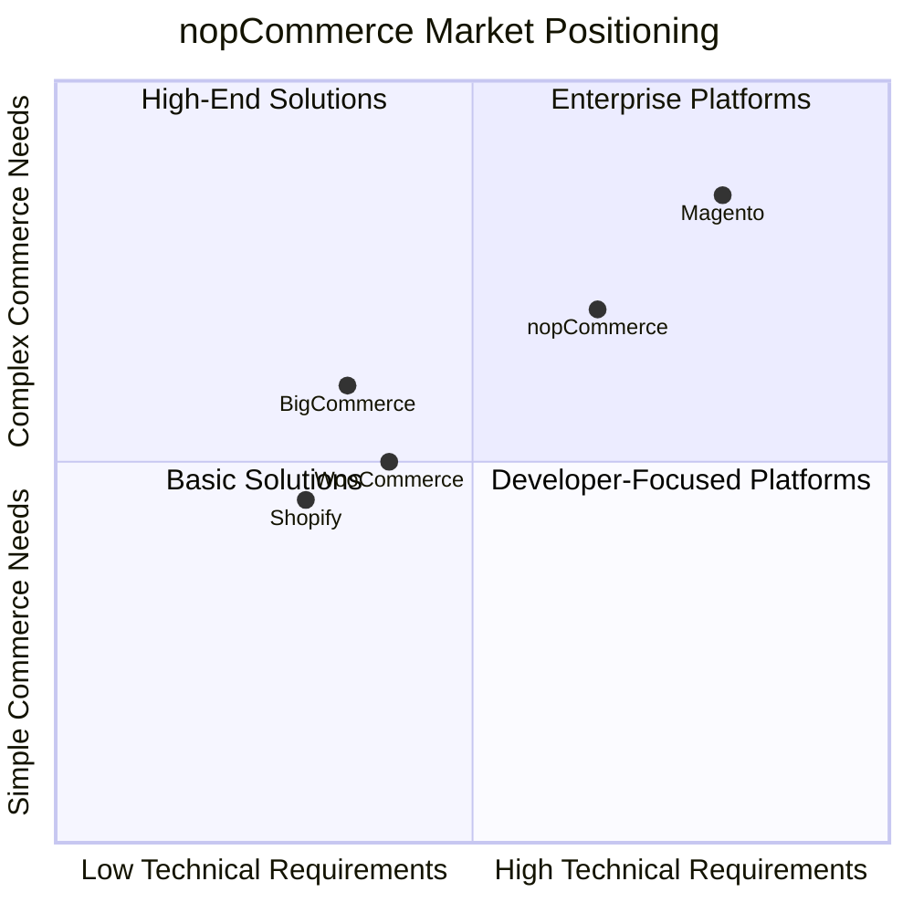
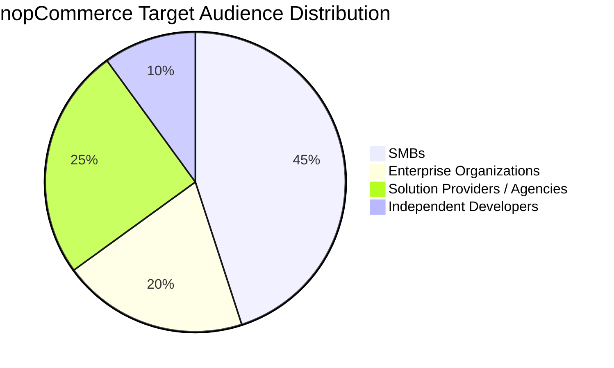

# nopCommerce Target Audience Analysis

[Home](../../index.md) | [Overview](index.md) | [Previous: Key Concepts](key-concepts.md) | [Next: Customer Profiles](customer-profiles.md)

## Overview

Based on the nopCommerce architecture analysis, this document defines the target audience for nopCommerce, creates typical customer profiles, and outlines a customer survey approach to gather feedback on features.

## Target Audience

nopCommerce, as an open-source e-commerce platform built on modern .NET Core technology, targets the following primary audience segments:

### 1. Small to Medium-Sized Businesses (SMBs)
- **Description**: Companies with limited IT resources seeking a robust e-commerce solution without enterprise-level costs
- **Needs**: Cost-effective, easy-to-manage platform with essential e-commerce functionality
- **Technical Capability**: Limited to moderate technical expertise, often relying on external developers

### 2. Enterprise Organizations
- **Description**: Larger organizations requiring customizable, scalable commerce solutions
- **Needs**: Advanced features, multi-store capabilities, complex business rule support, integration with existing systems
- **Technical Capability**: Dedicated IT departments with .NET expertise

### 3. E-commerce Solution Providers / Development Agencies
- **Description**: Companies that build and maintain e-commerce solutions for clients
- **Needs**: Extensible platform, good documentation, customization capabilities
- **Technical Capability**: Professional .NET developers, solution architects

### 4. Independent Developers
- **Description**: Freelancers and individual developers building solutions for clients or self
- **Needs**: Well-documented codebase, plugin ecosystem, community support
- **Technical Capability**: Moderate to advanced .NET skills

## Market Positioning

## Target Audience Distribution

---

*Previous: [Key Concepts](key-concepts.md) | [Next: Customer Profiles](customer-profiles.md)*

---

*[Home](../../index.md) | [Overview](index.md) | [Previous: Key Concepts](key-concepts.md) | [Next: Customer Profiles](customer-profiles.md)*