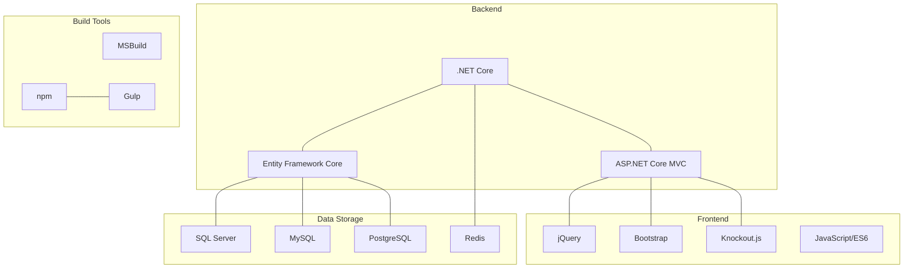
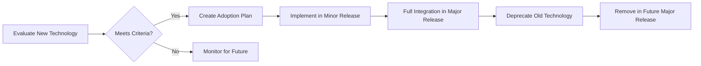

# nopCommerce Technology Stack

[Home](../../index.md) | [Overview](index.md) | [Previous: Design Patterns](design-patterns.md) | [Next: Solution Structure](solution-structure.md)

## Introduction

nopCommerce is built on modern, open-source technologies that provide a robust foundation for e-commerce applications. This document outlines the key technologies, frameworks, and libraries used in the nopCommerce platform.

## Core Technology Stack

## Backend Technologies

### .NET Core

nopCommerce is built on .NET Core, Microsoft's cross-platform, high-performance framework for building modern, cloud-based, and internet-connected applications.

**Key Features Used:**
- Cross-platform capabilities
- Dependency injection container
- Configuration system
- Logging infrastructure
- Task-based asynchronous pattern

**Version:** Latest LTS version (as of the current release)

### ASP.NET Core

nopCommerce uses ASP.NET Core for its web framework, providing:

- MVC architecture for web UI
- Web API for RESTful services
- Razor view engine
- Routing system
- Authentication and authorization
- Middleware pipeline

### Entity Framework Core

Entity Framework Core is used as the primary ORM (Object-Relational Mapper) for database access.

**Key Features Used:**
- Code-first approach
- Migrations
- LINQ support
- Multiple database provider support
- Lazy loading
- Query optimization

## Frontend Technologies

### JavaScript Libraries

nopCommerce uses several JavaScript libraries to enhance the user experience:

- **jQuery**: DOM manipulation and AJAX requests
- **Knockout.js**: MVVM pattern for dynamic UI components
- **jQuery Validate**: Client-side form validation
- **jQuery UI**: UI components like datepickers and dialogs

### CSS Frameworks

- **Bootstrap**: Responsive grid system and UI components
- **Font Awesome**: Icon library

### Build and Bundling

- **npm**: Package management
- **Gulp**: Task automation for minification and bundling
- **Sass**: CSS preprocessor (in some areas)

## Data Storage

### Relational Databases

nopCommerce supports multiple relational database systems:

- **Microsoft SQL Server**: Primary supported database
- **MySQL**: Open-source alternative
- **PostgreSQL**: Open-source alternative

### Caching

- **In-Memory Cache**: For application-level caching
- **Redis**: For distributed caching in multi-server deployments
- **SQL Server Cache**: For persistent caching

## Authentication and Security

- **ASP.NET Core Identity**: User management and authentication
- **OAuth/OpenID Connect**: For external authentication providers
- **Data Protection API**: For secure data protection

## Testing

- **xUnit**: Unit testing framework
- **Moq**: Mocking framework for unit tests
- **FluentAssertions**: Improved assertions for tests

## Deployment and Infrastructure

- **Docker**: Containerization support
- **IIS**: Windows hosting
- **Nginx/Apache**: Linux hosting options
- **Azure**: Cloud deployment support

## Third-Party Services Integration

nopCommerce integrates with various third-party services through its plugin system:

- Payment gateways (PayPal, Stripe, etc.)
- Shipping providers (UPS, FedEx, etc.)
- Tax calculation services (Avalara, etc.)
- Email marketing services (MailChimp, etc.)
- Social media platforms (Facebook, Twitter, etc.)

## Version Compatibility Matrix

The following table shows the compatibility between nopCommerce versions and key technologies:

| nopCommerce Version | .NET Version | Entity Framework Core | ASP.NET Core | Supported SQL Server Versions |
|---------------------|--------------|----------------------|--------------|------------------------------|
| 4.50+               | .NET 6       | 6.0                  | 6.0          | 2016, 2017, 2019, 2022      |
| 4.40                | .NET 5       | 5.0                  | 5.0          | 2012, 2014, 2016, 2017, 2019|
| 4.30                | .NET Core 3.1| 3.1                  | 3.1          | 2012, 2014, 2016, 2017, 2019|
| 4.20                | .NET Core 2.2| 2.2                  | 2.2          | 2012, 2014, 2016, 2017, 2019|
| 4.10                | .NET Core 2.1| 2.1                  | 2.1          | 2012, 2014, 2016, 2017      |

## Technology Selection Rationale

nopCommerce technology choices are guided by several principles:

1. **Open Source**: Preference for open-source technologies to reduce licensing costs
2. **Mainstream Support**: Technologies with active development and community support
3. **Performance**: Technologies optimized for performance and scalability
4. **Cross-Platform**: Support for multiple operating systems
5. **Developer Productivity**: Technologies that enhance developer experience
6. **Long-Term Support**: Technologies with long-term support commitments

## Technology Update Strategy

nopCommerce follows a structured approach to technology updates:

Key considerations in technology updates:
- Backward compatibility
- Migration path for existing plugins
- Performance impact
- Security improvements

## Development Environment

Recommended development environment for nopCommerce:

- **IDE**: Visual Studio 2022 or JetBrains Rider
- **Source Control**: Git
- **Database**: SQL Server (Developer Edition) or LocalDB
- **Containerization**: Docker Desktop
- **API Testing**: Postman or Swagger UI
- **Browser Dev Tools**: Chrome or Firefox Developer Tools

---

*Next: [Solution Structure](solution-structure.md)*

---

*[Home](../../index.md) | [Overview](index.md) | [Previous: Design Patterns](design-patterns.md) | [Next: Solution Structure](solution-structure.md)*