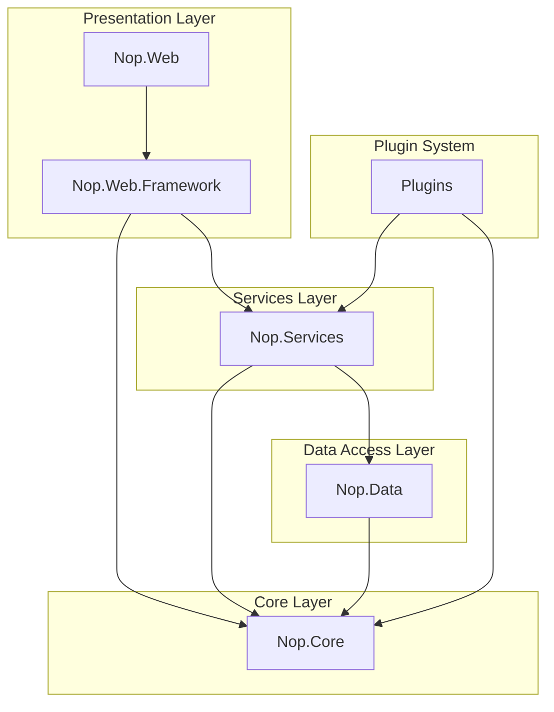

# nopCommerce Technical Architecture Documentation

[Home](index.md) | [GitHub Repository](https://github.com/nopSolutions/nopCommerce)

## Introduction

This comprehensive technical documentation covers the architecture of nopCommerce, an open-source e-commerce platform built on ASP.NET Core. nopCommerce follows a modular, extensible, and maintainable architecture that allows developers to customize and extend its functionality while maintaining a clean separation of concerns.

## Table of Contents

1. [Overview](architecture/overview/index.md)
   - [System Architecture](architecture/overview/system-architecture.md)
   - [Design Patterns](architecture/overview/design-patterns.md)
   - [Technology Stack](architecture/overview/technology-stack.md)
   - [Solution Structure](architecture/overview/solution-structure.md)
   - [Key Concepts](architecture/overview/key-concepts.md)
   - [Target Audience](architecture/overview/target-audience.md)
   - [Customer Profiles](architecture/overview/customer-profiles.md)
   - [Customer Survey](architecture/overview/customer-survey.md)
   - [Audience Analysis](architecture/overview/audience-analysis.md)
   - [Documentation Process](architecture/overview/documentation-process.md)

2. [Core Framework](architecture/core/index.md)
   - [Domain Model](architecture/core/domain-model.md)
   - [Infrastructure](architecture/core/infrastructure.md)
   - [Caching System](architecture/core/caching.md)
   - [Events System](architecture/core/events.md)
   - [Configuration](architecture/core/configuration.md)

3. [Data Access Layer](architecture/data/index.md)
   - [ORM Architecture](architecture/data/orm-architecture.md)
   - [Data Providers](architecture/data/data-providers.md)
   - [Migrations](architecture/data/migrations.md)
   - [Repository Pattern](architecture/data/repository-pattern.md)
   - [Database Schema](architecture/data/database-schema.md)

4. [Service Layer](architecture/services/index.md)
   - [Service Architecture](architecture/services/service-architecture.md)
   - [Catalog Services](architecture/services/catalog-services.md)
   - [Customer Services](architecture/services/customer-services.md)
   - [Order Services](architecture/services/order-services.md)
   - [Other Core Services](architecture/services/other-services.md)

5. [Web Layer](architecture/web/index.md)
   - [MVC Architecture](architecture/web/mvc-architecture.md)
   - [Routing System](architecture/web/routing.md)
   - [View Components](architecture/web/view-components.md)
   - [API Architecture](architecture/web/api.md)
   - [Security](architecture/web/security.md)
   - [Themes and UI](architecture/web/themes.md)

6. [Plugin System](architecture/plugins/index.md)
   - [Plugin Architecture](architecture/plugins/architecture.md)
   - [Payment Plugins](architecture/plugins/payment.md)
   - [Shipping Plugins](architecture/plugins/shipping.md)
   - [Tax Plugins](architecture/plugins/tax.md)
   - [Other Plugin Types](architecture/plugins/other-types.md)
   - [Developing Custom Plugins](architecture/plugins/custom-development.md)

7. [Deployment and Infrastructure](architecture/deployment/index.md)
   - [Hosting Options](architecture/deployment/hosting.md)
   - [Docker Deployment](architecture/deployment/docker.md)
   - [Database Configuration](architecture/deployment/database.md)
   - [Performance Optimization](architecture/deployment/performance.md)
   - [Scaling Strategies](architecture/deployment/scaling.md)

## Architecture Diagram

## About This Documentation

This documentation was created to provide a comprehensive understanding of the nopCommerce architecture. It is intended for developers, architects, and technical stakeholders who need to understand the inner workings of the platform.

All diagrams use the Mermaid syntax for visualization and all technical specifications are based on the latest version of nopCommerce.

---

*Last updated: May 22, 2025*