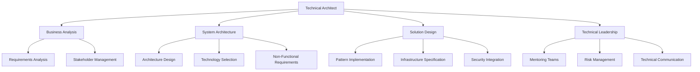
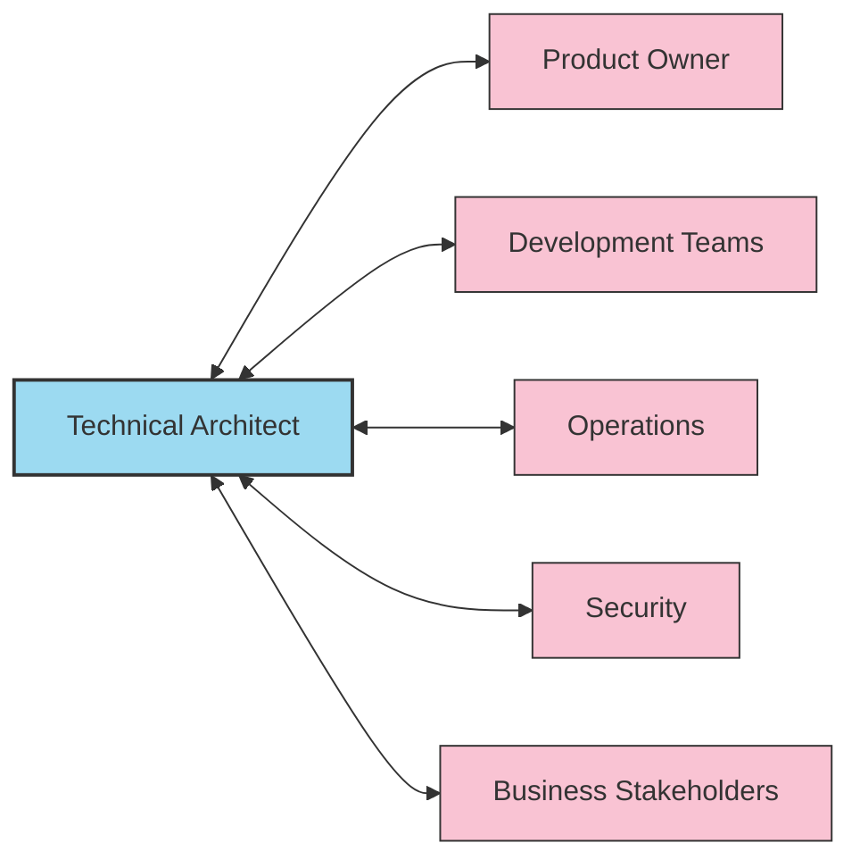
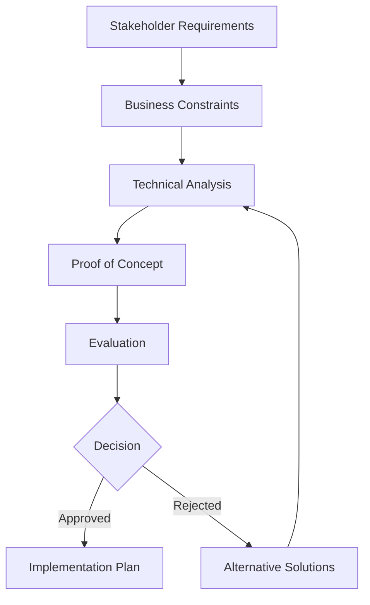
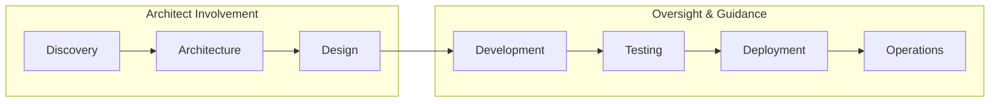

# Technical Architect Profile

## Overview

The Technical Architect is responsible for designing and overseeing the technical vision, architecture standards, and implementation of complex software systems. This role bridges the gap between business requirements and technical implementation, ensuring scalable, maintainable, and robust solutions.

## Role Diagram

## Core Responsibilities

### Architecture Design & Implementation

- Define overall technical architecture and design principles
- Create architecture diagrams and documentation
- Ensure architecture aligns with business goals and requirements
- Implement governance processes for architecture compliance
- Review and approve major design decisions

### Technology Strategy

- Evaluate and select appropriate technologies and frameworks
- Create technology roadmaps aligned with business strategy
- Balance innovation with stability and maintainability
- Guide platform evolution and modernization efforts
- Establish technical standards and best practices

### Cross-Functional Collaboration

- Translate business requirements into technical solutions
- Collaborate with product managers to define technical scope
- Work with development teams to implement architecture
- Coordinate with operations for deployment and maintenance
- Engage with security teams to ensure compliance and protection

## Technical Skills

- **Architecture Patterns**: Microservices, Event-Driven, Domain-Driven Design
- **Programming Languages**: Proficiency in multiple languages (Java, C#, Python, JavaScript)
- **Cloud Technologies**: AWS, Azure, GCP architecture design and implementation
- **Infrastructure**: Containerization, orchestration, CI/CD pipelines
- **Data Architecture**: Database design, data warehousing, analytics platforms
- **Security**: Authentication, authorization, data protection, secure coding
- **Performance**: Scalability, optimization, caching strategies

## Soft Skills

- **Communication**: Ability to explain complex technical concepts to various audiences
- **Leadership**: Guide and influence without direct authority
- **Strategic Thinking**: Balancing short-term needs with long-term vision
- **Problem Solving**: Complex system analysis and solution design
- **Negotiation**: Managing competing priorities and requirements

## Decision-Making Framework

## Workflow Integration

## Key Performance Indicators

- Architectural quality and adherence to standards
- System performance and scalability metrics
- Technical debt management
- Project delivery timelines and budget alignment
- Developer productivity and satisfaction
- Incident rates related to architectural decisions
- Successful technology adoption

## Career Progression Path

- **Junior Technical Architect**: Focused on component-level architecture
- **Technical Architect**: System-level architecture responsibility
- **Senior Technical Architect**: Multiple system integration, mentorship
- **Principal Architect**: Enterprise-wide architecture strategy
- **Chief Architect**: Organizational technical vision and strategy