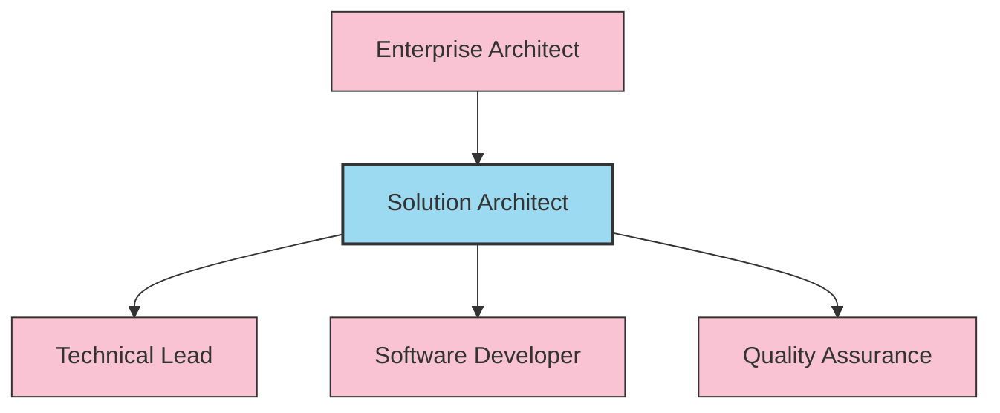
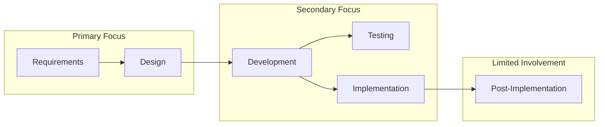

# Solution Architect Profile

## Overview

A Solution Architect is responsible for designing, developing, and implementing solutions to solve specific business problems. This role focuses on translating business requirements into specific technology solutions, typically within the scope of a single project or product.

## Role in Organization

## Primary Responsibilities

- Design solution architecture for specific business requirements
- Create detailed technical specifications and documentation
- Select appropriate technologies and frameworks for implementation
- Guide development teams in implementing the solution
- Ensure solution meets non-functional requirements (performance, security, scalability)
- Validate architectural decisions through prototypes and POCs
- Collaborate with stakeholders to ensure solution alignment with business needs

## Technical Skills

- **Solution Design**: Component design, API design, integration patterns
- **Technology Stack**: In-depth knowledge of relevant technologies and frameworks
- **Modeling**: UML, architecture diagrams, data modeling
- **Development**: Coding proficiency in relevant languages
- **Testing**: Test strategy, automated testing approaches
- **DevOps**: CI/CD, deployment strategies, infrastructure as code

## Project Lifecycle Involvement

## Difference from Technical Architect

While a Technical Architect focuses on broader technical strategy and standards across multiple systems, a Solution Architect specializes in designing specific solutions for defined business problems, usually within the scope of a single project or product.

**Key differences:**

1. **Scope**: Project/product specific vs. organization-wide
2. **Focus**: Implementation details vs. strategic direction
3. **Timeline**: Project lifecycle vs. long-term technical vision
4. **Depth vs. Breadth**: Deep technical expertise in specific domains vs. broader technical knowledge